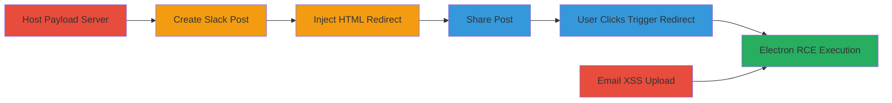

---

# Slack HTML Injection Leading to RCE in Desktop App via Electron Manipulation

Multi-stage attack chain demonstrating a complete attack workflow exploiting vulnerabilities in Slack's file handling and desktop app to achieve remote code execution.

## Chain Metrics Dashboard

| Metric | Value |
|--------|-------|
| Chain Status | Unverified |
| Total Steps | 6 |
| Execution Time | ~10 minutes |
| Skill Level | Intermediate |
| Complexity | Medium |
| Impact Level | High |

## Attack Flow Visualization

## Prerequisites & Requirements

### Required Tools

- [[tools/HTTP-Proxy]]
- [[tools/Email-Client-macOS]]
- [[tools/Slack-Web-UI]]
- [[tools/Slack-API-files-info]]

### Target Environment

- Slack desktop app versions 4.2 or 4.3.2 on Mac, Windows, or Linux
- Access to a Slack workspace (authenticated user)
- Attacker-controlled HTTPS server for hosting payloads
- Network access to files.slack.com and team Slack hostname

### Initial Access Requirements

- Valid Slack account in the target workspace
- No special privileges needed; works for standard users
- Desktop app must be installed and running

## Detailed Attack Procedures

### Step 1: Host RCE Payload
procedure: [[procedures/Upload-RCE-Payload-to-Server]]

**Objective**: Prepare the JavaScript payload on an attacker-controlled server to manipulate Electron BrowserWindow for RCE.

**Instructions**: Host a file like t.html containing the Electron manipulation JavaScript on an HTTPS server.

**Expected Output**: Accessible URL https://attacker.com/t.html serving the RCE JS.

**Success Indicators**:
- Payload file uploaded and verifiable via browser access
- HTTPS served without errors

### Step 2: Create Slack Post and Retrieve JSON
procedure: [[procedures/Create-Slack-Post-and-Retrieve-JSON]]

**Objective**: Generate a Slack Post that creates an editable JSON file on files.slack.com for HTML injection.

**Instructions**: Create a new Slack Post, then use [[commands/slack-api-files-info]] to retrieve the private file URL in format https://files.slack.com/files-pri/{TEAM_ID}-{FILE_ID}/TITLE.

**Expected Output**: JSON structure like {"full": "
content
", "preview": "
content
"} accessible via url_private.

**Success Indicators**:
- Post created successfully
- Private URL retrieved via API

### Step 3: Inject HTML Payload
procedure: [[procedures/Inject-HTML-Payload-into-Slack-Post]]

**Objective**: Modify the Post JSON to inject HTML tags that redirect to the attacker site.

**Instructions**: Use [[tools/Slack-Web-UI]] at https://{YOUR-TEAM-HOSTNAME}.slack.com/files/{YOUR-MEMBER-ID}/{FILE-ID}/title/edit to inject  with <map> and <area> tags pointing to https://attacker.com/t.html. Alternatively, intercept /api/files.edit with [[tools/HTTP-Proxy]] to change filetype to 'docs'.

**Expected Output**: Modified JSON with injected HTML like <map name="slack-img"><area href="https://attacker.com/t.html"></map>.

**Success Indicators**:
- HTML injection successful without sanitization errors
- Post preview shows large image for click enticement

### Step 4: Share Malicious Post
procedure: [[procedures/Share-Malicious-Slack-Post]]

**Objective**: Distribute the injected post to entice the target to click it in the desktop app.

**Instructions**: Share the edited Post with a channel or direct message.

**Expected Output**: Post appears in target channel with clickable large image.

**Success Indicators**:
- Post shared without errors
- Target views post in desktop app

### Step 5: Trigger Redirect and RCE
procedure: [[procedures/Trigger-Redirect-and-RCE-in-Desktop-App]]

**Objective**: Cause the desktop app to redirect to the attacker site and execute the RCE payload.

**Instructions**: Target clicks the post image, triggering HTML redirect in _top frame. Site loads JS using [[commands/electron-browserwindow-rce-mac]] or similar to manipulate window objects and execute commands.

**Expected Output**: Arbitrary command execution, e.g., Calculator app opens on Mac/Windows.

**Success Indicators**:
- Redirect occurs in desktop app
- RCE payload executes, e.g., app launches or data leaked

### Step 6: Alternative Stored XSS via Email
procedure: [[procedures/Upload-HTML-via-Email-for-Stored-XSS]]

**Objective**: Exploit unfiltered email uploads for stored XSS on files.slack.com.

**Instructions**: Use [[tools/Email-Client-macOS]] to send HTML/JS payload to Slack's email integration. Access via 'open original' or url_private for executable HTML.

**Expected Output**: Malicious HTML stored as text/html on trusted domain, executable on access.

**Success Indicators**:
- Email uploaded without filtering
- HTML executes on access, enabling phishing or payload hosting

## Attack Chain Summary

### Key Achievements

1. Achieved full RCE in Slack desktop app across platforms via HTML injection.
2. Bypassed Electron security (contextIsolation) to access nodeIntegration and child_process.
3. Bonus stored XSS on files.slack.com for trusted domain payload hosting.

## Technique & Tactic Coverage

### MITRE ATT&CK Techniques

- [[Drive-by Compromise]] Drive-by Compromise (HTML injection and redirect)
- [[JavaScript]] JavaScript (RCE payload execution)
- [[Exploitation for Client Execution]] Exploitation for Client Execution (Electron manipulation)

### MITRE ATT&CK Tactics

- [[Initial Access]] Initial Access (via shared post click)
- [[Execution]] Execution (arbitrary command run)
- [[Collection]] Collection (access to private data and tokens)

---

*Last updated: 2023-10-01T00:00:00Z*
