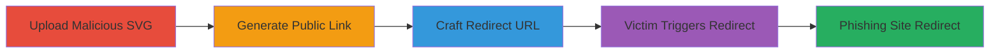

# Slack Open Redirect Bypass via Malicious SVG Upload for Phishing

Multi-stage attack chain demonstrating a complete phishing workflow by bypassing Slack's patched open redirect vulnerability using malicious SVG files hosted on Slack's domain.

## Chain Metrics Dashboard

| Metric | Value |
|--------|-------|
| Chain Status | Unverified |
| Total Steps | 4 |
| Execution Time | ~5 minutes |
| Skill Level | Intermediate |
| Complexity | Medium |
| Impact Level | High |

## Attack Flow Visualization

## Prerequisites & Requirements

### Required Tools

- Web browser for Slack interaction
- Text editor for SVG creation

### Target Environment

- Slack workspace with file upload permissions
- Web platform for link sharing

### Initial Access Requirements

- Valid Slack account with upload capabilities
- Ability to share links publicly

## Detailed Attack Procedures

### Step 1: Upload Malicious SVG
procedure: [[procedures/Upload-Malicious-SVG-to-Slack]]

**Objective**: Upload an SVG file containing JavaScript in an onload attribute to Slack, enabling client-side execution when loaded.

**Instructions**: Create an SVG file with embedded redirect script and upload it to a Slack channel.

**Expected Output**: Confirmation of file upload in Slack.

**Success Indicators**:
- SVG file appears in Slack channel
- File is accessible via Slack's file viewer

### Step 2: Generate Public Link
procedure: [[procedures/Generate-Public-Link-for-SVG-File]]

**Objective**: Obtain a public URL for the uploaded SVG, which is hosted on files.slack.com (a trusted Slack domain).

**Instructions**: Set the file sharing to public in Slack to generate a shareable link.

**Expected Output**: Public URL like https://files.slack.com/files-pri/T0E7QLVLL-F0G41EG2W/redirect.svg?pub_secret=7a6caed489.

**Success Indicators**:
- Public link is generated
- Link is accessible without authentication

### Step 3: Craft Open Redirect URL
procedure: [[procedures/Craft-Open-Redirect-URL-with-SVG]]

**Objective**: Construct a malicious link using Slack's /checkcookie endpoint with the public SVG URL in the redir parameter to bypass domain restrictions.

**Instructions**: Append the SVG public URL to the /checkcookie?redir= parameter.

**Expected Output**: Full URL like https://slack.com/checkcookie?redir=https://files.slack.com/files-pri/T0E7QLVLL-F0G41EG2W/redirect.svg?pub_secret=7a6caed489.

**Success Indicators**:
- URL is formed correctly
- Endpoint accepts the Slack-hosted redir parameter

### Step 4: Trigger Phishing Redirect
procedure: [[procedures/Trigger-Phishing-Redirect-via-Victim]]

**Objective**: Lure a victim to click the crafted link, loading the SVG and executing the JavaScript redirect to an external phishing site.

**Instructions**: Share the crafted URL via email, chat, or other means; when clicked, the /checkcookie allows the redirect to the SVG, which then onload redirects to example.com.

**Expected Output**: Victim's browser redirects to the external site.

**Success Indicators**:
- SVG loads without errors
- External redirect occurs

## Attack Chain Summary

### Key Achievements

1. Bypassed Slack's open redirect patch by leveraging trusted file hosting.
2. Executed client-side JavaScript via SVG onload for arbitrary redirects.
3. Enabled phishing attacks using seemingly legitimate Slack links.

## Technique & Tactic Coverage

### MITRE ATT&CK Techniques

- [[Drive-by Compromise]]
- [[JavaScript]]

### MITRE ATT&CK Tactics

- [[Initial Access]]
- [[Execution]]

---
*Last updated: 2023-10-01T00:00:00Z*
