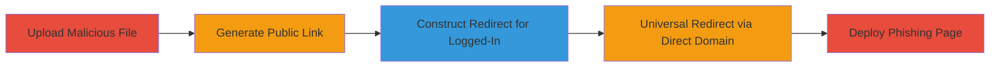

# Slack Open Redirect and XSS via Malicious File Upload Bypass

Multi-stage attack chain demonstrating exploitation of Slack's file upload vulnerability, where binary characters prefixed to HTML content bypass sanitization, allowing files to execute as HTML in browsers for redirects and phishing.

## Chain Metrics Dashboard

| Metric | Value |
|--------|-------|
| Chain Status | Unverified |
| Total Steps | 5 |
| Execution Time | ~10 minutes |
| Skill Level | Intermediate |
| Complexity | Medium |
| Impact Level | High |

## Attack Flow Visualization



## Prerequisites & Requirements

### Required Tools

- [[tools/Burp-Suite]]

### Target Environment

- Web platform with access to Slack workspace
- Services: Slack file upload API (upload.slack.com), file serving (files.slack.com, slack.com/files-pri)
- Network access: Internet connectivity to Slack endpoints

### Initial Access Requirements

- Valid Slack account credentials for authenticated uploads
- No prior access needed beyond login; anonymous access possible for link consumption

## Detailed Attack Procedures

### Step 1: Upload Malicious File
procedure: [[procedures/Upload-Malicious-HTML-File-with-Binary-Prefix]]

**Objective**: Upload an HTML file disguised as an image by prepending binary characters to bypass sanitization and enable HTML execution.

**Instructions**: Use Burp Suite to intercept and modify the POST request to the upload endpoint, crafting a multipart form with binary-prefixed HTML redirect script.

Execute [[commands/slack-upload-binary-html-redirect]] to send the malicious file:

```bash
curl -X POST https://upload.slack.com/api/files.uploadAsync \
  -H "Content-Type: multipart/form-data; boundary=---------------------------89481407720596" \
  --data-binary "@$file_with_binary_and_html" \
  -F "filename=pixel" \
  -F "token=$SLACK_TOKEN" \
  -F "channels=$CHANNEL_ID" \
  -F "title=pixel" \
  -F "initial_comment=hi"
```

**Expected Output**: JSON response with file ID (e.g., {"ok":true, "file":{"id":"F1AU0FTGR"}}).

**Success Indicators**:
- File uploaded successfully without rejection
- File ID returned for further use

### Step 2: Generate Public Sharing Link
procedure: [[procedures/Generate-Public-Sharing-Link-for-File]]

**Objective**: Create a public link to the uploaded file, allowing anonymous access and HTML execution.

**Instructions**: Use Slack's UI or API to generate a public sharing link for the uploaded file ID.

The link format will be like https://files.slack.com/files-pri/T1ARLSGBS-F1AU0FTGR/pixel?pub_secret=094ca97aee.

**Expected Output**: Public URL that serves the file as HTML.

**Success Indicators**:
- Link generated and accessible
- Accessing the link executes the redirect script

### Step 3: Construct Open Redirect for Logged-In Users
procedure: [[procedures/Construct-Open-Redirect-Link-for-Logged-In-Users]]

**Objective**: Chain the public file link with Slack's checkcookie endpoint to create a redirect that works for authenticated users.

**Instructions**: Combine the public file URL with the checkcookie redir parameter.

Example: https://slack.com/checkcookie?redir=https://files.slack.com/files-pri/T1ARLSGBS-F1AU0FTGR/pixel?pub_secret=094ca97aee

**Expected Output**: Victim redirected to evil.com upon clicking.

**Success Indicators**:
- Link bypasses any login checks
- Redirect executes in browser

### Step 4: Universal Redirect via Direct Domain
procedure: [[procedures/Use-Direct-Slack-Domain-for-Universal-Redirect]]

**Objective**: Use slack.com/files-pri directly for redirects that work regardless of login status.

**Instructions**: Access the public file via direct domain link.

Example: https://slack.com/files-pri/T1ARLSGBS-F1AU0FTGR/pixel?pub_secret=094ca97aee

**Expected Output**: Malicious HTML served and redirect triggered.

**Success Indicators**:
- Works for both logged-in and anonymous users
- No download forced; executes in browser

### Step 5: Deploy Phishing Page
procedure: [[procedures/Upload-Phishing-HTML-for-Credential-Theft]]

**Objective**: Upload a fake login page to steal credentials via phishing.

**Instructions**: Repeat upload process with phishing HTML content, then share public link.

Use similar curl as Step 1 but with phishing HTML (e.g., form submitting to evil.com).

**Expected Output**: Public link to fake login page.

**Success Indicators**:
- Victims submit credentials to attacker-controlled server
- Potential for further exploits like viruses

## Attack Chain Summary

### Key Achievements

1. Bypassed file sanitization to execute HTML as images
2. Enabled open redirects for phishing via public links
3. Demonstrated credential theft and malicious content distribution

## Technique & Tactic Coverage

### MITRE ATT&CK Techniques

- [[Exploit Public-Facing Application]]
- [[JavaScript]]
- [[T1566.001]]

### MITRE ATT&CK Tactics

- [[Initial Access]]
- [[Execution]]
- [[Collection]]

---
*Last updated: 2023-10-01T00:00:00Z*
