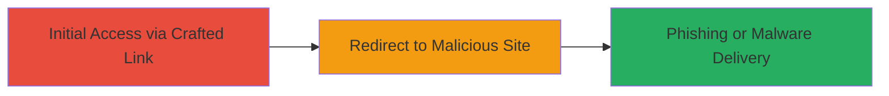

---
tags:
  - open-redirect
  - phishing
  - slack
type: attack_chain
tools: []
tactics:
  - '[[Initial Access]]'
verified: false
platforms:
  - Web
submitted: true
complexity: low
created_at: '2023-10-01T00:00:00Z'
procedures:
  - '[[procedures/Exploit-Slack-Open-Redirect-Vulnerability]]'
step_count: 1
techniques:
  - '[[T1566.002]]'
updated_at: '2025-12-14T17:24:27.299Z'
description: >-
  An attack chain exploiting an open redirect vulnerability in Slack's link
  handling to redirect users to arbitrary external sites for phishing or malware
  delivery.
skill_level: beginner
impact_level: medium
id: d3bf33be-9954-4e48-a0eb-88e51c39169a
validated: true
mitre_tactics:
  - '[[Initial Access]]'
mitre_techniques:
  - '[[T1566.002]]'
---
# Slack Open Redirect for Phishing via Workspace Link Parameter

Multi-stage attack chain demonstrating a complete attack workflow.

The vulnerability allows attackers to craft Slack workspace URLs that redirect users to arbitrary external sites without validation, enabling phishing attacks where victims are tricked into visiting malicious domains for credential theft or malware installation. Discovered in Slack's /link?url= parameter, this feature was intended for outbound links but lacked restrictions, leading to potential abuse. Slack later removed it as a designed behavior.

## Chain Metrics Dashboard

| Metric | Value |
|--------|-------|
| Chain Status | Unverified |
| Total Steps | 1 |
| Execution Time | ~1 minute |
| Skill Level | Beginner |
| Complexity | Low |
| Impact Level | Medium |

## Attack Flow Visualization



## Prerequisites & Requirements

### Required Tools

- None (browser or curl sufficient)

### Target Environment

- Slack workspace URL (e.g., https://[workspace].slack.com)
- Web browser or command-line tool for testing
- No specific ports or services required beyond HTTP/HTTPS access

### Initial Access Requirements

- Knowledge of target Slack workspace name
- Ability to share or trick users into clicking the crafted link
- No prior credentials needed for testing the redirect

## Detailed Attack Procedures

### Step 1: Craft and Trigger Open Redirect
procedure: [[procedures/Exploit-Slack-Open-Redirect-Vulnerability]]

**Objective**: Construct a malicious Slack URL to redirect users to an external phishing site without warnings.

**Instructions**: Identify the target Slack workspace (e.g., sehacure.slack.com). Append /link?url= followed by the malicious external URL. Test the redirect using a browser or [[commands/curl-test-slack-redirect]]:

```bash
curl -L -I "https://sehacure.slack.com/link?url=http://www.likelo.com"
```

Share the crafted URL with the victim via email, chat, or social engineering to induce clicks. Upon access, Slack automatically redirects to the specified URL.

**Expected Output**: HTTP 302 redirect response header pointing to the external URL, or browser navigation to the malicious site.

**Success Indicators**:
- Redirect occurs without user confirmation or validation errors
- Victim reaches the external malicious site

## Attack Chain Summary

### Key Achievements

1. Successful exploitation of open redirect to bypass Slack's link handling security
2. Enablement of phishing campaigns targeting Slack users
3. Demonstration of potential for malware distribution via trusted Slack domains

## Technique & Tactic Coverage

### MITRE ATT&CK Techniques

- [[T1566.002]]

### MITRE ATT&CK Tactics

- [[Initial Access]]

---
*Last updated: 2023-10-01T00:00:00Z*
