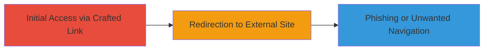

# Slack Open Redirect via Link Endpoint for Phishing

Multi-stage attack chain demonstrating exploitation of Slack's open redirect in the /link endpoint to facilitate phishing by redirecting users to malicious external sites.

## Chain Metrics Dashboard

| Metric | Value |
|--------|-------|
| Chain Status | Unverified |
| Total Steps | 1 |
| Execution Time | ~1 minute |
| Skill Level | Beginner |
| Complexity | Low |
| Impact Level | Medium |

## Attack Flow Visualization



## Prerequisites & Requirements

### Required Tools

- None (uses browser or curl for testing)

### Target Environment

- Slack workspace (e.g., https://workspace.slack.com)
- Web browser or command-line tool for URL crafting
- No special services or ports required beyond standard HTTPS (443)

### Initial Access Requirements

- Access to a Slack workspace URL
- Ability to share or click links within Slack
- No credentials needed for demonstration, but real impact requires user interaction

## Detailed Attack Procedures

### Step 1: Craft and Test Open Redirect
procedure: [[procedures/Exploit-Slack-Open-Redirect-via-Link-Endpoint]]

**Objective**: Construct a malicious URL using Slack's /link endpoint to redirect to an arbitrary external site, demonstrating potential for phishing.

**Instructions**: Start by identifying the Slack workspace URL, such as http://prakhar.slack.com. Append /link?url= followed by the URL-encoded target external site. Test the redirect using [[commands/curl-test-slack-redirect]] in a terminal:

```bash
curl -L "http://prakhar.slack.com/link?url=http%3A%2F%2Fgoogle.co.in" -v
```

Observe the HTTP response headers and final location to confirm redirection. In a browser, clicking the crafted link (e.g., http://prakhar.slack.com/link?url=http://google.co.in) should directly navigate to the external site without validation or warning.

**Expected Output**: HTTP 302 redirect response leading to the specified external URL, such as google.co.in, with no intermediate confirmation.

**Success Indicators**:
- Redirect occurs without user prompt or validation
- External site loads directly from Slack's domain
- No error or blocking from Slack's link handling

## Attack Chain Summary

### Key Achievements

1. Successful demonstration of unrestricted redirection to external domains via Slack's /link endpoint.
2. Highlighted phishing potential by tricking users into visiting malicious sites disguised as Slack links.
3. Confirmed Slack's classification as an intended feature, limiting remediation.

## Technique & Tactic Coverage

### MITRE ATT&CK Techniques

- [[Exploit Public-Facing Application]] Exploit Public-Facing Application
- [[T1566.002]] Phishing: Spearphishing Link

### MITRE ATT&CK Tactics

- [[Initial Access]] Initial Access

---
*Last updated: 2023-10-01T00:00:00Z*
