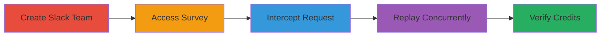

# Slack Race Condition in Account Creation Survey for Multiple Credits

Multi-stage attack chain demonstrating exploitation of a race condition vulnerability in Slack's survey process to obtain multiple promotional credits.

## Chain Metrics Dashboard

| Metric | Value |
|--------|-------|
| Chain Status | Unverified |
| Total Steps | 5 |
| Execution Time | ~10 minutes |
| Skill Level | Intermediate |
| Complexity | Medium |
| Impact Level | High |

## Attack Flow Visualization



## Prerequisites & Requirements

### Required Tools

- [[tools/Burp-Suite]]

### Target Environment

- Web platform (Slack.com)
- No specific ports or services beyond standard HTTPS
- Internet access to slack.com

### Initial Access Requirements

- No prior credentials needed; starts with new account creation
- Browser for navigation
- Burp Suite for interception

## Detailed Attack Procedures

### Step 1: Create New Slack Team
procedure: [[procedures/Create-Slack-Team-and-Intercept-Survey]]

**Objective**: Initiate the account creation process to access the survey feature.

**Instructions**: Navigate to Slack's signup page and create a new team using standard registration details. This sets up the environment for the survey.

**Expected Output**: Confirmation of team creation and prompt to set password.

**Success Indicators**:
- New team dashboard accessible
- Password setup completed

### Step 2: Access Account Creation Survey
procedure: [[procedures/Create-Slack-Team-and-Intercept-Survey]]

**Objective**: Reach the survey page after password setup to prepare for interception.

**Instructions**: After setting the password, navigate to https://yourteam.slack.com/account/reset/complete, which triggers the optional survey for new users.

**Expected Output**: Survey form loaded with fields for company details, interests, etc.

**Success Indicators**:
- Survey interface visible
- Form fields ready for input

### Step 3: Complete Survey and Intercept Request
procedure: [[procedures/Create-Slack-Team-and-Intercept-Survey]]

**Objective**: Fill out the survey and capture the submission request using Burp Suite.

**Instructions**: Configure Burp Suite as a proxy in your browser. Fill the survey form (e.g., select options for referral, interests, software, company size, industry) and submit. Intercept the POST request to /survey/6-23387113491-bed6344a95.

**Expected Output**: Captured POST request with parameters like done2=1, crumb, referral_options, interest_options, software_options, company_size, company_industry.

**Success Indicators**:
- Request intercepted in Burp
- Parameters visible and modifiable

### Step 4: Replay Request Asynchronously Multiple Times
procedure: [[procedures/Replay-Survey-Request-Concurrently]]

**Objective**: Exploit the race condition by sending duplicate requests before the system processes duplicates.

**Instructions**: From Burp Suite, copy the intercepted request as a curl command. Execute it multiple times in the background, e.g., 3-4 instances using [[commands/run-concurrent-curl-requests]]:

```bash
(curl -X POST https://slack.com/api/survey.complete -H "Cookie: d=..." -d "done2=1&crumb=...&referral_options=..." ) & (curl -X POST https://slack.com/api/survey.complete -H "Cookie: d=..." -d "done2=1&crumb=...&referral_options=..." ) & (curl -X POST https://slack.com/api/survey.complete -H "Cookie: d=..." -d "done2=1&crumb=...&referral_options=..." )
```

**Expected Output**: Multiple HTTP 200 responses indicating successful submissions.

**Success Indicators**:
- Concurrent requests sent without errors
- No immediate duplicate rejection

### Step 5: Verify Multiple Survey Completions and Credits
procedure: [[procedures/Verify-Multiple-Credits]]

**Objective**: Confirm the exploitation by checking for duplicate credits in the account.

**Instructions**: Log into the Slack account and navigate to billing or credits section to view applied promotions.

**Expected Output**: Multiple $100 credits listed, e.g., $200 total for two completions.

**Success Indicators**:
- Credits balance shows duplicates
- Financial gain realized

## Attack Chain Summary

### Key Achievements

1. Successful creation of a new Slack team and access to the survey.
2. Interception and concurrent replay of survey completion requests exploiting the race condition.
3. Receipt of multiple $100 promotional credits, resulting in unauthorized financial benefit.

## Technique & Tactic Coverage

### MITRE ATT&CK Techniques

- [[Exploit Public-Facing Application]]

### MITRE ATT&CK Tactics

- [[Initial Access]]

---
*Last updated: 2023-10-01T00:00:00Z*
