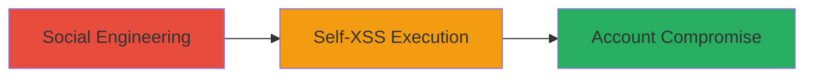

# Social Engineering Self-XSS via Missing Browser Protection on Weblate

Multi-stage attack chain demonstrating a complete attack workflow exploiting the lack of self-XSS protections on the Weblate website.

## Chain Metrics Dashboard

| Metric | Value |
|--------|-------|
| Chain Status | Unverified |
| Total Steps | 1 |
| Execution Time | ~5 minutes |
| Skill Level | Beginner |
| Complexity | Low |
| Impact Level | Medium |

## Attack Flow Visualization

## Prerequisites & Requirements

### Required Tools

- Browser Developer Console (built-in to modern browsers like Chrome or Firefox)

### Target Environment

- Web platform
- Target: https://weblate.org/
- No specific services or ports required beyond standard HTTPS (443)

### Initial Access Requirements

- No credentials needed initially
- Attacker must communicate with target user (e.g., via email, chat, or forum)
- User must be a Weblate visitor or logged-in account holder

## Detailed Attack Procedures

### Step 1: Discover and Exploit Missing Self-XSS Protection
procedure: [[procedures/Discover-and-Exploit-Missing-Self-XSS-Protection]]

**Objective**: Identify the lack of self-XSS protections and socially engineer the user to execute malicious JavaScript in their browser console, leading to potential account takeover.

**Instructions**: Begin by verifying the absence of protections on https://weblate.org/. Open the browser developer console (F12 or right-click > Inspect > Console). Attempt to paste and execute a benign JavaScript snippet, such as `alert('test')`. Unlike protected sites like Facebook, no warning or redirect should appear, confirming the vulnerability. Then, craft a social engineering message (e.g., "Paste this code into your browser console to fix a Weblate issue: javascript:alert(document.cookie);") and send it to the target user via email or chat. Instruct them to open the console on weblate.org and execute the payload, which could steal session cookies or perform other actions like sending spam.

**Expected Output**: JavaScript executes without interruption, potentially displaying an alert or exfiltrating data (e.g., via a network request to attacker-controlled server).

**Success Indicators**:
- No self-XSS warning or redirect triggered on paste/execution
- User confirms execution (e.g., sees alert)
- Attacker receives exfiltrated data, such as cookies, enabling account access

## Attack Chain Summary

### Key Achievements

1. Confirmed missing self-XSS protection on Weblate, differentiating it from hardened sites like Facebook.
2. Demonstrated social engineering vector to trick low-knowledge users into self-executing malicious JS.
3. Highlighted potential for account compromise, fraud, or spam propagation.

## Technique & Tactic Coverage

### MITRE ATT&CK Techniques

- [[Phishing]] Phishing (social engineering to induce JS execution)
- [[JavaScript]] JavaScript (execution of malicious code in browser)

### MITRE ATT&CK Tactics

- [[Initial Access]] Initial Access (via user deception)
- [[Execution]] Execution (client-side script execution)

---
*Last updated: 2023-10-01T00:00:00Z*
