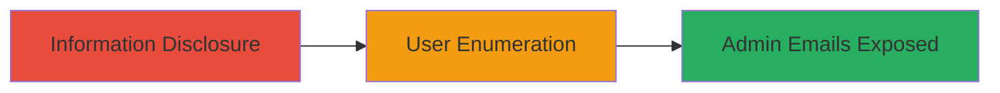

# Squarespace Information Disclosure Leading to Admin User Enumeration

Multi-stage attack chain demonstrating reconnaissance via information disclosure and user enumeration on a Squarespace-hosted site.

## Chain Metrics Dashboard

| Metric | Value |
|--------|-------|
| Chain Status | Unverified |
| Total Steps | 2 |
| Execution Time | ~2 minutes |
| Skill Level | Beginner |
| Complexity | Low |
| Impact Level | Medium |

## Attack Flow Visualization



## Prerequisites & Requirements

### Required Tools

- Browser or [[commands/curl-fetch-json]]

### Target Environment

- Squarespace-hosted web application
- Publicly accessible homepage
- No authentication required for initial access

### Initial Access Requirements

- Internet access to the target site
- No credentials needed
- Basic understanding of URL parameter manipulation

## Detailed Attack Procedures

### Step 1: Exploit Information Disclosure
procedure: [[procedures/Exploit-Squarespace-JSON-Information-Disclosure]]

**Objective**: Retrieve sensitive data from the site's JSON endpoint to gather information for further enumeration.

**Instructions**: Append `?format=json` to the target site's homepage URL and fetch the response using [[commands/curl-fetch-json]]:

```bash
curl "https://uber-movement.squarespace.com/?format=json"
```

Analyze the JSON output for any embedded sensitive details, such as user-related metadata.

**Expected Output**: JSON response containing site data, potentially including user identifiers or configurations.

**Success Indicators**:
- JSON data retrieved without errors
- Presence of unexpected sensitive fields in the response

### Step 2: Enumerate Admin Users
procedure: [[procedures/Enumerate-Admin-Users-on-Squarespace-Config]]

**Objective**: Use data from the disclosure to identify and enumerate admin accounts on the site's config page.

**Instructions**: Navigate to the admin config endpoint at `https://uber-movement.squarespace.com/config` in a browser or via [[commands/curl-fetch-json]] to inspect for user details:

```bash
curl "https://uber-movement.squarespace.com/config"
```

Cross-reference any disclosed information from Step 1 to match and confirm admin email addresses, such as admin@gmail.com or jason@jasonbarone.com.

**Expected Output**: Page or response revealing admin user emails or identifiers.

**Success Indicators**:
- Admin email addresses identified
- Successful correlation of data from JSON disclosure

## Attack Chain Summary

### Key Achievements

1. Exposed sensitive JSON data via unauthenticated endpoint
2. Enumerated admin users without direct authentication bypass
3. Demonstrated low-privilege reconnaissance leading to potential targeting of admins

## Technique & Tactic Coverage

### MITRE ATT&CK Techniques

- [[Gather Victim Host Information]] Gather Victim Host Information
- [[Account Discovery]] Account Discovery

### MITRE ATT&CK Tactics

- [[Reconnaissance]] Reconnaissance
- [[Discovery]] Discovery

---
*Last updated: 2023-10-01T00:00:00Z*
