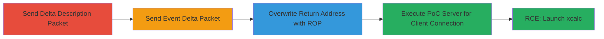

---
tags:
  - buffer-overflow
  - rce
  - rop
  - goldsrc
  - counter-strike
type: attack_chain
tools:
  - '[[tools/Python3]]'
tactics:
  - '[[Execution]]'
commands:
  - '[[commands/python3-poc-py]]'
platforms:
  - Linux
complexity: medium
procedures:
  - '[[procedures/Send-svc_deltadescription-Packet]]'
  - '[[procedures/Send-Crafted-svc_event-Delta-Packet]]'
  - '[[procedures/Construct-ROP-Chain-for-Execution]]'
  - '[[procedures/Run-PoC-Exploit-Server]]'
step_count: 4
techniques:
  - '[[Exploitation for Client Execution]]'
description: >-
  Multi-stage exploitation of a stack buffer overflow in the DELTA_ParseDelta
  function of the GoldSrc engine in Counter-Strike 1.6, enabling remote code
  execution on the client via crafted network packets and ROP chain
  construction.
skill_level: intermediate
impact_level: high
id: cd3351c6-43b7-41b9-8167-5f3f99c491f3
created_at: '2025-12-14T17:28:28.368Z'
updated_at: '2025-12-14T17:28:28.368Z'
verified: false
validated: true
submitted: true
mitre_tactics:
  - '[[Execution]]'
mitre_techniques:
  - '[[Exploitation for Client Execution]]'
---
# Stack Buffer Overflow in GoldSrc DELTA_ParseDelta for Client RCE

The vulnerability exploits a stack buffer overflow in the DELTA_ParseDelta function of the GoldSrc engine used in Counter-Strike 1.6. The function fails to validate if field_offset + field_size exceeds the allocated memory bounds for structures like event_t, allowing attackers to overwrite the return address on the stack. Discovered through analysis of packet parsing logic, the attack involves sending an svc_deltadescription packet to set up field descriptions, followed by a svc_event delta packet that triggers the overflow during structure filling in ParseEvent. Exploitation crafts a ROP chain using gadgets from hw.so and fixed addresses in the hl executable to bypass NX and execute xcalc, achieving remote code execution on the client.

## Chain Metrics Dashboard

| Metric | Value |
|--------|-------|
| Chain Status | Unverified |
| Total Steps | 4 |
| Execution Time | ~5 minutes |
| Skill Level | Intermediate |
| Complexity | Medium |
| Impact Level | High |

## Attack Flow Visualization



## Prerequisites & Requirements

### Required Tools

- [[tools/Python3]]

### Target Environment

- Linux platform
- Counter-Strike 1.6 Client running GoldSrc Engine (C/C++ based)
- Network access to client on port 27015 (default game port)

### Initial Access Requirements

- Attacker must be able to send network packets to the client (e.g., spoofed or direct connection)
- No credentials required; exploits client-side parsing
- Client must connect to attacker's PoC server at 127.0.0.1

## Detailed Attack Procedures

### Step 1: Send svc_deltadescription Packet
procedure: [[procedures/Send-svc_deltadescription-Packet]]

**Objective**: Describe the memory layout of structures to set up fields for the overflow, including a string field at offset 0xac for payload injection and integer fields to pad and avoid null bytes.

**Instructions**: Craft and send the svc_deltadescription packet containing a list of fields with types (e.g., String, Integer), offsets (e.g., 0xac for return address targeting), and sizes. Use Python scripting to construct the packet binary data, ensuring the first field is a String at offset 0xac to hold the ROP payload, followed by Integer fields for controlled overflow.

**Expected Output**: Server receives confirmation of packet parsing; client structures are prepared for delta filling without immediate crash.

**Success Indicators**:
- Packet sent successfully without disconnection
- No immediate client crash, indicating valid description setup

### Step 2: Send Crafted svc_event Delta Packet
procedure: [[procedures/Send-Crafted-svc_event-Delta-Packet]]

**Objective**: Trigger the buffer overflow by sending an oversized or misaligned delta packet that causes DELTA_ParseDelta to write beyond the event_t structure bounds during ParseEvent processing.

**Instructions**: Construct the svc_event packet with delta data that references the previously described fields. Allocate event_t on the stack in ParseEvent, then invoke DELTA_ParseDelta to fill it. Use oversized field sizes or misaligned offsets to overflow the stack buffer, targeting the return address.

**Expected Output**: Overflow occurs, corrupting stack memory including return address; client may appear to lag or crash if not controlled.

**Success Indicators**:
- Stack corruption detected via debugger (e.g., return address overwritten)
- Client continues processing without full termination

### Step 3: Overwrite Return Address with ROP Chain
procedure: [[procedures/Construct-ROP-Chain-for-Execution]]

**Objective**: Build and execute a ROP chain to bypass NX protections, loading modules, preparing syscall arguments, and invoking execve for xcalc launch.

**Instructions**: In the overflow payload, chain gadgets: Use strncpy to assemble strings '/usr/bin/xcalc' and 'DISPLAY=:0' in .bss from scattered bytes; call Sys_LoadModule('hw.so') to resolve base address; set up execve arguments (pointers to strings, null terminator); jump to int 0x80 gadget in hw.so for syscall execution. Fixed addresses from hl executable ensure reliability.

**Expected Output**: ROP chain executes, launching xcalc calculator on client's X11 display.

**Success Indicators**:
- xcalc window pops up on client machine
- No segmentation fault; controlled execution flow

### Step 4: Run PoC Exploit Server
procedure: [[procedures/Run-PoC-Exploit-Server]]

**Objective**: Host the exploit server to deliver crafted packets upon client connection, simulating a malicious server.

**Instructions**: Execute the PoC script using [[commands/python3-poc-py]] to start a server listening on 127.0.0.1:27015. Upon client connection (e.g., directing CS 1.6 to connect to localhost), the server sends the sequence of packets from steps 1-3.

```bash
python3 poc.py
```

**Expected Output**: Server output shows connection and packet transmission; xcalc launches on client.

**Success Indicators**:
- Client connects and receives packets
- RCE confirmed by xcalc execution

## Attack Chain Summary

### Key Achievements

1. Successful stack overflow via unvalidated field bounds in DELTA_ParseDelta
2. ROP chain construction bypassing NX for arbitrary code execution
3. Remote client compromise without authentication, demonstrating game client risks

## Technique & Tactic Coverage

### MITRE ATT&CK Techniques

- [[Exploitation for Client Execution]] Exploitation for Client Execution

### MITRE ATT&CK Tactics

- [[Execution]] Execution

---
*Last updated: [TIMESTAMP]*
