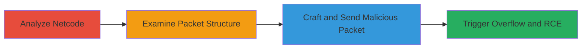

# Stack Buffer Overflow in Mario Kart 8 Deluxe Pia P2P Library for Remote Code Execution

Multi-stage attack chain demonstrating exploitation of a stack buffer overflow in Mario Kart 8 Deluxe's Pia P2P networking library, leading to potential user-mode remote code execution on peers' Nintendo Switch consoles in LAN/LDN modes, and possibly NEX.

## Chain Metrics Dashboard

| Metric | Value |
|--------|-------|
| Chain Status | Unverified |
| Total Steps | 3 |
| Execution Time | ~120 minutes |
| Skill Level | Advanced |
| Complexity | High |
| Impact Level | High |

## Attack Flow Visualization

## Prerequisites & Requirements

### Required Tools

- Reverse engineering tools (e.g., Ghidra or IDA Pro for analyzing binaries)
- Packet crafting tool (e.g., custom script or Scapy for Nintendo LAN packets)

### Target Environment

- Nintendo Switch running Mario Kart 8 Deluxe v3.0.1 or vulnerable version
- LAN/LDN mode enabled for P2P networking
- Access to the game's main module for analysis

### Initial Access Requirements

- Physical or emulated access to a Nintendo Switch for testing
- Network position as a peer in LAN/LDN session
- No credentials required; exploits peer-to-peer communication

## Detailed Attack Procedures

### Step 1: Analyze Pia Library and MK8DX Netcode
procedure: [[procedures/Analyze-Pia-Library-and-MK8DX-Netcode-for-Buffer-Overflow]]

**Objective**: Identify misuse of the CopyAppData function in the Pia library to detect the buffer size mismatch.

**Instructions**: Use reverse engineering tools to disassemble the game's main module and review the pseudocode of the LAN_CopyAppData function. Focus on offset +0xA0F8C0, noting how appDataLength from packet offset 432 is compared to outBufSize (150 bytes), but memcpy copies outBufSize bytes from packet +48 without proper bounds checking against the actual 128-byte buffer.

**Expected Output**: Confirmation of the buffer overflow vulnerability in the memcpy operation.

**Success Indicators**:
- Identified mismatch between outBufSize (150) and buffer capacity (128)
- Verified uncontrolled memcpy using controlled packet data

### Step 2: Examine LAN Protocol Browse-Reply Packet Structure
procedure: [[procedures/Examine-LAN-Protocol-Browse-Reply-Packet-Structure]]

**Objective**: Understand the packet format to control application data for overflow exploitation.

**Instructions**: Analyze the browse-reply packet: starts with u8 type (0x1), u32 body size (1266), 42 bytes misc, 0x180 bytes app data space at index 47, u32 app data length at offset 431. Craft sample packets to manipulate the application data section.

**Expected Output**: Detailed packet structure diagram or template for crafting malicious packets.

**Success Indicators**:
- Packet fields mapped, including app data length control at offset 431
- Ability to craft packets with oversized app data

### Step 3: Craft and Send Oversized Browse-Reply Packet
procedure: [[procedures/Craft-and-Send-Oversized-Browse-Reply-Packet-to-Trigger-Overflow]]

**Objective**: Trigger the stack overflow by sending a packet with appDataLength set to 150 (or less but exceeding buffer), causing memcpy to write beyond stack bounds.

**Instructions**: Set appDataLength <= outBufSize (150) in the packet, but ensure the actual buffer is 128 bytes. Use controlled data from packet +48 to overwrite stack frame. Send the packet in a LAN/LDN session to a target peer console.

**Expected Output**: Overflow triggered, potentially leading to crash or controlled stack overwrite; chain with info leak for RCE.

**Success Indicators**:
- Target console crashes or exhibits anomalous behavior
- Stack frame overwritten with attacker data, enabling RCE when combined with leak

## Attack Chain Summary

### Key Achievements

1. Discovered stack buffer overflow in Pia library's CopyAppData usage
2. Mapped LAN protocol packet structure for precise control
3. Demonstrated potential RCE impact on Nintendo Switch peers in P2P modes

## Technique & Tactic Coverage

### MITRE ATT&CK Techniques

- [[Exploitation for Client Execution]] Exploitation for Client Execution

### MITRE ATT&CK Tactics

- [[Execution]] Execution

---
*Last updated: 2024-01-01T00:00:00Z*
