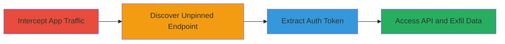

# Static Basic Auth Token Bypass via Incomplete SSL Pinning in Starbucks Turkey App

Multi-stage attack chain demonstrating exploitation of improper authentication and incomplete SSL pinning in the Starbucks Turkey Android app, leading to full unauthorized access to customer profiles, transactions, and API tokens.

## Chain Metrics Dashboard

| Metric | Value |
|--------|-------|
| Chain Status | Unverified |
| Total Steps | 4 |
| Execution Time | ~15 minutes |
| Skill Level | Intermediate |
| Complexity | Medium |
| Impact Level | High |

## Attack Flow Visualization

## Prerequisites & Requirements

### Required Tools

- [[tools/Burp-Suite]]

### Target Environment

- Android mobile app (Starbucks Turkey)
- API server at crmproxy.protel.com.tr (ports 443/HTTPS)
- Network access to intercept app traffic (e.g., rooted device or proxy setup)

### Initial Access Requirements

- Installed Starbucks Turkey Android app
- Burp Suite configured as proxy
- No prior credentials needed; exploits static token

## Detailed Attack Procedures

### Step 1: Intercept App Traffic
procedure: [[procedures/Intercept-App-Traffic-with-Burp-Suite]]

**Objective**: Set up traffic interception to identify pinned and unpinned paths in the app.

**Instructions**: Configure Burp Suite to proxy Android app traffic. Install the app's CA certificate on the device. Attempt to navigate app screens while monitoring for intercepted requests.

**Expected Output**: Initial interception failures due to SSL pinning on most paths.

**Success Indicators**:
- Proxy setup confirmed
- Traffic visible in Burp but blocked by pinning

### Step 2: Discover Unpinned Endpoint
procedure: [[procedures/Discover-Unpinned-MobileInbox-Endpoint]]

**Objective**: Identify endpoints not protected by SSL pinning, such as /MobileInbox/.

**Instructions**: Navigate to the app's messages tab to trigger requests. Check Burp history for successful interceptions.

**Expected Output**: Successful request to https://crmproxy.protel.com.tr/api/v1/MobileInbox/Limit/20.

**Success Indicators**:
- Request to /MobileInbox/ intercepted without pinning error
- Response received in Burp

### Step 3: Extract and Reuse Auth Token
procedure: [[procedures/Extract-and-Reuse-Static-Auth-Token]]

**Objective**: Capture the static Basic Auth token and test its reuse outside the app.

**Instructions**: Inspect the intercepted request headers for Authorization. Copy the token and add it to browser requests via developer tools or extensions.

**Expected Output**: Successful authentication in browser without app login.

**Success Indicators**:
- Token: Basic QVBSTlhXTFpUUTo4NGY0NDlmMWYzOWEyMDUz
- No auth popup in browser

### Step 4: Access API and Exfil Data
procedure: [[procedures/Access-API-Documentation-and-Sensitive-Endpoints]]

**Objective**: Enumerate and access all GET endpoints to retrieve sensitive customer data.

**Instructions**: Browse to API root, access Swagger docs, and query endpoints like /customerprofiles using the token.

**Expected Output**: JSON responses with customer GUIDs, profiles, transactions, and masked cards.

**Success Indicators**:
- Full API documentation accessed
- Unauthorized data retrieval (e.g., /api/v1/customerprofile/{guid})

## Attack Chain Summary

### Key Achievements

1. Bypassed SSL pinning on /MobileInbox/ to intercept traffic.
2. Extracted static Basic Auth token for reuse.
3. Gained full read access to customer data without authentication.

## Technique & Tactic Coverage

### MITRE ATT&CK Techniques

- [[Network Sniffing]] Network Sniffing
- [[Valid Accounts]] Valid Accounts
- [[Unsecured Credentials]] Unsecured Credentials

### MITRE ATT&CK Tactics

- [[Initial Access]] Initial Access
- [[Discovery]] Discovery
- [[Collection]] Collection

---

*Last updated: 2023-10-01T00:00:00Z*
