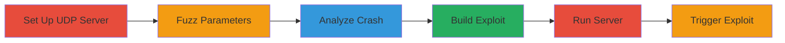

---
tags:
  - rce
  - buffer-overflow
  - steam
  - udp-exploit
type: attack_chain
tools:
  - '[[tools/Python]]'
  - '[[tools/Immunity-Debugger]]'
tactics:
  - '[[Initial Access]]'
  - '[[Execution]]'
commands:
  - '[[commands/python-steam-serverinfo-exploit]]'
platforms:
  - Windows
  - Linux
  - macOS
complexity: high
procedures:
  - '[[procedures/Set-Up-Custom-UDP-Server-for-Valve-Protocol]]'
  - '[[procedures/Fuzz-Parameters-to-Identify-Buffer-Overflow]]'
  - '[[procedures/Analyze-Crash-with-Debugger]]'
  - '[[procedures/Build-ROP-Chain-and-Shellcode-Exploit]]'
  - '[[procedures/Run-Exploit-Server]]'
  - '[[procedures/Trigger-Exploit-via-Steam-Client-or-Browser]]'
step_count: 6
techniques:
  - '[[Exploitation for Client Execution]]'
  - '[[Command-Line Interface]]'
description: >-
  Exploitation of a stack-based buffer overflow in Steam's serverbrowser library
  via oversized player names in UDP responses, leading to arbitrary code
  execution on Windows systems.
skill_level: advanced
impact_level: high
id: 202250e6-a69d-4f82-8f38-e7760078ccb5
created_at: '2025-12-11T06:10:40.374Z'
updated_at: '2025-12-11T06:10:40.374Z'
verified: false
validated: true
submitted: true
mitre_tactics:
  - '[[TA0001]]'
  - '[[TA0002]]'
mitre_techniques:
  - '[[T1203]]'
  - '[[T1059]]'
---
# Steam Client RCE via Buffer Overflow in A2S_PLAYER Response

Multi-stage attack chain demonstrating remote code execution on Steam clients by exploiting a buffer overflow vulnerability in the serverbrowser library through malicious UDP responses.

## Chain Metrics Dashboard

| Metric | Value |
|--------|-------|
| Chain Status | Unverified |
| Total Steps | 6 |
| Execution Time | ~30 minutes |
| Skill Level | Advanced |
| Complexity | High |
| Impact Level | High |

## Attack Flow Visualization



## Prerequisites & Requirements

### Required Tools

- [[tools/Python]]
- [[tools/Immunity-Debugger]]

### Target Environment

- Windows OS with Steam client installed
- UDP port 27015 accessible
- Network access to simulate Valve server queries

### Initial Access Requirements

- Ability to host a malicious UDP server
- Victim interaction with Steam server browser or steam:// URL

## Detailed Attack Procedures

### Step 1: Set Up Custom UDP Server - [[procedures/Set-Up-Custom-UDP-Server-for-Valve-Protocol]]

**Objective**: Create a server mimicking Valve's query protocol to handle A2S_INFO and A2S_PLAYER requests.

**Instructions**: Implement the server using Python's socket library to listen on port 27015 and respond to UDP queries based on Valve documentation.

**Expected Output**: Server running and responding to queries.

**Success Indicators**:
- Server binds to port 27015
- Handles basic A2S queries without errors

### Step 2: Fuzz Parameters to Identify Crashes - [[procedures/Fuzz-Parameters-to-Identify-Buffer-Overflow]]

**Objective**: Send oversized player names to cause stack overflows in the Steam client.

**Instructions**: Modify the A2S_PLAYER response to include large strings like 'A*1100' or Unicode equivalents, observing client crashes.

**Expected Output**: Steam client crashes upon receiving malicious response.

**Success Indicators**:
- Client crash logs indicate buffer overflow
- Reproducible crash on parameter fuzzing

### Step 3: Analyze Crash with Debugger - [[procedures/Analyze-Crash-with-Debugger]]

**Objective**: Use a debugger to inspect the stack overflow and confirm exploitability.

**Instructions**: Attach Immunity Debugger to Steam.exe and trigger the crash to analyze stack layout and lack of canary protection.

**Expected Output**: Debugger shows overflow in serverbrowser library.

**Success Indicators**:
- Identification of overwriteable return address
- Confirmation of no stack canaries on Windows

### Step 4: Build ROP Chain and Shellcode - [[procedures/Build-ROP-Chain-and-Shellcode-Exploit]]

**Objective**: Craft a Unicode ROP chain to bypass protections and execute shellcode.

**Instructions**: Use gadgets from Steam.exe to call VirtualProtect, make stack executable, and run shellcode for cmd.exe execution, adjusting for ASLR.

**Expected Output**: Functional exploit payload.

**Success Indicators**:
- ROP chain successfully overwrites return address
- Shellcode executes without crashes

### Step 5: Run Exploit Server - [[procedures/Run-Exploit-Server]]

**Objective**: Launch the malicious UDP server to deliver the exploit.

**Instructions**: Execute [[commands/python-steam-serverinfo-exploit]] to start the server:

```bash
python steam_serverinfo_exploit.py
```

**Expected Output**: Server starts on host 0.0.0.0 port 27015.

**Success Indicators**:
- Server logs incoming queries
- Malicious responses sent successfully

### Step 6: Trigger Exploit via Client - [[procedures/Trigger-Exploit-via-Steam-Client-or-Browser]]

**Objective**: Induce the victim to connect to the malicious server.

**Instructions**: View server info in Steam browser or open a webpage with steam://connect/ iframe.

**Expected Output**: RCE on victim machine, e.g., cmd.exe launch.

**Success Indicators**:
- Arbitrary code execution confirmed
- No client-side errors during trigger

## Attack Chain Summary

### Key Achievements

1. Identification and exploitation of buffer overflow
2. Bypass of ASLR via ROP chain
3. Remote code execution on Steam clients

## Technique & Tactic Coverage

### MITRE ATT&CK Techniques

- [[Exploitation for Client Execution]]
- [[Command-Line Interface]]

### MITRE ATT&CK Tactics

- [[Initial Access]]
- [[Execution]]

*Last updated: 2023-10-01*
