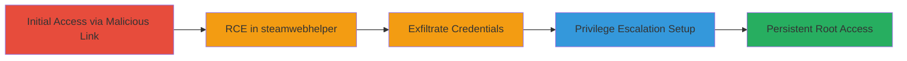

---
tags:
  - rce
  - privilege-escalation
  - steam-deck
  - cef
  - cve-2020-16040
  - linux
type: attack_chain
tools: []
tactics:
  - '[[Initial Access]]'
  - '[[Execution]]'
  - '[[Privilege Escalation]]'
  - '[[Credential Access]]'
verified: false
platforms:
  - Linux
submitted: true
complexity: medium
created_at: '2023-10-01T00:00:00Z'
procedures:
  - '[[procedures/Steam-Deck-RCE-via-CEF-Vulnerability]]'
  - '[[procedures/Steam-Deck-Privilege-Escalation-via-Bashrc-Modification]]'
step_count: 5
techniques:
  - '[[Exploitation for Client Execution]]'
  - '[[Exploitation for Privilege Escalation]]'
  - '[[Unsecured Credentials]]'
updated_at: '2025-12-14T17:23:36.568Z'
description: >-
  Remote code execution in Steam Deck's steamwebhelper process via
  CVE-2020-16040, leading to user-level access and chained local privilege
  escalation to root using sudo misconfiguration.
skill_level: intermediate
impact_level: high
id: 496093bb-2be1-45b6-8a2e-04cb02fb081c
validated: true
mitre_tactics:
  - '[[Initial Access]]'
  - '[[Execution]]'
  - '[[Privilege Escalation]]'
  - '[[Credential Access]]'
mitre_techniques:
  - '[[Exploitation for Client Execution]]'
  - '[[Exploitation for Privilege Escalation]]'
  - '[[Unsecured Credentials]]'
---
# Steam Deck RCE via Malicious Chat Link Chained to Root Privilege Escalation

Multi-stage attack chain exploiting a vulnerable Chromium Embedded Framework in the Steam client on Steam Deck, enabling remote code execution as the 'deck' user and subsequent privilege escalation to root access.

## Chain Metrics Dashboard

| Metric | Value |
|--------|-------|
| Chain Status | Unverified |
| Total Steps | 5 |
| Execution Time | ~5 minutes |
| Skill Level | Intermediate |
| Complexity | Medium |
| Impact Level | High |

## Attack Flow Visualization

## Prerequisites & Requirements

### Required Tools

- Web browser for hosting malicious payload (e.g., attacker-controlled server)
- Knowledge of Steam Chat interface

### Target Environment

- Steam Deck running Linux with Steam client
- Vulnerable CEF version 85.0.4183.121
- 'deck' user with passwordless sudo access

### Initial Access Requirements

- Victim must be online in Steam Chat
- Attacker must have victim's Steam friend or chat access
- No prior credentials needed

## Detailed Attack Procedures

### Step 1: Deliver Malicious Link
procedure: [[procedures/Steam-Deck-RCE-via-CEF-Vulnerability]]

**Objective**: Trick the user into clicking a malicious link in Steam Chat to load a webpage in the vulnerable steamwebhelper process.

**Instructions**: Send a phishing message in Steam Chat containing a link to an attacker-controlled webpage that exploits CVE-2020-16040. The link triggers the CEF renderer in steamwebhelper without sandboxing.

**Expected Output**: Webpage loads in Steam's embedded browser, initiating the exploit.

**Success Indicators**:
- Link clicked and webpage accessed
- No immediate user suspicion

### Step 2: Exploit CVE-2020-16040 for RCE
procedure: [[procedures/Steam-Deck-RCE-via-CEF-Vulnerability]]

**Objective**: Achieve remote code execution as the 'deck' user in the steamwebhelper process.

**Instructions**: The malicious webpage delivers JavaScript payload exploiting the heap buffer overflow in CEF 85.0.4183.121, disabling sandbox and executing arbitrary code. Use ROP chains to spawn a shell or download further payloads.

**Expected Output**: Code execution in steamwebhelper context, allowing file read/write as 'deck'.

**Success Indicators**:
- Process memory corruption confirmed
- Shell access or file access granted

### Step 3: Exfiltrate Steam Credentials
procedure: [[procedures/Steam-Deck-RCE-via-CEF-Vulnerability]]

**Objective**: Access and steal Steam Sentry files for account takeover.

**Instructions**: From the RCE shell, read files in ~/.local/share/Steam/ssfn* and exfiltrate them to attacker server via HTTP POST or similar.

**Expected Output**: Sentry files containing authentication tokens retrieved by attacker.

**Success Indicators**:
- Files read successfully
- Data sent to external server

### Step 4: Setup Privilege Escalation
procedure: [[procedures/Steam-Deck-Privilege-Escalation-via-Bashrc-Modification]]

**Objective**: Modify user-executable files to bypass 'no new privileges' flag and leverage passwordless sudo.

**Instructions**: Inject malicious code into ~/.bashrc or a script run on reboot, such as echoing shellcode that sets up a sudo call without the flag restriction.

**Expected Output**: Modified file planted, ready for execution outside steamwebhelper.

**Success Indicators**:
- File modification confirmed
- No immediate detection

### Step 5: Achieve Persistent Root Access
procedure: [[procedures/Steam-Deck-Privilege-Escalation-via-Bashrc-Modification]]

**Objective**: Gain full root shell upon trigger like reboot.

**Instructions**: Trigger the modified file (e.g., via logout/reboot), executing the payload to call [[commands/sudo-elevate]] for root access, bypassing restrictions.

**Expected Output**: Root shell with access to all system files and peripherals.

**Success Indicators**:
- Root prompt obtained
- Persistent backdoor established

## Attack Chain Summary

### Key Achievements

1. Remote RCE via social engineering in Steam Chat
2. Theft of Steam account credentials for takeover
3. Full device compromise with root privileges

## Technique & Tactic Coverage

### MITRE ATT&CK Techniques

- [[Drive-by Compromise]]
- [[Exploitation for Client Execution]]
- [[Unsecured Credentials]]
- [[Exploitation for Privilege Escalation]]

### MITRE ATT&CK Tactics

- [[Initial Access]]
- [[Execution]]
- [[Credential Access]]
- [[Privilege Escalation]]

---
*Last updated: 2023-10-01T00:00:00Z*
