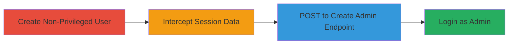

---
tags:
  - privilege-escalation
  - broken-access-control
  - auth-bypass
  - shopify
  - stocky
type: attack_chain
tools: []
tactics:
  - '[[Initial Access]]'
  - '[[Persistence]]'
verified: false
platforms:
  - Web
submitted: true
complexity: medium
created_at: '2023-10-01T00:00:00Z'
procedures:
  - '[[procedures/Create-Non-Privileged-User-in-Stocky]]'
  - '[[procedures/Intercept-Session-Cookies-and-Authenticity-Token]]'
  - '[[procedures/Exploit-Create-Admin-Endpoint]]'
  - '[[procedures/Login-as-New-Admin-User]]'
step_count: 4
techniques:
  - '[[Exploit Public-Facing Application]]'
  - '[[Valid Accounts]]'
  - '[[Exploitation for Privilege Escalation]]'
updated_at: '2025-12-14T17:30:27.390Z'
description: >-
  Non-privileged user escalates to admin privileges in Stocky by intercepting
  session data and posting directly to the /users/create_admin endpoint,
  bypassing authorization checks.
skill_level: intermediate
impact_level: high
id: 078077c5-6fef-4d65-b8db-4d590176ff76
validated: true
mitre_tactics:
  - '[[Initial Access]]'
  - '[[Persistence]]'
mitre_techniques:
  - '[[Exploit Public-Facing Application]]'
  - '[[Valid Accounts]]'
  - '[[Exploitation for Privilege Escalation]]'
---
# Stocky Admin Privilege Escalation via Unauthorized Create Admin Endpoint

Multi-stage attack chain demonstrating privilege escalation in the Stocky Shopify app, where a non-privileged user can create an admin account by exploiting missing authorization on the /users/create_admin endpoint. This allows full control over inventory, vendors, and purchase orders.

## Chain Metrics Dashboard

| Metric | Value |
|--------|-------|
| Chain Status | Unverified |
| Total Steps | 4 |
| Execution Time | ~5 minutes |
| Skill Level | Intermediate |
| Complexity | Medium |
| Impact Level | High |

## Attack Flow Visualization

## Prerequisites & Requirements

### Required Tools

- Browser with developer tools (e.g., Chrome DevTools) or proxy like Burp Suite for interception

### Target Environment

- Web platform
- Stocky app on Shopify (https://stocky.shopifyapps.com)
- Ruby on Rails backend
- Requires Shopify 'Apps and channels' permission for access

### Initial Access Requirements

- Valid Shopify account with 'Apps and channels' permission
- Ability to create a non-privileged user in Stocky
- Network access to Stocky login and endpoints

## Detailed Attack Procedures

### Step 1: Create Non-Privileged User
procedure: [[procedures/Create-Non-Privileged-User-in-Stocky]]

**Objective**: Establish a low-privilege session in Stocky to use for interception.

**Instructions**: Access the Stocky admin panel via Shopify and create a new user without admin privileges. Ensure the user has basic access but no elevated roles.

**Expected Output**: Confirmation of user creation with non-admin status.

**Success Indicators**:
- User listed in Stocky users without admin flag
- Able to login with the new credentials

### Step 2: Intercept Session Cookies and Authenticity Token
procedure: [[procedures/Intercept-Session-Cookies-and-Authenticity-Token]]

**Objective**: Capture session artifacts needed to authenticate the admin creation request.

**Instructions**: Login as the non-privileged user, navigate to the profile page (/users/me), and submit a form update to capture the request. Use browser dev tools or a proxy to extract cookies and the authenticity_token from the intercepted request.

**Expected Output**: Cookies (e.g., _stocky_session) and authenticity_token value.

**Success Indicators**:
- Valid session cookies obtained
- Authenticity token extracted from form or headers

### Step 3: Exploit Create Admin Endpoint
procedure: [[procedures/Exploit-Create-Admin-Endpoint]]

**Objective**: Bypass authorization by directly posting to the admin creation endpoint using intercepted data.

**Instructions**: Use the captured cookies and token to craft a POST request to /users/create_admin. Replace placeholders with actual values and execute via curl or similar tool.

**Expected Output**: HTTP 200/302 response indicating successful admin creation, with redirect to login or dashboard.

**Success Indicators**:
- New admin user created in Stocky
- No authorization error in response

### Step 4: Login as New Admin User
procedure: [[procedures/Login-as-New-Admin-User]]

**Objective**: Verify and access the elevated privileges.

**Instructions**: Logout from the current session, then login using the new admin credentials at the Stocky login page.

**Expected Output**: Successful login with admin dashboard access, showing privileges for inventory, vendors, and orders.

**Success Indicators**:
- Admin interface loaded
- Ability to perform admin actions like managing purchase orders

## Attack Chain Summary

### Key Achievements

1. Bypassed Stocky authorization to create admin from non-privileged session
2. Exploited authenticity token leakage from invalid login attempts
3. Gained full admin control without Shopify admin permissions
4. Demonstrated impact on business operations via unauthorized inventory management

## Technique & Tactic Coverage

### MITRE ATT&CK Techniques

- [[Exploit Public-Facing Application]]
- [[Valid Accounts]]
- [[Exploitation for Privilege Escalation]]

### MITRE ATT&CK Tactics

- [[Initial Access]]
- [[Persistence]]

---
*Last updated: 2023-10-01T00:00:00Z*
