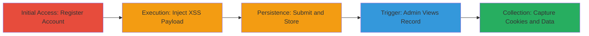

---
tags:
  - xss
  - stored-xss
  - blind-xss
  - web-vulnerability
  - cookie-theft
type: attack_chain
tools:
  - '[[tools/xsshunter]]'
tactics:
  - '[[Initial Access]]'
  - '[[Execution]]'
  - '[[Collection]]'
verified: false
platforms:
  - Web
submitted: true
complexity: medium
created_at: '2023-10-01T00:00:00Z'
procedures:
  - '[[procedures/Access-Registration-Page-and-Create-Account]]'
  - '[[procedures/Inject-Blind-XSS-Payload-in-Company-Field]]'
  - '[[procedures/Submit-Registration-to-Store-Payload]]'
  - '[[procedures/Wait-for-Admin-Trigger-of-Stored-XSS]]'
  - '[[procedures/Monitor-and-Capture-XSS-Execution]]'
step_count: 5
techniques:
  - '[[Exploit Public-Facing Application]]'
  - '[[JavaScript]]'
updated_at: '2025-12-14T17:29:20.223Z'
description: >-
  A multi-stage attack exploiting improper HTML sanitization in the Company
  field of Informatica's registration form to store a blind XSS payload, which
  executes in the admin panel to steal cookies and leak user data.
skill_level: intermediate
impact_level: high
id: ba7190d4-ba3c-4ddf-9b21-ea506508d7a7
validated: true
mitre_tactics:
  - '[[Initial Access]]'
  - '[[Execution]]'
  - '[[Collection]]'
mitre_techniques:
  - '[[Exploit Public-Facing Application]]'
  - '[[JavaScript]]'
---
# Stored Blind XSS in Informatica Registration Form for Admin Cookie Theft

Multi-stage attack chain demonstrating a complete attack workflow exploiting improper HTML sanitization in the registration form to achieve stored XSS execution in the admin context.

## Chain Metrics Dashboard

| Metric | Value |
|--------|-------|
| Chain Status | Unverified |
| Total Steps | 5 |
| Execution Time | ~30 minutes |
| Skill Level | Intermediate |
| Complexity | Medium |
| Impact Level | High |

## Attack Flow Visualization

## Prerequisites & Requirements

### Required Tools

- [[tools/xsshunter]]

### Target Environment

- Web platform
- Access to public-facing registration form at https://accounts.informatica.com/registration.html
- No specific ports or services beyond standard HTTPS (443)

### Initial Access Requirements

- No credentials required for registration
- Public internet access
- No prior access needed

## Detailed Attack Procedures

### Step 1: Initial Access
procedure: [[procedures/Access-Registration-Page-and-Create-Account]]

**Objective**: Gain initial foothold by creating a temporary user account to store the malicious payload.

**Instructions**: Navigate to the registration page and fill out the required fields with arbitrary but valid data, such as a fake name, email, and password. Avoid using the Company field in this step to prepare for payload injection.

**Expected Output**: Successful navigation to the form without errors.

**Success Indicators**:
- Registration form loads correctly
- Form fields are accessible for input

### Step 2: Execution
procedure: [[procedures/Inject-Blind-XSS-Payload-in-Company-Field]]

**Objective**: Introduce the malicious JavaScript payload into the unsanitized Company field to enable stored XSS.

**Instructions**: In the Company input field, enter the blind XSS payload: `">`. This payload closes any open HTML tags and injects a script tag sourcing from an external XSS monitoring service.

**Expected Output**: Payload entered without form validation errors.

**Success Indicators**:
- Payload is accepted in the field
- No immediate JavaScript errors on the client side

### Step 3: Persistence
procedure: [[procedures/Submit-Registration-to-Store-Payload]]

**Objective**: Complete the registration to persist the payload in the backend user record.

**Instructions**: Submit the form after filling all fields, including the injected payload in Company. The system stores the input without sanitization, saving the payload in the database.

**Expected Output**: Account creation confirmation, such as a success message or email verification.

**Success Indicators**:
- Registration completes successfully
- Temporary account is created

### Step 4: Privilege Escalation
procedure: [[procedures/Wait-for-Admin-Trigger-of-Stored-XSS]]

**Objective**: Await admin interaction with the stored user record to trigger the XSS in a privileged context.

**Instructions**: No active action required; monitor passively. The payload executes when an admin views the record via admin panel URLs like https://█████████/phnx/driver.aspx?routename=Social/UniversalProfile/UserRecordEdit&TargetUser=480514&FromSearch=True#loaded or https://█████████/admin/OrgUnitList.aspx.

**Expected Output**: Payload fires upon admin access, sending data to the external endpoint.

**Success Indicators**:
- Notification from XSS hunter service
- No direct confirmation without monitoring tool

### Step 5: Objective
procedure: [[procedures/Monitor-and-Capture-XSS-Execution]]

**Objective**: Collect stolen data including admin cookies, IP addresses, and leaked user information.

**Instructions**: Use the XSS Hunter dashboard to view execution reports, which include victim IP, HTTP headers, cookies, and any leaked data like other users' names and emails.

**Expected Output**: Dashboard alerts with captured data such as admin session cookies and backend details.

**Success Indicators**:
- XSS hit reported
- Sensitive data (cookies, IPs, user info) received

## Attack Chain Summary

### Key Achievements

1. Successful storage of blind XSS payload in public registration form
2. Execution in admin context leading to cookie theft and data exfiltration
3. Exposure of backend server IPs and other user PII without direct access

## Technique & Tactic Coverage

### MITRE ATT&CK Techniques

- [[Exploit Public-Facing Application]]
- [[JavaScript]]

### MITRE ATT&CK Tactics

- [[Initial Access]]
- [[Execution]]
- [[Collection]]

---

*Last updated: 2023-10-01T00:00:00Z*
