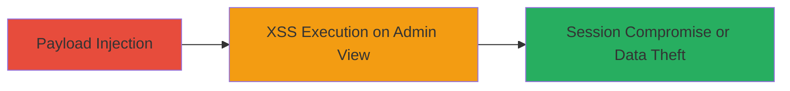

---
tags:
  - xss
  - stored-xss
  - blind-xss
  - web-vulnerability
type: attack_chain
tools: []
tactics:
  - '[[Execution]]'
  - '[[Collection]]'
verified: false
platforms:
  - Web
submitted: true
complexity: low
created_at: '2023-10-01T00:00:00Z'
procedures:
  - '[[procedures/Inject-Stored-Blind-XSS-in-Contact-Form]]'
step_count: 1
techniques:
  - '[[Exploit Public-Facing Application]]'
  - '[[JavaScript]]'
updated_at: '2025-12-14T03:47:23.564Z'
description: >-
  A stored blind XSS vulnerability in the Mapbox contact form allows injection
  of malicious JavaScript payloads that execute when admins view or process the
  submitted messages.
skill_level: beginner
impact_level: high
id: c39fa93a-ca08-428d-b519-7cc1c1dcd228
validated: true
mitre_tactics:
  - '[[Execution]]'
  - '[[Collection]]'
mitre_techniques:
  - '[[Exploit Public-Facing Application]]'
  - '[[JavaScript]]'
---
# Stored Blind XSS in Mapbox Contact Form

Multi-stage attack chain demonstrating a complete attack workflow.

## Chain Metrics Dashboard

| Metric | Value |
|--------|-------|
| Chain Status | Unverified |
| Total Steps | 1 |
| Execution Time | ~1 minutes |
| Skill Level | Beginner |
| Complexity | Low |
| Impact Level | High |

## Attack Flow Visualization



## Prerequisites & Requirements

### Required Tools

- None (manual submission or basic HTTP client like curl)

### Target Environment

- Web platform
- Public-facing contact form endpoint (/contact)
- No specific services/ports required beyond HTTP/HTTPS

### Initial Access Requirements

- Public internet access to www.mapbox.com
- No credentials needed
- No prior access required

## Detailed Attack Procedures

### Step 1: Payload Injection
procedure: [[procedures/Inject-Stored-Blind-XSS-in-Contact-Form]]

**Objective**: Submit a malicious XSS payload via the contact form to store it on the server for later execution by administrators.

**Instructions**: Use [[commands/curl-submit-xss-payload]] to POST a form with an injected JavaScript payload in the message field:

```bash
curl -X POST https://www.mapbox.com/contact \
  -d "name=TestUser" \
  -d "email=test@example.com" \
  -d "message=<script>alert('XSS')</script>" \
  -d "submit=Send"
```

Monitor for confirmation of submission, then wait for admin processing.

**Expected Output**: HTTP 200 or redirect confirming form submission; payload stored blindly without immediate feedback.

**Success Indicators**:
- Form submission succeeds without errors
- Payload is stored and later triggers alert or callback when viewed by admins

## Attack Chain Summary

### Key Achievements

1. Successful injection of stored XSS payload into contact form
2. Potential compromise of admin sessions via JavaScript execution
3. Demonstration of data theft or phishing capabilities

## Technique & Tactic Coverage

### MITRE ATT&CK Techniques

- [[Exploit Public-Facing Application]]
- [[JavaScript]]

### MITRE ATT&CK Tactics

- [[Execution]]
- [[Collection]]

---
*Last updated: 2023-10-01T00:00:00Z*
