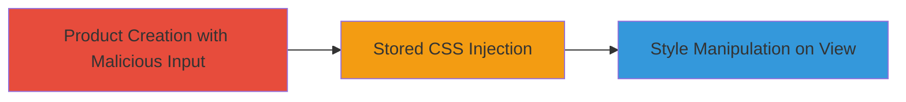

---
tags:
  - css-injection
  - stored-injection
  - web-vulnerability
type: attack_chain
tools: []
tactics:
  - '[[Execution]]'
commands: []
platforms:
  - Web
complexity: low
procedures:
  - '[[procedures/Inject-Malicious-CSS-via-Unescaped-logo_url]]'
step_count: 1
techniques:
  - '[[Exploit Public-Facing Application]]'
description: >-
  A stored CSS injection vulnerability in Coinbase's product creation feature
  allowing malicious CSS to be injected via the logo_url parameter, limited by
  CSP to prevent XSS.
skill_level: beginner
impact_level: low
id: bb59df92-e51c-44b5-8a41-fa4a01abe65a
created_at: '2025-12-14T03:47:12.686Z'
updated_at: '2025-12-14T03:47:12.687Z'
verified: false
validated: true
submitted: true
mitre_tactics:
  - '[[Execution]]'
mitre_techniques:
  - '[[Exploit Public-Facing Application]]'
---
# Stored CSS Injection via Unescaped Logo URL in Product Creation

## Overview

This attack chain demonstrates a stored CSS injection vulnerability in Coinbase's product creation feature. An attacker can inject malicious CSS code through the unescaped logo_url parameter, which gets rendered inside a style tag. The injection is stored and displayed to other users viewing the product, but the Content Security Policy (CSP) blocks any potential XSS execution, limiting the impact to cosmetic or minor style manipulations. Discovered by researcher cablej and reported on February 14, 2018, via HackerOne report #315865.

## Chain Metrics Dashboard

| Metric | Value |
|--------|-------|
| Chain Status | Unverified |
| Total Steps | 1 |
| Execution Time | ~5 minutes |
| Skill Level | Beginner |
| Complexity | Low |
| Impact Level | Low |

## Attack Flow Visualization

## Prerequisites & Requirements

### Required Tools

- Web browser (e.g., Chrome Developer Tools for testing)

### Target Environment

- Web application (Coinbase product creation endpoint)
- Authenticated access to create products

### Initial Access Requirements

- Valid user account with permission to create products
- Network access to the web application

## Detailed Attack Procedures

### Step 1: Inject Malicious CSS via Product Creation
procedure: [[procedures/Inject-Malicious-CSS-via-Unescaped-logo_url]]

**Objective**: Submit a product creation request with a crafted logo_url that injects malicious CSS into a style tag, enabling stored style manipulation viewable by other users.

**Instructions**: Access the product creation form or API endpoint. In the logo_url field, input a URL that includes unescaped characters to break out of the attribute and inject CSS, such as `https://example.com/logo.png" style="background: red;">`. The script tag will be blocked by CSP, but the style injection will apply.

**Expected Output**: The product is created successfully, and when viewed by others (or yourself), the injected CSS modifies the page styling, e.g., changing background colors.

**Success Indicators**:
- Product created without errors
- Viewing the product page shows applied malicious styles (e.g., red background)
- No JavaScript execution due to CSP

## Attack Chain Summary

### Key Achievements

1. Successful injection of CSS code via stored logo_url parameter
2. Demonstration of style manipulation on product view pages
3. Confirmation that CSP mitigates XSS risks

## Technique & Tactic Coverage

### MITRE ATT&CK Techniques

- [[Exploit Public-Facing Application]]

### MITRE ATT&CK Tactics

- [[Execution]]

---
*Last updated: 2023-10-01*
