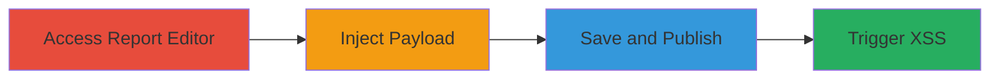

# Stored DOM XSS in Infogram Report Overview Table for Arbitrary JavaScript Execution

Multi-stage attack chain demonstrating exploitation of a stored DOM-based XSS vulnerability in Infogram's Report Designer, where unsanitized user input in the Overview Table allows injection of HTML and JavaScript. This leads to arbitrary code execution in the browser of any user viewing the published report, enabling session hijacking, data theft, or phishing attacks.

## Chain Metrics Dashboard

| Metric | Value |
|--------|-------|
| Chain Status | Unverified |
| Total Steps | 4 |
| Execution Time | ~5 minutes |
| Skill Level | Beginner |
| Complexity | Low |
| Impact Level | High |

## Attack Flow Visualization

## Prerequisites & Requirements

### Required Tools

- Web browser (e.g., Chrome, Firefox)

### Target Environment

- Infogram platform (https://infogram.com)
- Access to report creation (free account sufficient)

### Initial Access Requirements

- Valid Infogram user account
- No special privileges needed
- Internet access to Infogram services

## Detailed Attack Procedures

### Step 1: Access Report Creation Interface
procedure: [[procedures/Access-Infogram-Report-Editor]]

**Objective**: Gain entry to the Infogram report editing environment to prepare for payload injection.

**Instructions**: Log in to your Infogram account and navigate to the report creation or editing section. Use the provided editing URL if accessing an existing report.

**Expected Output**: Report editor interface loads, showing the Overview Table section.

**Success Indicators**:
- Editor URL accessible (e.g., https://infogram.com/app/#edit/e7b161f1-f708-48e5-bab7-de9887ae202a)
- Overview Table field visible for input

### Step 2: Inject Malicious Payload
procedure: [[procedures/Inject-Malicious-Payload-in-Overview-Table]]

**Objective**: Insert unsanitized HTML/JavaScript into the Overview Table to store the XSS payload.

**Instructions**: In the Overview Table field, enter the malicious payload as text content. No special tools required; direct input via the web interface.

**Expected Output**: Payload appears in the table without visible errors during editing.

**Success Indicators**:
- Payload saved temporarily in the editor
- No immediate sanitization or rejection of HTML tags

### Step 3: Save and Publish Report
procedure: [[procedures/Save-and-Publish-Infogram-Report]]

**Objective**: Persist the injected payload by saving and making the report publicly viewable.

**Instructions**: Click the save button in the editor, then publish the report to generate a public URL.

**Expected Output**: Public report URL generated (e.g., https://infogram.com/report-classic-1g57pr0g3xdvp01).

**Success Indicators**:
- Report saves without errors
- Public link shares successfully
- Payload visible in preview

### Step 4: Trigger Vulnerability
procedure: [[procedures/Trigger-DOM-XSS-via-Report-Viewing]]

**Objective**: Execute the stored JavaScript by interacting with the published report in a victim's browser.

**Instructions**: Share the public URL with a target or open it in another browser/session. Hover over the injected link to fire the onmouseover event.

**Expected Output**: JavaScript alert pops up (e.g., "HackerOne MkSecurity Dom XSS").

**Success Indicators**:
- Alert executes on hover
- Arbitrary JS runs in browser context
- Potential for further exploitation like cookie theft

## Attack Chain Summary

### Key Achievements

1. Successful injection and storage of XSS payload in Infogram's Overview Table.
2. Publication of a malicious report accessible to any viewer.
3. Execution of arbitrary JavaScript in victim browsers, demonstrating critical impact.

## Technique & Tactic Coverage

### MITRE ATT&CK Techniques

- [[JavaScript]]
- [[Exploit Public-Facing Application]]

### MITRE ATT&CK Tactics

- [[Execution]]
- [[Initial Access]]

---
*Last updated: 2023-10-01T00:00:00Z*
