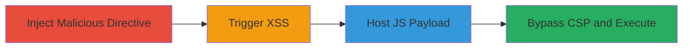
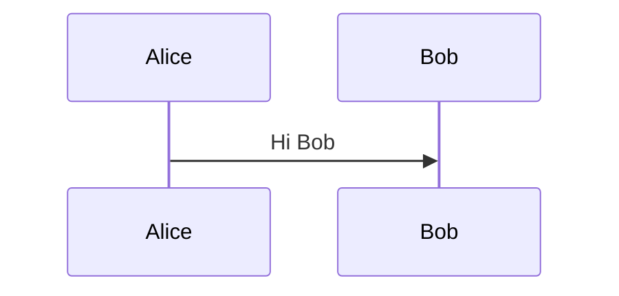

---
tags:
  - xss
  - dom-xss
  - stored-xss
  - csp-bypass
  - gitlab
  - mermaid
type: attack_chain
tools:
  - '[[tools/Mermaid]]'
  - '[[tools/GitLab-CI-CD]]'
  - '[[tools/Stylis]]'
tactics:
  - '[[Initial Access]]'
  - '[[Execution]]'
commands:
  - '[[commands/echo-test-in-gitlab-ci]]'
platforms:
  - Web
complexity: medium
procedures:
  - '[[procedures/Inject-Malicious-Mermaid-Directive-for-DOM-XSS]]'
  - '[[procedures/Trigger-XSS-in-GitLab-Issue]]'
  - '[[procedures/Host-JS-Payload-via-GitLab-CI-Artifact]]'
  - '[[procedures/Bypass-CSP-with-Iframe-Srcdoc-in-Mermaid-Payload]]'
step_count: 4
techniques:
  - '[[JavaScript]]'
  - '[[Disable or Modify Tools]]'
description: >-
  A multi-stage attack exploiting a stored DOM XSS vulnerability in GitLab's
  Mermaid integration, allowing arbitrary JavaScript execution in viewers'
  browsers, with a CSP bypass using GitLab CI artifacts.
skill_level: intermediate
impact_level: high
id: 4cdb4460-fc45-45a5-a429-5d71951fa457
created_at: '2025-12-13T23:52:24.614Z'
updated_at: '2025-12-13T23:52:24.614Z'
verified: false
validated: true
submitted: true
mitre_tactics:
  - '[[Initial Access]]'
  - '[[Execution]]'
mitre_techniques:
  - '[[JavaScript]]'
  - '[[Disable or Modify Tools]]'
---
# Stored DOM XSS via Unsanitized Mermaid Directives in GitLab Issues with CSP Bypass

Multi-stage attack chain demonstrating a complete attack workflow exploiting stored DOM XSS in GitLab's Mermaid library integration, leading to arbitrary JavaScript execution across users viewing affected issues.

## Chain Metrics Dashboard

| Metric | Value |
|--------|-------|
| Chain Status | Unverified |
| Total Steps | 4 |
| Execution Time | ~10 minutes |
| Skill Level | Intermediate |
| Complexity | Medium |
| Impact Level | High |

## Attack Flow Visualization



## Prerequisites & Requirements

### Required Tools

- [[tools/Mermaid]]
- [[tools/GitLab-CI-CD]]
- [[tools/Stylis]]

### Target Environment

- GitLab instance (self-hosted or gitlab.com)
- Required services/ports: Web interface (HTTPS/443)
- Network access requirements: Valid GitLab account with project creation and issue posting permissions

### Initial Access Requirements

- Credential requirements: Authenticated GitLab user
- Network position: Direct access to GitLab UI
- Prior access needed: Ability to create issues and projects

## Detailed Attack Procedures

### Step 1: Inject Malicious Mermaid Directive for DOM XSS
procedure: [[procedures/Inject-Malicious-Mermaid-Directive-for-DOM-XSS]]

**Objective**: Insert a stored payload into a GitLab issue using Mermaid syntax to trigger DOM XSS via unsanitized directives.

**Instructions**: Use the GitLab UI to create a new issue in any repository. In the description, add a Mermaid code block with a malicious directive in the init configuration. For example:

````markdown

````

Save the issue. The payload merges into CSS rules without sanitization, injecting HTML/JS into a style tag via innerHTML.

**Expected Output**: Issue saved successfully; payload stored in Markdown.

**Success Indicators**:
- Issue renders a Mermaid diagram without errors on save
- Payload directive is preserved in the issue description

### Step 2: Trigger XSS in GitLab Issue
procedure: [[procedures/Trigger-XSS-in-GitLab-Issue]]

**Objective**: View the affected issue to execute the injected JavaScript, observing initial CSP violations.

**Instructions**: Navigate to the created issue page in the GitLab UI. The Mermaid library processes the directive, generating CSS with the injected payload and inserting it via innerHTML, triggering DOM XSS. Initially, CSP blocks inline script execution, showing errors in browser console.

**Expected Output**: Alert attempts to fire but is blocked by CSP; console logs CSP violations like "Refused to execute inline script".

**Success Indicators**:
- DOM manipulation occurs (e.g., img tag with onerror)
- CSP errors confirm injection but block execution

### Step 3: Host JS Payload via GitLab CI Artifact
procedure: [[procedures/Host-JS-Payload-via-GitLab-CI-Artifact]]

**Objective**: Create a persistent, CSP-allowed JavaScript host using GitLab CI/CD artifacts.

**Instructions**: Create a new GitLab project via UI. Add a file named `payload.js` with content:

```javascript
alert(document.cookie);
```

Create `.gitlab-ci.yml` with:

```yaml
js:
  script: '[[commands/echo-test-in-gitlab-ci]]'
  artifacts:
    paths:
      - payload.js
    expire_in: 4 weeks
```

Commit and push to trigger the CI job. Wait for completion, then navigate to CI/CD > Jobs > Latest Job > Artifacts to get the raw URL (e.g., `https://gitlab.com/<user>/<project>/-/jobs/<job_id>/artifacts/raw/payload.js`), served as `application/javascript`.

**Expected Output**: Artifact download link available; accessing URL returns JS content.

**Success Indicators**:
- CI job succeeds without errors
- Artifact URL loads JS file with correct Content-Type

### Step 4: Bypass CSP with Iframe Srcdoc in Mermaid Payload
procedure: [[procedures/Bypass-CSP-with-Iframe-Srcdoc-in-Mermaid-Payload]]

**Objective**: Escalate the injection to load and execute external JS from the GitLab domain, bypassing CSP.

**Instructions**: Create a new issue and insert an advanced Mermaid payload:

````markdown

````

The `<title>` forces HTML parsing in the style context. Save and view the issue; the iframe srcdoc loads the script from gitlab.com (CSP-allowed), executing the JS.

**Expected Output**: Alert pops up showing document cookies; no CSP errors.

**Success Indicators**:
- Iframe renders and script executes
- Arbitrary JS runs in viewer's context

## Attack Chain Summary

### Key Achievements

1. Stored injection of malicious directives into GitLab issues via Mermaid
2. Initial DOM XSS trigger with CSP observation
3. Self-hosted JS payload using GitLab CI for persistence
4. Full CSP bypass enabling cross-user JS execution

## Technique & Tactic Coverage

### MITRE ATT&CK Techniques

- [[JavaScript]]
- [[Disable or Modify Tools]]

### MITRE ATT&CK Tactics

- [[Initial Access]]
- [[Execution]]

---
*Last updated: 2023-10-01*
