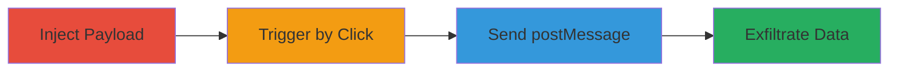

---
tags:
  - xss
  - dom-xss
  - shopify
  - javascript
  - postmessage
  - admin-injection
type: attack_chain
tools: []
tactics:
  - '[[Execution]]'
  - '[[Collection]]'
commands: []
platforms:
  - Web
complexity: medium
procedures:
  - '[[procedures/Inject-Malicious-Payload-into-Shopify-Admin-Page]]'
  - '[[procedures/Trigger-XSS-by-Clicking-Injected-Link]]'
  - '[[procedures/Manipulate-Admin-Page-State-with-postMessage]]'
step_count: 3
techniques:
  - '[[JavaScript]]'
description: >-
  A multi-stage stored DOM-based XSS attack exploiting improper filtering of
  invalid protocols in Shopify's admin panel to inject arbitrary content and
  exfiltrate sensitive admin session data.
skill_level: intermediate
impact_level: high
id: c2a684e0-e1fa-48dc-844d-71b1bc1cd2c3
created_at: '2025-12-14T17:30:07.277Z'
updated_at: '2025-12-14T17:30:07.277Z'
verified: false
validated: true
submitted: true
mitre_tactics:
  - '[[Execution]]'
  - '[[Collection]]'
mitre_techniques:
  - '[[JavaScript]]'
---
# Stored DOM-based XSS in Shopify Admin Panel via Invalid Protocols in pushState

Multi-stage attack chain demonstrating a complete attack workflow exploiting a stored DOM-based XSS vulnerability in Shopify's admin panel.

## Chain Metrics Dashboard

| Metric | Value |
|--------|-------|
| Chain Status | Unverified |
| Total Steps | 3 |
| Execution Time | ~5 minutes |
| Skill Level | Intermediate |
| Complexity | Medium |
| Impact Level | High |

## Attack Flow Visualization



## Prerequisites & Requirements

### Required Tools

- Browser developer tools for JavaScript execution
- Access to a Shopify admin account or prior injection vector

### Target Environment

- Shopify admin panel (web application)
- JavaScript-enabled browser
- No specific ports or services beyond standard HTTPS (443)

### Initial Access Requirements

- Ability to inject payloads into admin-accessible pages (builds on prior report #662083 for storage)
- Active admin session to abuse for data extraction
- Network access to the Shopify instance

## Detailed Attack Procedures

### Step 1: Inject Payload
procedure: [[procedures/Inject-Malicious-Payload-into-Shopify-Admin-Page]]

**Objective**: Store a malicious JavaScript payload in a page accessible to the admin, setting up the stored XSS.

**Instructions**: Follow the injection steps from the previous report (#662083) to store the payload. Replace the original step 02 script with the new payload that defines an attack function and includes a clickable link. The payload script should be:

```javascript
function attack() {
  var win = window.open(location.origin + '/admin/themes', '_blank');
  var interval = setInterval(function() {
    if (win.attackSuccess) {
      clearInterval(interval);
    } else {
      win.postMessage({message: 'Shopify.API.pushState', data: {pathname: 'invalid:pages/xss'}}, '*');
    }
  }, 100);
}
// Add a clickable link: <a href="javascript:attack()">Click me</a>
```

Embed this into the storable content field as per the prior report's method.

**Expected Output**: The payload is stored successfully, and the link appears on the admin-accessible page without immediate execution.

**Success Indicators**:
- Payload confirmed stored via page inspection
- No immediate errors or sanitization blocks the injection

### Step 2: Trigger XSS
procedure: [[procedures/Trigger-XSS-by-Clicking-Injected-Link]]

**Objective**: Execute the injected JavaScript by interacting with the stored link, opening a new window to the admin themes page.

**Instructions**: Navigate to the page where the payload was injected. Click the malicious link, which invokes `javascript:attack()`. This opens a new browser window targeted at `location.origin + '/admin/themes'` in a blank context.

Monitor the browser console for any execution traces.

**Expected Output**: A new window opens to the Shopify admin themes page, ready for further manipulation.

**Success Indicators**:
- New window loads the admin themes page without errors
- JavaScript execution confirmed in console (no CSP blocks)

### Step 3: Manipulate State
procedure: [[procedures/Manipulate-Admin-Page-State-with-postMessage]]

**Objective**: Use postMessage to exploit the invalid protocol handling in Shopify.API.pushState, injecting arbitrary content into the admin panel and enabling data exfiltration.

**Instructions**: With the new window open, the interval in the attack function begins sending postMessage events. The message payload is a JSON object: `{message: 'Shopify.API.pushState', data: {pathname: 'invalid:pages/xss'}}`. This is sent repeatedly to the window until `window.attackSuccess` is set to true by the receiving side.

The invalid protocol 'invalid:' bypasses filters, causing the DOM to render injected content from '/pages/xss', allowing arbitrary JavaScript execution in the admin context.

To exfiltrate data, extend the injected content to capture session tokens or configurations via additional postMessage or direct access.

**Expected Output**: The admin panel pathname updates to include the injected 'invalid:pages/xss', rendering attacker-controlled content that can access DOM elements for data theft.

**Success Indicators**:
- postMessage received and processed without rejection
- Admin panel displays injected content or altered pathname
- Sensitive data (e.g., tokens) accessible via console or network requests

## Attack Chain Summary

### Key Achievements

1. Successful storage of XSS payload building on prior vulnerability
2. Bypassing protocol filters to inject arbitrary admin content
3. Abuse of admin session for sensitive data extraction like tokens and store configs

## Technique & Tactic Coverage

### MITRE ATT&CK Techniques

- [[JavaScript]]

### MITRE ATT&CK Tactics

- [[Execution]]
- [[Collection]]

---
*Last updated: 2023-10-01T00:00:00Z*
