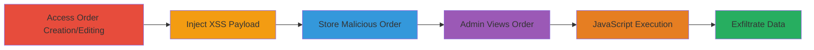

---
tags:
  - xss
  - dom-xss
  - woocommerce
  - wordpress
type: attack_chain
tools:
  - '[[tools/Web-Intercept-Proxy]]'
tactics:
  - '[[Initial Access]]'
  - '[[Execution]]'
  - '[[Collection]]'
verified: false
platforms:
  - Web
submitted: true
complexity: medium
created_at: '2023-10-01T00:00:00Z'
procedures:
  - '[[procedures/Inject-XSS-into-WooCommerce-State-Fields]]'
step_count: 6
techniques:
  - '[[JavaScript]]'
  - '[[Exploit Public-Facing Application]]'
updated_at: '2025-12-13T23:52:33.793Z'
description: >-
  Demonstrates exploitation of a stored DOM-based XSS vulnerability in
  WooCommerce 3.5.6 via unescaped user input in billing/shipping state fields,
  allowing JavaScript execution when admins view orders.
skill_level: intermediate
impact_level: high
id: e56c4a4a-3854-4cfe-bad7-8829849f5f05
validated: true
mitre_tactics:
  - '[[Initial Access]]'
  - '[[Execution]]'
  - '[[Collection]]'
mitre_techniques:
  - '[[JavaScript]]'
  - '[[Exploit Public-Facing Application]]'
---
# Stored DOM-based XSS in WooCommerce Order State Fields

Multi-stage attack chain demonstrating exploitation of a stored DOM-based XSS in WooCommerce 3.5.6, where malicious payloads injected into _shipping_state or _billing_state fields during order creation or editing execute JavaScript when administrators view the order page. This can lead to session hijacking, cookie theft, or further compromise of the admin's browser.

## Chain Metrics Dashboard

| Metric | Value |
|--------|-------|
| Chain Status | Unverified |
| Total Steps | 6 |
| Execution Time | ~5 minutes |
| Skill Level | Intermediate |
| Complexity | Medium |
| Impact Level | High |

## Attack Flow Visualization

## Prerequisites & Requirements

### Required Tools

- [[tools/Web-Intercept-Proxy]]

### Target Environment

- WordPress with WooCommerce 3.5.6 plugin
- Web application accessible via browser
- Admin access for primary path; customer access for alternative

### Initial Access Requirements

- Valid admin credentials for direct order manipulation
- Or customer session to reach checkout
- Network access to the WordPress site

## Detailed Attack Procedures

### Step 1: Access WooCommerce Order Management

procedure: [[procedures/Inject-XSS-into-WooCommerce-State-Fields]]

**Objective**: Navigate to the order creation or editing interface to prepare for payload injection.

**Instructions**: Log in as an admin and go to WooCommerce > Add Order (or edit an existing order) from the WordPress admin menu.

**Expected Output**: Order form loads with billing/shipping sections.

**Success Indicators**:
- Admin dashboard accessible
- Order add/edit page displayed

### Step 2: Expand Billing or Shipping Form

procedure: [[procedures/Inject-XSS-into-WooCommerce-State-Fields]]

**Objective**: Reveal the state field for payload input.

**Instructions**: Click the pencil icon next to Billing or Shipping to expand the input form.

**Expected Output**: Editable fields for address details appear.

**Success Indicators**:
- Form expands successfully
- State/County field visible

### Step 3: Enable State Input

procedure: [[procedures/Inject-XSS-into-WooCommerce-State-Fields]]

**Objective**: Select a country to activate the state dropdown or input.

**Instructions**: In the Country dropdown, select a country (e.g., United States) to enable the State field.

**Expected Output**: State field becomes available for entry.

**Success Indicators**:
- Country selected
- State input field enabled

### Step 4: Inject Malicious Payload

procedure: [[procedures/Inject-XSS-into-WooCommerce-State-Fields]]

**Objective**: Insert XSS payload into the state field to store malicious script.

**Instructions**: Enter the payload `'><img src=/ onerror="alert(location.host)"` into the State / County field.

**Expected Output**: Payload accepted without validation errors.

**Success Indicators**:
- Payload entered successfully
- No immediate sanitization rejection

### Step 5: Create or Update Order

procedure: [[procedures/Inject-XSS-into-WooCommerce-State-Fields]]

**Objective**: Persist the order with the injected payload.

**Instructions**: Click the Create button (or Update if editing).

**Expected Output**: Order saved; confirmation message appears.

**Success Indicators**:
- Order created/updated
- Payload stored in database

### Step 6: Trigger Payload Execution

procedure: [[procedures/Inject-XSS-into-WooCommerce-State-Fields]]

**Objective**: View the order as admin to execute the DOM-based XSS.

**Instructions**: Navigate back to the order edit page; the payload executes, displaying an alert with the host.

**Expected Output**: JavaScript alert pops up showing location.host or document.cookie (in alternative).

**Success Indicators**:
- Alert executes
- Potential for cookie theft or session hijack

## Attack Chain Summary

### Key Achievements

1. Successful injection of XSS payload into order state fields without escaping.
2. Storage and persistence of malicious input in WooCommerce orders.
3. Execution of arbitrary JavaScript in admin browser context upon order viewing.

## Technique & Tactic Coverage

### MITRE ATT&CK Techniques

- [[JavaScript]]
- [[Exploit Public-Facing Application]]

### MITRE ATT&CK Tactics

- [[Initial Access]]
- [[Execution]]
- [[Collection]]

---
*Last updated: 2023-10-01T00:00:00Z*
