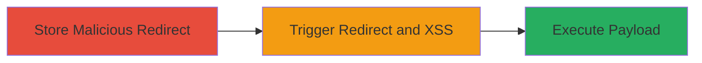

---
tags:
  - open-redirect
  - xss
  - stored-xss
  - web-vulnerability
type: attack_chain
tools: []
tactics:
  - '[[Initial Access]]'
  - '[[Execution]]'
verified: false
platforms:
  - Web
submitted: true
complexity: medium
created_at: '2023-10-01T00:00:00Z'
procedures:
  - '[[procedures/Exploit-Stored-Open-Redirect-in-About-Page]]'
  - '[[procedures/Trigger-XSS-via-HTML-Parsing-Bug]]'
step_count: 2
techniques:
  - '[[Drive-by Compromise]]'
  - '[[JavaScript]]'
updated_at: '2025-12-14T17:24:30.774Z'
description: >-
  A multi-stage web attack exploiting a stored open redirect vulnerability in
  Flickr's about page, which uncovers an underlying HTML parsing bug enabling
  XSS execution.
skill_level: intermediate
impact_level: medium
id: 6fd87cf7-e1b0-441a-9770-61bf508aab9f
validated: true
mitre_tactics:
  - '[[Initial Access]]'
  - '[[Execution]]'
mitre_techniques:
  - '[[Drive-by Compromise]]'
  - '[[JavaScript]]'
---
# Stored Open Redirect Chained to XSS in Flickr About Page

Multi-stage attack chain demonstrating exploitation of a stored open redirect in Flickr's about page, which reveals an HTML parsing bug leading to XSS. Discovered and reported via HackerOne on September 11, 2020, this vulnerability allows attackers to redirect users to malicious sites and execute scripts in the victim's browser.

## Chain Metrics Dashboard

| Metric | Value |
|--------|-------|
| Chain Status | Unverified |
| Total Steps | 2 |
| Execution Time | ~5 minutes |
| Skill Level | Intermediate |
| Complexity | Medium |
| Impact Level | Medium |

## Attack Flow Visualization

## Prerequisites & Requirements

### Required Tools

- Web browser (e.g., Chrome with developer tools)
- Proxy tool like Burp Suite for interception (optional)

### Target Environment

- Flickr web application
- Access to user account for storing content on about page
- No specific ports; standard HTTPS (443)

### Initial Access Requirements

- Valid Flickr user account
- Network access to flickr.com
- No prior privileged access needed

## Detailed Attack Procedures

### Step 1: Store Malicious Open Redirect
procedure: [[procedures/Exploit-Stored-Open-Redirect-in-About-Page]]

**Objective**: Inject a malicious URL into the about page that triggers an uncontrolled redirect when viewed by other users.

**Instructions**: Log in to a Flickr account and navigate to the about page or profile section where user input is stored (e.g., bio or description field). Submit a crafted URL intended for redirection, such as one pointing to a phishing site. The vulnerability allows this URL to be stored without validation, leading to open redirection upon page load.

For testing, use browser developer tools to inspect the stored content:

- Open DevTools (F12)
- Navigate to the about page
- Check if the redirect URL is reflected in the HTML

**Expected Output**: The submitted URL is stored and visible on the about page without sanitization.

**Success Indicators**:
- Redirect URL appears in page source
- Clicking or loading the page attempts to redirect to the external URL

### Step 2: Chain to XSS Exploitation
procedure: [[procedures/Trigger-XSS-via-HTML-Parsing-Bug]]

**Objective**: Leverage the open redirect's HTML parsing flaw to inject and execute JavaScript, enabling session hijacking or data theft.

**Instructions**: During investigation of the redirect, craft a payload that exploits the HTML parsing bug, such as embedding JavaScript within the redirect URL or using HTML tags that the parser mishandles (e.g., `` disguised in the redirect parameter). View the about page as another user to trigger the redirect, which parses the input insecurely and executes the XSS payload.

Monitor with proxy tools if available:

- Intercept the request to the about page
- Modify parameters to include XSS payload
- Observe execution in the browser console

**Expected Output**: JavaScript alert or console log fires, confirming XSS execution.

**Success Indicators**:
- Script executes in victim's browser context
- Potential for cookie theft or further exploitation

## Attack Chain Summary

### Key Achievements

1. Successful storage of open redirect payload
2. Discovery and exploitation of chained XSS via parsing bug
3. Medium-impact vulnerability leading to phishing and script execution

## Technique & Tactic Coverage

### MITRE ATT&CK Techniques

- [[Drive-by Compromise]]
- [[JavaScript]]

### MITRE ATT&CK Tactics

- [[Initial Access]]
- [[Execution]]

---
*Last updated: 2023-10-01T00:00:00Z*
