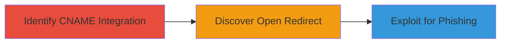

# Stored Open Redirect via Third-Party CNAME Inheritance on Twitter Subdomains

Multi-stage attack chain demonstrating a complete attack workflow exploiting an inherited open redirect vulnerability on Twitter subdomains through a third-party vendor's CNAME configuration, allowing attackers to craft phishing URLs that redirect users to malicious sites while masquerading as legitimate Twitter domains.

## Chain Metrics Dashboard

| Metric | Value |
|--------|-------|
| Chain Status | Unverified |
| Total Steps | 3 |
| Execution Time | ~5 minutes |
| Skill Level | Intermediate |
| Complexity | Medium |
| Impact Level | High |

## Attack Flow Visualization



## Prerequisites & Requirements

### Required Tools

- Browser developer tools for URL testing
- DNS resolution tools like [[commands/dig-resolve]]

### Target Environment

- Web platform
- Access to public DNS records
- No authentication required

### Initial Access Requirements

- Public internet access
- No credentials needed
- Ability to craft and test URLs

## Detailed Attack Procedures

### Step 1: Identify Third-Party Integration via CNAME Resolution
procedure: [[procedures/Identify-Third-Party-Integration-via-CNAME-Resolution]]

**Objective**: Discover hidden third-party integrations by resolving DNS records for target subdomains to identify CNAME pointers.

**Instructions**: Use DNS lookup tools to query the CNAME for twitterflightschool.com. For example, execute [[commands/dig-resolve]] to check the resolution:

```bash
dig twitterflightschool.com CNAME
```

This reveals the CNAME pointing to the third-party vendor's domain.

**Expected Output**: DNS response showing CNAME to vendor domain, e.g., "twitterflightschool.com is an alias for vendor.example.com".

**Success Indicators**:
- CNAME record identified linking to third-party
- Potential for inherited vulnerabilities noted

### Step 2: Discover Stored Open Redirect in Vendor Endpoint
dig-resolve
procedure: [[procedures/Discover-Stored-Open-Redirect-in-Vendor-Endpoint]]

**Objective**: Test the vendor's endpoint for open redirect vulnerabilities by manipulating URL parameters.

**Instructions**: Access the /widgets/experience endpoint and append a destination_url parameter with an arbitrary domain. Use a browser or [[commands/curl-test-url]] to send a request:

```bash
curl "https://vendor.example.com/widgets/experience?destination_url=https://evil.com"
```

Observe if the response or subsequent redirect accepts the arbitrary URL without validation.

**Expected Output**: Page or redirect that incorporates the arbitrary destination_url, confirming lack of sanitization.

**Success Indicators**:
- Arbitrary URL accepted in response
- Redirect behavior observed to attacker-controlled site

### Step 3: Exploit Open Redirect on Twitter Subdomains for Phishing
procedure: [[procedures/Exploit-Open-Redirect-on-Twitter-Subdomains-for-Phishing]]

**Objective**: Craft malicious URLs targeting Twitter subdomains to store open redirects, enabling phishing by leveraging user trust in Twitter domains.

**Instructions**: Using the inherited vulnerability, construct URLs for flightschool.twitter.com and takeflight.twitter.com with destination_url set to a phishing site. Test with [[commands/curl-test-url]]:

```bash
curl "https://www.twitterflightschool.com/widgets/experience?destination_url=https://evil.com"
```

Embed these in phishing campaigns to redirect users from trusted subdomains.

**Expected Output**: Stored redirect on Twitter subdomain leading to evil.com, mimicking legitimate Twitter traffic.

**Success Indicators**:
- Redirect active on Twitter subdomain
- Potential for user deception confirmed

## Attack Chain Summary

### Key Achievements

1. Identified CNAME-based inheritance of third-party vulnerability
2. Discovered and validated stored open redirect in vendor endpoint
3. Demonstrated phishing impact on Twitter subdomains

## Technique & Tactic Coverage

### MITRE ATT&CK Techniques

- [[Exploit Public-Facing Application]]
- [[Phishing]]

### MITRE ATT&CK Tactics

- [[Initial Access]]

---
*Last updated: 2023-10-01T00:00:00Z*
