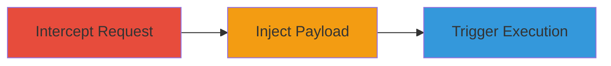

# Stored Passive XSS in Scheduled Posts Website Link Field

Multi-stage attack chain demonstrating a complete attack workflow for exploiting a stored passive XSS vulnerability in the Kit app (kitcrm.com) on Shopify.

## Chain Metrics Dashboard

| Metric | Value |
|--------|-------|
| Chain Status | Unverified |
| Total Steps | 3 |
| Execution Time | ~5 minutes |
| Skill Level | Intermediate |
| Complexity | Medium |
| Impact Level | Low |

## Attack Flow Visualization

## Prerequisites & Requirements

### Required Tools

- Proxy tool (e.g., Burp Suite for request interception)

### Target Environment

- Shopify-hosted app: Kit CRM (kitcrm.com)
- Access to authenticated session for creating/editing scheduled posts
- No specific ports or services beyond standard HTTPS (443)

### Initial Access Requirements

- Valid user account in the Kit app on Shopify
- Network access to the app's API endpoints
- No prior elevated privileges needed; exploits user-level access

## Detailed Attack Procedures

### Step 1: Intercept Scheduled Post Request
procedure: [[procedures/Intercept-Scheduled-Post-Request]]

**Objective**: Capture the HTTP request for creating or editing a scheduled post to prepare for payload injection.

**Instructions**: Use a proxy tool to intercept the POST request to the scheduled posts endpoint. Monitor traffic while attempting to create or edit a post in the Kit app dashboard.

**Expected Output**: Captured POST request to `/pages/{page_id}/manual_posts/{post_id}` with multipart/form-data body.

**Success Indicators**:
- Request intercepted successfully
- Form fields including 'website_link' visible in the proxy

### Step 2: Inject XSS Payload into Website Link
procedure: [[procedures/Inject-XSS-Payload-into-Website-Link]]

**Objective**: Modify the 'website_link' parameter in the intercepted request to include a JavaScript payload that bypasses any basic filtering.

**Instructions**: In the proxy tool, edit the multipart body to alter the 'website_link' field. For example, inject a payload like `javascript:alert('XSS')` or embed an event handler such as `<svg onload=alert('XSS')>`. Forward the modified request to the server.

**Expected Output**: Server responds with 200 OK, confirming successful post creation or modification with the stored payload.

**Success Indicators**:
- Modified request sent without errors
- Post saved in the app with the injected link

### Step 3: Trigger XSS by Viewing Post
procedure: [[procedures/Trigger-XSS-by-Viewing-Post]]

**Objective**: Access the scheduled post in the app and interact with the malicious link to execute the injected JavaScript.

**Instructions**: Navigate to the scheduled posts list in the Kit app, view the targeted post, and click the website link. The payload should execute in the browser context.

**Expected Output**: JavaScript alert or other payload effect (e.g., popup) in the user's browser.

**Success Indicators**:
- Payload executes on link click
- XSS confirmed via alert or console log

## Attack Chain Summary

### Key Achievements

1. Successful interception and modification of API requests
2. Storage of malicious JavaScript in the website link field
3. Execution of self-XSS upon user interaction, demonstrating the vulnerability

## Technique & Tactic Coverage

### MITRE ATT&CK Techniques

- [[JavaScript]]

### MITRE ATT&CK Tactics

- [[Execution]]

---
*Last updated: 2023-10-01T00:00:00Z*
