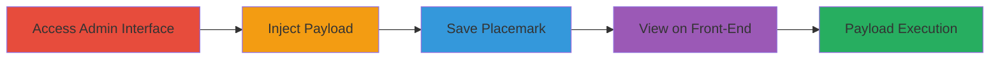

---
tags:
  - xss
  - stored-xss
  - self-xss
  - wordpress
  - plugin-vulnerability
type: attack_chain
tools: []
tactics:
  - '[[Execution]]'
verified: false
platforms:
  - Web
  - WordPress
submitted: true
complexity: low
created_at: '2023-10-01T00:00:00Z'
procedures:
  - '[[procedures/Access-Placemark-Creation-Interface]]'
  - '[[procedures/Inject-JavaScript-Payload-into-Title]]'
  - '[[procedures/Save-Placemark-with-Malicious-Title]]'
  - '[[procedures/Trigger-Self-XSS-by-Viewing-Placemark]]'
step_count: 4
techniques:
  - '[[JavaScript]]'
updated_at: '2025-12-14T03:15:47.203Z'
description: >-
  A multi-step attack demonstrating stored self-XSS in the WordPress plugin's
  placemark title field, allowing JavaScript execution limited to the
  authenticated user.
skill_level: beginner
impact_level: low
id: cc473bcf-8259-47cc-a39b-5cfff22a71c2
validated: true
mitre_tactics:
  - '[[Execution]]'
mitre_techniques:
  - '[[JavaScript]]'
---
# Stored Self-XSS in Basic Google Maps Placemarks Plugin Title Field

Multi-stage attack chain demonstrating a complete workflow for exploiting a stored self-XSS vulnerability in the Basic Google Maps Placemarks Settings WordPress plugin. The attack involves injecting a JavaScript payload into the placemark title field, which is stored without proper sanitization and executes when the authenticated user views the placemark on the front-end. This is a self-XSS, meaning it only affects the user who injected the payload, with no escalation to other users.

## Chain Metrics Dashboard

| Metric | Value |
|--------|-------|
| Chain Status | Unverified |
| Total Steps | 4 |
| Execution Time | ~2 minutes |
| Skill Level | Beginner |
| Complexity | Low |
| Impact Level | Low |

## Attack Flow Visualization

## Prerequisites & Requirements

### Required Tools

- Web browser (e.g., Chrome with developer tools for payload testing)

### Target Environment

- WordPress site with Basic Google Maps Placemarks Settings plugin installed and active
- Authenticated user with admin or editor privileges to create/edit placemarks
- No specific ports or services beyond standard HTTP/HTTPS access to WordPress admin and front-end

### Initial Access Requirements

- Valid WordPress credentials for an authenticated user
- Direct access to the WordPress admin dashboard
- No prior network compromise needed; assumes legitimate user session

## Detailed Attack Procedures

### Step 1: Access Placemark Creation Interface
procedure: [[procedures/Access-Placemark-Creation-Interface]]

**Objective**: Navigate to the plugin's interface to prepare for payload injection.

**Instructions**: Log in to the WordPress admin dashboard and locate the Basic Google Maps Placemarks settings section. This step sets up the environment for creating or editing a placemark.

**Expected Output**: The placemark creation or editing form is visible, including the title field.

**Success Indicators**:
- Admin dashboard accessible
- Placemark form loaded without errors

### Step 2: Inject JavaScript Payload into Title
procedure: [[procedures/Inject-JavaScript-Payload-into-Title]]

**Objective**: Enter a malicious JavaScript payload into the unsanitized title field to store executable code.

**Instructions**: In the title field, input a payload such as ``. This leverages the lack of sanitization to embed the script.

**Expected Output**: The payload is accepted in the form without validation errors.

**Success Indicators**:
- Payload entered successfully
- No immediate sanitization or escape observed in the input field

### Step 3: Save Placemark with Malicious Title
procedure: [[procedures/Save-Placemark-with-Malicious-Title]]

**Objective**: Persist the injected payload by submitting the form, storing it in the database.

**Instructions**: Fill any required fields (e.g., coordinates) and submit the form to save the placemark.

**Expected Output**: Confirmation of successful save; placemark stored with the malicious title.

**Success Indicators**:
- Save operation completes without errors
- Placemark listed in the admin interface with the injected title

### Step 4: Trigger Self-XSS by Viewing Placemark
procedure: [[procedures/Trigger-Self-XSS-by-Viewing-Placemark]]

**Objective**: Execute the stored payload by accessing the front-end view, confirming XSS in the user's browser context.

**Instructions**: Navigate to the front-end page or preview where the placemark is displayed. The payload should execute automatically upon rendering.

**Expected Output**: JavaScript alert or other payload effect triggers in the browser.

**Success Indicators**:
- Script executes (e.g., alert box appears)
- Confirmed via browser developer tools showing script injection

## Attack Chain Summary

### Key Achievements

1. Successful injection and storage of JavaScript in the placemark title
2. Demonstration of payload execution on front-end view
3. Validation that the vulnerability is limited to self-XSS for the authenticated user

## Technique & Tactic Coverage

### MITRE ATT&CK Techniques

- [[JavaScript]]

### MITRE ATT&CK Tactics

- [[Execution]]

---
*Last updated: 2023-10-01T00:00:00Z*
