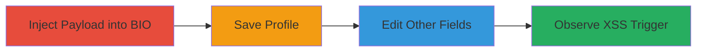

# Stored Self-XSS in Khan Academy User Profile BIO Field via Subsequent Edits

Multi-stage attack chain demonstrating a complete attack workflow.

The vulnerability is a stored Cross-site Scripting (XSS) in the BIO section of the user profile on Khan Academy. The attacker injects a JavaScript payload into the BIO field, which does not trigger immediately upon saving. However, upon editing and saving other profile fields like REAL NAME or LOCATION, the payload executes, displaying an alert with 'undefined' instead of the intended prompt, allowing potential script execution in the user's own session. The impact is limited to self-XSS, affecting only the authenticated user without harming others, leading to an Informative classification.

## Chain Metrics Dashboard

| Metric | Value |
|--------|-------|
| Chain Status | Unverified |
| Total Steps | 4 |
| Execution Time | ~2 minutes |
| Skill Level | Beginner |
| Complexity | Low |
| Impact Level | Low |

## Attack Flow Visualization

## Prerequisites & Requirements

### Required Tools

- Web browser (e.g., Chrome, Firefox)

### Target Environment

- Khan Academy web platform
- Authenticated user account with profile editing access
- No specific services/ports required beyond standard HTTPS (443)

### Initial Access Requirements

- Valid Khan Academy login credentials
- Direct access to the user's profile editing page
- No prior network position needed; operates within the authenticated session

## Detailed Attack Procedures

### Step 1: Inject XSS Payload into BIO Field
procedure: [[procedures/Inject-XSS-Payload-into-BIO-Field]]

**Objective**: Introduce a malicious JavaScript payload into the BIO field without immediate execution.

**Instructions**: Log in to Khan Academy, navigate to the user profile editing page, and enter the following payload into the BIO input field: `"><svg/onload=alert(document.domain);>"` or a variant like `"><svg/onload=alert(document.cookie);>`. Do not save yet.

**Expected Output**: The payload is accepted in the input field without sanitization errors.

**Success Indicators**:
- Payload text appears in the BIO field
- No immediate alert or error on input

### Step 2: Save Profile with Malicious BIO
procedure: [[procedures/Save-Profile-with-Malicious-BIO]]

**Objective**: Persist the injected payload in the stored BIO data.

**Instructions**: With the payload in the BIO field, submit the profile form by clicking the SAVE button.

**Expected Output**: Profile saves successfully with no visible errors or immediate XSS trigger.

**Success Indicators**:
- Profile updates confirm the save
- No alert pops up upon saving
- Payload is stored but dormant

### Step 3: Edit and Save Other Profile Fields
procedure: [[procedures/Edit-and-Save-Other-Profile-Fields]]

**Objective**: Trigger the stored payload execution by resubmitting the profile form.

**Instructions**: Return to the profile editing page, modify another field such as REAL NAME or LOCATION (e.g., change REAL NAME to "Test"), and click SAVE again.

**Expected Output**: Form submits, and after a short delay, the XSS payload executes.

**Success Indicators**:
- Other fields update successfully
- No errors on save
- Preparation for payload trigger

### Step 4: Observe XSS Execution
procedure: [[procedures/Observe-XSS-Execution]]

**Objective**: Confirm arbitrary JavaScript execution in the user's browser session.

**Instructions**: After saving the edited fields, wait a few seconds for the page to process.

**Expected Output**: An alert dialog appears displaying 'undefined' (due to payload issues), confirming script execution.

**Success Indicators**:
- Alert box with 'undefined' or domain/cookie content
- JavaScript runs in the context of the authenticated session
- Limited to self-impact; no effect on other users

## Attack Chain Summary

### Key Achievements

1. Successful injection and storage of XSS payload in BIO field
2. Deferred execution triggered by subsequent profile edits
3. Demonstration of self-XSS with arbitrary JS alert
4. Identification of insufficient sanitization in stored profile data

## Technique & Tactic Coverage

### MITRE ATT&CK Techniques

- [[JavaScript]]

### MITRE ATT&CK Tactics

- [[Execution]]

---

*Last updated: 2024-10-04T00:00:00Z*
