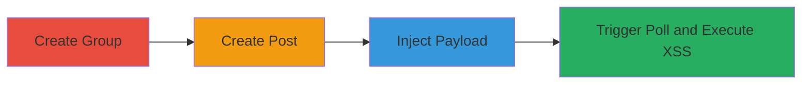

---
tags:
  - xss
  - stored-xss
  - self-xss
  - ok.ru
  - web-vulnerability
type: attack_chain
tools: []
tactics:
  - '[[Execution]]'
verified: false
platforms:
  - Web
submitted: true
complexity: low
created_at: '2023-10-01T00:00:00Z'
procedures:
  - '[[procedures/Create-New-Group-on-ok-ru]]'
  - '[[procedures/Initiate-New-Post-in-ok-ru-Group]]'
  - '[[procedures/Inject-XSS-Payload-into-Group-Post-Topic-Field]]'
  - '[[procedures/Trigger-and-Execute-Self-XSS-via-Add-Poll]]'
step_count: 4
techniques:
  - '[[JavaScript]]'
updated_at: '2025-12-14T03:16:14.527Z'
description: >-
  A stored Cross-Site Scripting (XSS) vulnerability in the ok.ru group posting
  feature allows injection of JavaScript payloads into the topic field, leading
  to self-XSS execution upon triggering the add poll function.
skill_level: beginner
impact_level: low
id: 55dad67f-09aa-423a-883f-a952d88e2be7
validated: true
mitre_tactics:
  - '[[Execution]]'
mitre_techniques:
  - '[[JavaScript]]'
---
# Stored Self-XSS in ok.ru Group Post Topic Field via Add Poll

Multi-stage attack chain demonstrating a complete attack workflow for exploiting a stored XSS vulnerability in the ok.ru platform's group posting feature.

## Chain Metrics Dashboard

| Metric | Value |
|--------|-------|
| Chain Status | Unverified |
| Total Steps | 4 |
| Execution Time | ~5 minutes |
| Skill Level | Beginner |
| Complexity | Low |
| Impact Level | Low |

## Attack Flow Visualization

## Prerequisites & Requirements

### Required Tools

- Web browser (e.g., Chrome, Firefox)

### Target Environment

- ok.ru platform (web application)
- Authenticated user account with group creation permissions

### Initial Access Requirements

- Valid ok.ru user credentials
- Network access to ok.ru
- No prior access needed beyond login

## Detailed Attack Procedures

### Step 1: Create New Group
procedure: [[procedures/Create-New-Group-on-ok-ru]]

**Objective**: Establish a test group on the ok.ru platform to serve as the target for the posting feature.

**Instructions**: Log in to your ok.ru account, navigate to the groups section, and initiate the creation of a new group by providing basic details such as name and description.

**Expected Output**: A new group is successfully created and visible in your account.

**Success Indicators**:
- Group creation confirmation message
- Group appears in the user's group list

### Step 2: Initiate New Post in Group
procedure: [[procedures/Initiate-New-Post-in-ok-ru-Group]]

**Objective**: Start a new discussion post within the created group to access the topic field.

**Instructions**: Enter the newly created group, locate the posting interface, and click to begin a new post, preparing the topic field for input.

**Expected Output**: The new post creation interface opens, displaying the topic input field.

**Success Indicators**:
- Post creation form loads
- Topic field is editable

### Step 3: Inject XSS Payload into Group Post Topic Field
procedure: [[procedures/Inject-XSS-Payload-into-Group-Post-Topic-Field]]

**Objective**: Insert a malicious JavaScript payload into the topic field to test for XSS injection.

**Instructions**: In the topic field, enter the payload `'><svg onload=prompt(document.domain)>` and prepare to submit via the add poll function.

**Expected Output**: The payload is accepted without sanitization errors.

**Success Indicators**:
- Payload text is entered without validation warnings
- Form remains submittable

### Step 4: Trigger and Execute Self-XSS via Add Poll
procedure: [[procedures/Trigger-and-Execute-Self-XSS-via-Add-Poll]]

**Objective**: Activate the poll addition feature to store and execute the injected payload, resulting in self-XSS.

**Instructions**: With the payload in the topic field, click the 'add poll' button to process the post.

**Expected Output**: A JavaScript prompt appears displaying the document domain (e.g., 'ok.ru').

**Success Indicators**:
- Browser executes the onload event in the SVG tag
- Prompt box shows the domain without errors

## Attack Chain Summary

### Key Achievements

1. Successful creation of a test group on ok.ru
2. Injection of unsanitized HTML/JavaScript into the post topic field
3. Triggering of self-XSS execution via the add poll mechanism
4. Confirmation of vulnerability through local JavaScript prompt

## Technique & Tactic Coverage

### MITRE ATT&CK Techniques

- [[JavaScript]]

### MITRE ATT&CK Tactics

- [[Execution]]

---
*Last updated: 2023-10-01T00:00:00Z*
