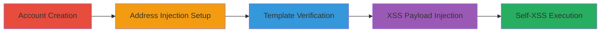

# Stored Self-XSS via AngularJS Template Injection in WordPress Mercantile Checkout

Multi-stage attack chain demonstrating exploitation of unsanitized user input in address fields to inject AngularJS templates, verify evaluation, and escalate to stored self-XSS for JavaScript execution during checkout.

## Chain Metrics Dashboard

| Metric | Value |
|--------|-------|
| Chain Status | Unverified |
| Total Steps | 5 |
| Execution Time | ~10 minutes |
| Skill Level | Intermediate |
| Complexity | Medium |
| Impact Level | Medium |

## Attack Flow Visualization

## Prerequisites & Requirements

### Required Tools

- [[tools/PortSwigger-Web-Security-Research]]

### Target Environment

- Web platform with WordPress and Mercantile plugin
- Access to https://mercantile.wordpress.org/
- No specific ports required; standard HTTPS (443)

### Initial Access Requirements

- No prior credentials needed; public registration available
- Direct network access to the target site
- Modern browser for JavaScript execution

## Detailed Attack Procedures

### Step 1: Account Creation
procedure: [[procedures/Create-User-Account-on-WordPress-Mercantile]]

**Objective**: Establish a user account to access editable profile sections for injection.

**Instructions**: Navigate to the registration page and complete the signup form with valid email and password.

**Expected Output**: Confirmation of account creation and redirect to login or dashboard.

**Success Indicators**:
- Successful login to /my-account/
- Access to edit profile features

### Step 2: Basic Account Editing
procedure: [[procedures/Edit-Account-Details]]

**Objective**: Update non-sensitive fields to prepare for address injection without raising flags.

**Instructions**: Log in and navigate to the account edit page to fill in first and last name fields.

**Expected Output**: Saved account details visible on profile.

**Success Indicators**:
- Profile updates confirmed
- No errors in form submission

### Step 3: Template Injection Setup
procedure: [[procedures/Inject-Template-Payloads-into-Address-Fields]]

**Objective**: Inject simple AngularJS expressions into billing and shipping address fields to test template evaluation.

**Instructions**: Go to the address edit page, enter '{{1+1}}' in billing fields (except zip), '{{1==1}}' in shipping fields, and save.

**Expected Output**: Form saves without validation errors.

**Success Indicators**:
- Addresses updated in profile
- No immediate rejection of payloads

### Step 4: Injection Verification
procedure: [[procedures/Verify-Template-Injection-on-Checkout]]

**Objective**: Confirm template evaluation by observing rendered output on checkout.

**Instructions**: Add a product to cart and proceed to checkout to view address rendering.

**Expected Output**: Billing fields show '2', shipping shows 'true'.

**Success Indicators**:
- Injected expressions evaluated client-side
- Proof of AngularJS template processing

### Step 5: XSS Exploitation
procedure: [[procedures/Exploit-with-AngularJS-XSS-Payload]]

**Objective**: Escalate to full XSS by injecting a crafted payload that manipulates AngularJS scope for JavaScript alert.

**Instructions**: Re-edit addresses with the complex payload in one field, save, and revisit checkout.

**Expected Output**: Alert box pops up with document.domain.

**Success Indicators**:
- Arbitrary JS execution (alert triggered)
- Confirmation of self-XSS impact

## Attack Chain Summary

### Key Achievements

1. Successful account creation and profile access
2. Template injection verification in address rendering
3. Escalation to stored self-XSS with JS execution

## Technique & Tactic Coverage

### MITRE ATT&CK Techniques

- [[Exploit Public-Facing Application]]
- [[JavaScript]]

### MITRE ATT&CK Tactics

- [[Execution]]
- [[Collection]]

---
*Last updated: 2023-10-01T12:00:00Z*
