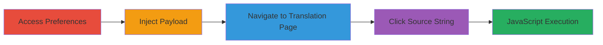

---
tags:
  - xss
  - stored-xss
  - self-xss
  - weblate
type: attack_chain
tools: []
tactics:
  - '[[Execution]]'
verified: false
platforms:
  - Web
submitted: true
complexity: low
created_at: '2024-10-04T00:00:00Z'
procedures:
  - '[[procedures/Access-Weblate-Preferences-Page]]'
  - '[[procedures/Inject-JavaScript-Payload-in-Editor-Link]]'
  - '[[procedures/Navigate-to-Weblate-Translation-Page]]'
  - '[[procedures/Trigger-XSS-via-Source-String-Click]]'
step_count: 4
techniques:
  - '[[JavaScript]]'
updated_at: '2025-12-14T03:15:47.099Z'
description: >-
  A multi-step attack demonstrating stored self-XSS in Weblate's Editor Link
  field, allowing arbitrary JavaScript execution in the authenticated user's
  browser context when interacting with translation components.
skill_level: beginner
impact_level: low
id: 766dd1b2-c89b-4ba6-a5c0-5cb4adfd4fc0
validated: true
mitre_tactics:
  - '[[Execution]]'
mitre_techniques:
  - '[[JavaScript]]'
---
# Stored Self-XSS via Editor Link in Weblate Preferences

The vulnerability involves a stored self-XSS in the 'Editor Link' field on Weblate's user preferences page. Due to missing input validation and sanitization, attackers can store arbitrary JavaScript payloads using javascript: URIs. When the authenticated user visits a translation page and clicks on a source string location (e.g., 'main.c'), the payload executes in their browser context within the Weblate instance. This leads to self-XSS, potentially allowing the user to inadvertently harm their own session, such as stealing their own cookies or modifying page content, but it does not directly impact other users.

## Chain Metrics Dashboard

| Metric | Value |
|--------|-------|
| Chain Status | Unverified |
| Total Steps | 4 |
| Execution Time | ~2 minutes |
| Skill Level | Beginner |
| Complexity | Low |
| Impact Level | Low |

## Attack Flow Visualization

## Prerequisites & Requirements

### Required Tools

- Web browser (e.g., Chrome, Firefox)

### Target Environment

- Weblate instance (e.g., https://demo.weblate.org)
- Authenticated user account with access to preferences and translation pages

### Initial Access Requirements

- Valid credentials for a Weblate user account
- Direct network access to the Weblate web application
- No prior access needed beyond authentication

## Detailed Attack Procedures

### Step 1: Access Preferences Page
procedure: [[procedures/Access-Weblate-Preferences-Page]]

**Objective**: Locate the vulnerable Editor Link field in user preferences.

**Instructions**: Open your web browser and log in to the Weblate instance if not already authenticated. Navigate to the profile preferences section to identify the input field.

**Expected Output**: The preferences page loads, displaying the 'Editor Link' field.

**Success Indicators**:
- Preferences page accessible
- Editor Link field visible and editable

### Step 2: Inject JavaScript Payload
procedure: [[procedures/Inject-JavaScript-Payload-in-Editor-Link]]

**Objective**: Store a malicious JavaScript payload in the Editor Link field without sanitization.

**Instructions**: In the Editor Link field, enter the payload `javascript:confirm(document.domain)` and save the profile changes.

**Expected Output**: Profile saves successfully, with the payload stored in the backend.

**Success Indicators**:
- No validation errors on save
- Payload persists in the field upon reload

### Step 3: Navigate to Translation Page
procedure: [[procedures/Navigate-to-Weblate-Translation-Page]]

**Objective**: Position the user to interact with source strings that reference the Editor Link.

**Instructions**: After saving, navigate to a translation project page, such as a specific language translation view.

**Expected Output**: Translation page loads, showing source strings with clickable locations.

**Success Indicators**:
- Translation interface accessible
- Source string locations (e.g., file names) visible

### Step 4: Trigger XSS Execution
procedure: [[procedures/Trigger-XSS-via-Source-String-Click]]

**Objective**: Execute the stored JavaScript by clicking a source string link.

**Instructions**: Click on a source string location, such as 'main.c', which constructs a link using the stored Editor Link payload.

**Expected Output**: JavaScript alert or confirm dialog appears, confirming execution (e.g., displaying the domain).

**Success Indicators**:
- JavaScript payload runs in the browser
- Alert box shows document domain or equivalent effect

## Attack Chain Summary

### Key Achievements

1. Successful storage of unsanitized JavaScript URI in user preferences
2. Triggering of self-XSS upon standard user interaction with translation components
3. Demonstration of JavaScript execution limited to the authenticated user's session

## Technique & Tactic Coverage

### MITRE ATT&CK Techniques

- [[JavaScript]]

### MITRE ATT&CK Tactics

- [[Execution]]

---
*Last updated: 2024-10-04T00:00:00Z*
