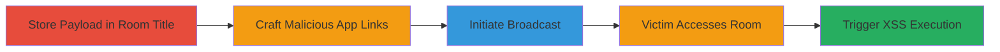

# Stored XSS Account Takeover in Chaturbate via Split JavaScript URI Payloads

Multi-stage attack chain exploiting a stored XSS vulnerability in Chaturbate's broadcast room chat header. Attackers craft application names containing the '|' character to forge malicious javascript: URI links, bypassing the 32-character limit by splitting the payload across two apps and storing additional payload in the room title. This allows arbitrary JavaScript execution when victims click the links, leading to full account control.

## Chain Metrics Dashboard

| Metric | Value |
|--------|-------|
| Chain Status | Unverified |
| Total Steps | 5 |
| Execution Time | ~5 minutes |
| Skill Level | Intermediate |
| Complexity | Medium |
| Impact Level | High |

## Attack Flow Visualization

## Prerequisites & Requirements

### Required Tools

- Web browser with developer tools (e.g., Chrome DevTools for inspecting elements)

### Target Environment

- Chaturbate platform
- Access to a broadcaster account
- Victim account for testing access

### Initial Access Requirements

- Valid Chaturbate broadcaster credentials
- Ability to create and run apps/bots in broadcast rooms
- No special network access beyond standard web connectivity

## Detailed Attack Procedures

### Step 1: Store XSS Payload in Broadcast Room Title
procedure: [[procedures/Store-XSS-Payload-in-Broadcast-Room-Title]]

**Objective**: Store executable JavaScript code in the room title element to serve as the payload for later evaluation.

**Instructions**: Log in to your Chaturbate broadcaster account, navigate to the broadcast setup, and set the room title to the desired payload. For demonstration, use `alert('XSS by skavans at ' + document.domain)`.

**Expected Output**: Room title updated and visible in the #roomtitle element upon room load.

**Success Indicators**:
- Room title reflects the injected JavaScript code
- Inspecting the page source shows the code stored in the title element

### Step 2: Craft First Malicious App Name for Variable Setup
procedure: [[procedures/Craft-First-Malicious-App-Name-for-Variable-Setup]]

**Objective**: Create the first part of the split payload by forging a javascript: URI in an app name to set a variable referencing the room title element.

**Instructions**: In the app creation interface, set the app name to `1|javascript:b='#roomtitle';0`. Create and run this dummy app/bot.

**Expected Output**: App appears in the chat header with a forged link that, when clicked, sets the variable `b` to '#roomtitle'.

**Success Indicators**:
- App name parsed correctly with '|' forging the URI
- Link in chat header points to the javascript: protocol

### Step 3: Craft Second Malicious App Name for Payload Execution
procedure: [[procedures/Craft-Second-Malicious-App-Name-for-Payload-Execution]]

**Objective**: Create the second part of the split payload to evaluate and execute the stored code from the room title.

**Instructions**: Create and run a second app/bot with the name `2|javascript:eval($(b).text())`.

**Expected Output**: Second app link in chat header that retrieves and executes the room title content using the variable `b`.

**Success Indicators**:
- Second link forged successfully
- Variable `b` from first link is available for use

### Step 4: Initiate Broadcast to Display Malicious Links
procedure: [[procedures/Initiate-Broadcast-to-Display-Malicious-Links]]

**Objective**: Start the broadcast to render the malicious app links in the chat header for victim visibility.

**Instructions**: Begin broadcasting from your account. Use a separate victim account to open and access the room.

**Expected Output**: Malicious links appear in the broadcast room's chat header.

**Success Indicators**:
- Broadcast active and room accessible
- App links visible in the header without errors

### Step 5: Trigger XSS via Victim Link Clicks
procedure: [[procedures/Trigger-XSS-via-Victim-Link-Clicks]]

**Objective**: Execute the XSS payload by having the victim click the forged links in sequence.

**Instructions**: From the victim account, click the first app link to set the variable, then click the second to evaluate the room title payload.

**Expected Output**: Alert box pops up with 'XSS by skavans at [domain]', confirming execution.

**Success Indicators**:
- Variable set without errors
- JavaScript from room title executes, demonstrating arbitrary code run
- Potential for further exploitation like session hijacking

## Attack Chain Summary

### Key Achievements

1. Bypassed 32-character app name limit via payload splitting and room title storage
2. Forged javascript: URIs using unfiltered '|' in app_info_json parameter
3. Achieved stored XSS leading to arbitrary JS execution and account takeover

## Technique & Tactic Coverage

### MITRE ATT&CK Techniques

- [[JavaScript]]
- [[Malicious File]]

### MITRE ATT&CK Tactics

- [[Execution]]
- [[Initial Access]]

---
*Last updated: 2024-10-01T00:00:00Z*
