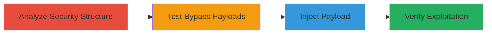

# Stored XSS Bypass via Greedy Regex Filter in Vimeo Input Fields

Multi-stage attack chain demonstrating a complete workflow to bypass Vimeo's XSS filter and achieve stored XSS execution.

## Chain Metrics Dashboard

| Metric | Value |
|--------|-------|
| Chain Status | Unverified |
| Total Steps | 4 |
| Execution Time | ~10 minutes |
| Skill Level | Intermediate |
| Complexity | Medium |
| Impact Level | High |

## Attack Flow Visualization

## Prerequisites & Requirements

### Required Tools

- Web browser with developer tools (e.g., Chrome DevTools for inspecting responses)
- Burp Suite or similar proxy for intercepting requests (optional but recommended for testing)

### Target Environment

- Web application (Vimeo platform)
- Access to user input fields (e.g., profile updates, form submissions)
- No special ports or services required beyond standard HTTPS (443)

### Initial Access Requirements

- Valid user account on the target platform
- Network access to the web application
- No prior elevated access needed; exploits standard user inputs

## Detailed Attack Procedures

### Step 1: Analyze Application Security Structure
procedure: [[procedures/Analyze-Application-Security-Structure]]

**Objective**: Identify the XSS filtering mechanism to understand potential bypass opportunities.

**Instructions**: Use browser developer tools to inspect input handling and output rendering. Submit test strings like `` to input fields and observe how the application processes them. Analyze network responses to detect regex patterns removing content from '<' to '>'.

**Expected Output**: Confirmation of a greedy regex filter that strips entire strings between angle brackets.

**Success Indicators**:
- Filter behavior documented (e.g., payload truncated in database storage)
- Secondary encoding (HTML entities) noted on output

### Step 2: Test XSS Filter Bypass Payloads
procedure: [[procedures/Test-XSS-Filter-Bypass-Payloads]]

**Objective**: Develop and validate a malformed payload that evades the greedy regex without triggering removal or encoding issues.

**Instructions**: Craft payloads using URL encoding and line breaks, such as `<%0crameset%20src=''>`. Submit variations to input fields via the web form and monitor if the payload survives filtering. Use proxy tools to inspect the request and response bodies for intact payload storage. Test in non-JS contexts first to isolate filter behavior.

**Expected Output**: Payload like `<%0crameset%20src=''>` accepted without stripping, appearing in raw database responses.

**Success Indicators**:
- Payload not removed by regex
- No immediate alert or block from the application

### Step 3: Inject Malformed XSS Payload into Input Fields
procedure: [[procedures/Inject-Malformed-XSS-Payload-into-Input-Fields]]

**Objective**: Store the bypass payload in the application's database through vulnerable inputs.

**Instructions**: Navigate to input fields like profile update forms. Enter the tested payload `<%0crameset%20src=''>` (or enhanced versions like `` wrapped in the bypass) and submit. Use developer tools to confirm the request payload and response. Repeat across multiple fields (e.g., bio, comments) to maximize storage points.

**Expected Output**: Successful form submission with no errors; payload echoed back in profile data or API responses.

**Success Indicators**:
- Payload stored in database as-is
- Visible in user profile or related outputs without encoding in certain contexts

### Step 4: Verify Stored XSS Exploitation Contexts
procedure: [[procedures/Verify-Stored-XSS-Exploitation-Contexts]]

**Objective**: Confirm the stored payload executes JavaScript when viewed by other users in exploitable contexts.

**Instructions**: Access the affected content (e.g., view the updated profile) in different contexts: JavaScript inputs, unencoded string outputs, or JSON responses with HTML content-type headers. Check for script execution by embedding an alert or data exfiltration payload. Simulate victim viewing by logging out or using an incognito session.

**Expected Output**: Arbitrary JavaScript execution, such as an alert popup or network request to an attacker-controlled domain.

**Success Indicators**:
- Script runs in browser console or triggers actions
- Impact observed in JS contexts or JSON parsing

## Attack Chain Summary

### Key Achievements

1. Bypassed greedy regex filter using malformed encoded tags
2. Stored XSS payload in database despite secondary encoding
3. Achieved execution in multiple contexts for cross-user impact
4. Demonstrated potential for session hijacking or data theft

## Technique & Tactic Coverage

### MITRE ATT&CK Techniques

- [[JavaScript]]

### MITRE ATT&CK Tactics

- [[Execution]]

---
*Last updated: 2023-10-01T00:00:00Z*
