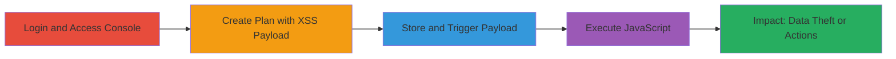

---
tags:
  - xss
  - stored-xss
  - acronis
  - javascript-execution
type: attack_chain
tools:
  - '[[tools/Mozilla-Firefox]]'
tactics:
  - '[[Execution]]'
verified: false
platforms:
  - Web
submitted: true
complexity: medium
created_at: '2023-10-01T00:00:00Z'
procedures:
  - '[[procedures/Access-Acronis-Cloud-Console]]'
  - '[[procedures/Create-Malicious-Backup-Scanning-Plan]]'
  - '[[procedures/Trigger-Stored-XSS-Payload]]'
  - '[[procedures/Handle-Payload-Execution-Alerts]]'
  - '[[procedures/Verify-XSS-Impact]]'
step_count: 5
techniques:
  - '[[JavaScript]]'
updated_at: '2025-12-13T23:56:03.495Z'
description: >-
  A multi-step attack chain exploiting a stored XSS vulnerability in the Acronis
  cloud console by injecting a malicious payload into a backup scanning plan
  name, leading to arbitrary JavaScript execution upon viewing or editing the
  plan.
skill_level: intermediate
impact_level: high
id: f4e6567b-ed3c-4748-be51-1b189f5f4eed
validated: true
mitre_tactics:
  - '[[Execution]]'
mitre_techniques:
  - '[[JavaScript]]'
---
# Stored XSS Exploitation in Acronis Cloud Console Backup Scanning Plan

Multi-stage attack chain demonstrating a complete stored XSS workflow in the Acronis cloud console.

## Chain Metrics Dashboard

| Metric | Value |
|--------|-------|
| Chain Status | Unverified |
| Total Steps | 5 |
| Execution Time | ~5 minutes |
| Skill Level | Intermediate |
| Complexity | Medium |
| Impact Level | High |

## Attack Flow Visualization

## Prerequisites & Requirements

### Required Tools

- [[tools/Mozilla-Firefox]]

### Target Environment

- Web platform
- Acronis cloud console at https://mc-beta-cloud.acronis.com/ui/
- Access to backup scanning plans feature
- Network access to the console

### Initial Access Requirements

- Valid user credentials for the Acronis cloud console
- Browser with JavaScript enabled
- No prior access needed beyond login

## Detailed Attack Procedures

### Step 1: Access Acronis Cloud Console
procedure: [[procedures/Access-Acronis-Cloud-Console]]

**Objective**: Gain initial access to the vulnerable Acronis cloud console interface.

**Instructions**: Use a web browser to navigate to the login page and authenticate with provided credentials.

**Expected Output**: Successful login and dashboard access.

**Success Indicators**:
- User is redirected to the main console UI
- Navigation menu is visible

### Step 2: Navigate to Backup Scanning Plans
procedure: [[procedures/Create-Malicious-Backup-Scanning-Plan]]

**Objective**: Reach the plan creation section to prepare for payload injection.

**Instructions**: From the dashboard, select 'PLANS' and navigate to 'Backup Scanning'. Click 'Create Plan' and specify a backup location, such as the user's PC with the agent installed.

**Expected Output**: Plan creation form is loaded.

**Success Indicators**:
- Backup location selected
- Plan name input field available

### Step 3: Inject XSS Payload into Plan Name
procedure: [[procedures/Create-Malicious-Backup-Scanning-Plan]]

**Objective**: Insert the malicious JavaScript payload into the plan name to store the XSS.

**Instructions**: In the plan name field, enter the payload `/><svg/onload=prompt(document.domain)>`. Proceed to create the plan by clicking 'Create', then edit and save changes.

**Expected Output**: Plan is created with the injected payload.

**Success Indicators**:
- Plan appears in the list
- Initial alerts may pop up during creation

### Step 4: Trigger Stored XSS Execution
procedure: [[procedures/Trigger-Stored-XSS-Payload]]

**Objective**: View or edit the plan to execute the stored payload.

**Instructions**: Reload the page or navigate back to 'Backup Scanning' under 'PLANS'. Select the malicious plan and attempt to edit it.

**Expected Output**: Multiple prompt alerts displaying the document domain.

**Success Indicators**:
- JavaScript prompts appear
- Payload executes in the browser context

### Step 5: Verify and Handle XSS Impact
procedure: [[procedures/Handle-Payload-Execution-Alerts]]
procedure: [[procedures/Verify-XSS-Impact]]

**Objective**: Confirm arbitrary JavaScript execution and assess potential impacts like session theft.

**Instructions**: Dismiss repeated alerts by clicking 'OK'. Observe that the payload can be modified to steal cookies or perform actions on behalf of the victim.

**Expected Output**: Alerts confirm execution; no further errors in console.

**Success Indicators**:
- Repeated self-XSS alerts triggered
- Potential for data exfiltration demonstrated

## Attack Chain Summary

### Key Achievements

1. Successful injection of stored XSS payload in plan name
2. Triggering of arbitrary JavaScript execution upon plan interaction
3. Demonstration of high-impact effects like session hijacking

## Technique & Tactic Coverage

### MITRE ATT&CK Techniques

- [[JavaScript]]

### MITRE ATT&CK Tactics

- [[Execution]]

---
*Last updated: 2023-10-01T00:00:00Z*
