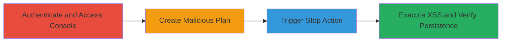

---
tags:
  - stored-xss
  - xss
  - web-vulnerability
  - javascript-injection
type: attack_chain
tools: []
tactics:
  - '[[Execution]]'
  - '[[Collection]]'
commands: []
platforms:
  - Web
complexity: medium
procedures:
  - '[[procedures/Authenticate-to-Acronis-Console]]'
  - '[[procedures/Create-Protection-Plan-with-XSS-Payload]]'
  - '[[procedures/Trigger-XSS-via-Plan-Stop-Action]]'
  - '[[procedures/Verify-Stored-XSS-Persistence]]'
step_count: 4
techniques:
  - '[[JavaScript]]'
description: >-
  A multi-step attack chain exploiting a stored XSS vulnerability in the Acronis
  Cyber Protect Console by injecting a malicious JavaScript payload into the
  protection plan name field, which executes when the 'Stop' action is performed
  on the plan.
skill_level: intermediate
impact_level: high
id: 372d1c83-2802-44f1-8bf6-21d667cec9b6
created_at: '2025-12-13T23:52:50.029Z'
updated_at: '2025-12-13T23:52:50.029Z'
verified: false
validated: true
submitted: true
mitre_tactics:
  - '[[Execution]]'
  - '[[Collection]]'
mitre_techniques:
  - '[[JavaScript]]'
---
# Stored XSS Exploitation in Acronis Cyber Protect Console via Protection Plan Name

Multi-stage attack chain demonstrating a complete stored XSS workflow in the Acronis Cyber Protect Console.

## Chain Metrics Dashboard

| Metric | Value |
|--------|-------|
| Chain Status | Unverified |
| Total Steps | 4 |
| Execution Time | ~10 minutes |
| Skill Level | Intermediate |
| Complexity | Medium |
| Impact Level | High |

## Attack Flow Visualization

## Prerequisites & Requirements

### Required Tools

- Web browser (e.g., Chrome, Firefox)

### Target Environment

- Acronis Cyber Protect Console (web application at https://mc-beta-cloud.acronis.com/ui/)
- Required services/ports: HTTPS (443)
- Network access requirements: Direct internet access to the console URL

### Initial Access Requirements

- Valid user credentials for the Acronis console
- Network position: External or internal access to the web interface
- Prior access needed: None, assuming legitimate account

## Detailed Attack Procedures

### Step 1: Authenticate to Console
procedure: [[procedures/Authenticate-to-Acronis-Console]]

**Objective**: Gain access to the Acronis Cyber Protect Console to perform administrative actions on protection plans.

**Instructions**: Open a web browser and navigate to the login page. Enter the provided credentials to authenticate.

**Expected Output**: Successful login redirecting to the console dashboard.

**Success Indicators**:
- Dashboard loads without errors
- User session established

### Step 2: Create Protection Plan with XSS Payload
procedure: [[procedures/Create-Protection-Plan-with-XSS-Payload]]

**Objective**: Inject a malicious JavaScript payload into the protection plan name field during creation, storing it persistently.

**Instructions**: Navigate to the Plans section, initiate plan creation, add a device, and enter the payload in the name field before submitting.

**Expected Output**: Plan created successfully with the payload in the name.

**Success Indicators**:
- Plan appears in the list with the injected name
- No validation errors on submission

### Step 3: Trigger XSS via Plan Stop Action
procedure: [[procedures/Trigger-XSS-via-Plan-Stop-Action]]

**Objective**: Execute the stored payload by performing the 'Stop' action on the malicious plan, firing the JavaScript in the victim's browser.

**Instructions**: Select the plan, access the Actions pane, click 'Stop', and confirm the action.

**Expected Output**: Alert box or JavaScript execution (e.g., alert(document.domain)) in the browser.

**Success Indicators**:
- JavaScript alert or console error indicating execution
- Potential session cookie theft or phishing capability

### Step 4: Verify Stored XSS Persistence
procedure: [[procedures/Verify-Stored-XSS-Persistence]]

**Objective**: Confirm the XSS is stored by reloading the page and re-triggering the action, demonstrating persistence across sessions.

**Instructions**: Reload the console, re-navigate to plans, select the plan, and repeat the stop action.

**Expected Output**: XSS triggers again on confirmation.

**Success Indicators**:
- Payload executes on subsequent triggers
- Vulnerability confirmed as stored, not reflected

## Attack Chain Summary

### Key Achievements

1. Successful injection of HTML/JavaScript payload into plan name without sanitization
2. Arbitrary JavaScript execution in victim browser context via UI action
3. Demonstration of persistence, allowing repeated exploitation

## Technique & Tactic Coverage

### MITRE ATT&CK Techniques

- [[JavaScript]]

### MITRE ATT&CK Tactics

- [[Execution]]
- [[Collection]]

---
*Last updated: 2023-10-01*
