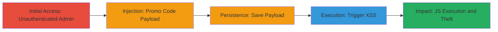

---
tags:
  - xss
  - stored-xss
  - web-vulnerability
  - javascript-execution
type: attack_chain
tools: []
tactics:
  - '[[Initial Access]]'
  - '[[Execution]]'
  - '[[Collection]]'
verified: false
platforms:
  - Web
submitted: true
complexity: low
created_at: '2024-10-01T12:00:00Z'
procedures:
  - '[[procedures/Access-Unauthenticated-Admin-Interface]]'
  - '[[procedures/Inject-and-Save-Stored-XSS-Payload]]'
  - '[[procedures/Trigger-Stored-XSS-Execution]]'
step_count: 4
techniques:
  - '[[Exploit Public-Facing Application]]'
  - '[[JavaScript]]'
updated_at: '2025-12-14T03:46:38.055Z'
description: >-
  A multi-step attack exploiting a stored XSS vulnerability in the
  unauthenticated Acronis store admin promo code editing functionality, allowing
  arbitrary JavaScript execution for session theft and site defacement.
skill_level: beginner
impact_level: high
id: 02d1c1e0-01c7-4e2d-b2a3-d74f2b6acbe5
validated: true
mitre_tactics:
  - '[[Initial Access]]'
  - '[[Execution]]'
  - '[[Collection]]'
mitre_techniques:
  - '[[Exploit Public-Facing Application]]'
  - '[[JavaScript]]'
---
# Stored XSS Exploitation in Acronis Store Admin Promo Code Field

Multi-stage attack chain demonstrating a complete attack workflow exploiting a stored XSS vulnerability in the Acronis store admin page.

## Chain Metrics Dashboard

| Metric | Value |
|--------|-------|
| Chain Status | Unverified |
| Total Steps | 4 |
| Execution Time | ~5 minutes |
| Skill Level | Beginner |
| Complexity | Low |
| Impact Level | High |

## Attack Flow Visualization



## Prerequisites & Requirements

### Required Tools

- Web browser (e.g., Chrome, Firefox)

### Target Environment

- Web platform
- ColdFusion-based application
- Unauthenticated access to admin interface
- Network access to http://www.grouplogic.com

### Initial Access Requirements

- No credentials required (unauthenticated)
- Direct URL access
- No prior access needed

## Detailed Attack Procedures

### Step 1: Access the Unauthenticated Admin Interface
procedure: [[procedures/Access-Unauthenticated-Admin-Interface]]

**Objective**: Gain entry to the admin store page without authentication to identify the vulnerable endpoint.

**Instructions**: Open a web browser and navigate directly to the admin store index page.

```plaintext
URL: http://www.grouplogic.com/ADMIN/store/index.cfm
```

**Expected Output**: The admin interface loads without prompting for login, displaying store management options.

**Success Indicators**:
- Page loads successfully without authentication prompt
- Admin dashboard is accessible

### Step 2: Navigate to Promo Codes Section and Prepare Edit
procedure: [[procedures/Inject-and-Save-Stored-XSS-Payload]]

**Objective**: Locate the promo code management section and select an existing code for modification to prepare for payload injection.

**Instructions**: From the admin dashboard, access the promo codes endpoint and select a promo code to edit.

```plaintext
URL: http://www.grouplogic.com/ADMIN/store/index.cfm?fa=disprocode
```
Select any existing promo code entry and click to edit it.

**Expected Output**: The edit form for the promo code opens, showing fields including the Promo Code input.

**Success Indicators**:
- Promo codes list loads
- Edit mode activated for a selected code

### Step 3: Inject and Save Malicious Payload
procedure: [[procedures/Inject-and-Save-Stored-XSS-Payload]]

**Objective**: Insert a JavaScript payload into the promo code field to store malicious code that will execute on page view.

**Instructions**: In the Promo Code field, replace the value with a malicious payload such as `<h1 onmouseover=alert(document.domain)>XSS</h1>` (Payload 1) or `` (Payload 2). Then, submit the form by clicking the 'Edit Promo Code' button to save the changes.

**Expected Output**: The promo code is updated and saved without errors, storing the payload in the backend.

**Success Indicators**:
- Form submits successfully
- No validation errors on payload

### Step 4: Revisit Page to Trigger XSS Execution
procedure: [[procedures/Trigger-Stored-XSS-Execution]]

**Objective**: Reload the promo codes page to render the stored payload, triggering JavaScript execution and demonstrating the vulnerability.

**Instructions**: Navigate back to the promo codes page. For Payload 1, hover the mouse over the rendered `<h1>` element to trigger `alert(document.domain)`. For Payload 2, the `alert(1)` triggers automatically on page load via the `onerror` event.

```plaintext
URL: http://www.grouplogic.com/ADMIN/store/index.cfm?fa=disprocode
```

**Expected Output**: JavaScript alert box pops up, confirming execution (e.g., domain alert or numeric alert).

**Success Indicators**:
- Alert dialog appears on hover or load
- Console shows JavaScript execution without errors

## Attack Chain Summary

### Key Achievements

1. Unauthenticated access to admin interface
2. Successful storage of XSS payload in promo code
3. Arbitrary JavaScript execution on page render, enabling cookie theft, defacement, or redirection

## Technique & Tactic Coverage

### MITRE ATT&CK Techniques

- [[Exploit Public-Facing Application]]
- [[JavaScript]]

### MITRE ATT&CK Tactics

- [[Initial Access]]
- [[Execution]]
- [[Collection]]

---
*Last updated: 2024-10-01T12:00:00Z*
