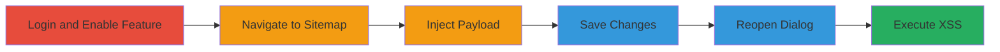

# Stored XSS Exploitation in Concrete CMS Sitemap Location Dialog Additional URLs

Multi-stage attack chain demonstrating a complete stored XSS workflow in Concrete CMS, where a crafted JavaScript payload is injected into the Additional URLs field of the Location dialog, persists upon saving, and executes when another user reopens the dialog, leading to arbitrary JavaScript execution limited to authenticated page editors.

## Chain Metrics Dashboard

| Metric | Value |
|--------|-------|
| Chain Status | Unverified |
| Total Steps | 6 |
| Execution Time | ~5 minutes |
| Skill Level | Intermediate |
| Complexity | Medium |
| Impact Level | Low |

## Attack Flow Visualization

## Prerequisites & Requirements

### Required Tools

- Web browser (e.g., Chrome with developer tools)

### Target Environment

- Concrete CMS 8.2.0 RC2 running on PHP 5.6.30, Apache 2.4.25, MySQL 5.7.13
- Web platform with admin access

### Initial Access Requirements

- Valid admin or editor credentials for Concrete CMS
- Direct network access to the CMS instance
- No prior access needed beyond authentication

## Detailed Attack Procedures

### Step 1: Login and Enable Conversations Feature
procedure: [[procedures/Login-and-Enable-Conversations-Feature-in-Concrete-CMS]]

**Objective**: Gain authenticated access and prepare the environment by enabling the Conversations feature, which is required for the Sitemap functionality.

**Instructions**: Access the admin login page, enter credentials, and navigate to the dashboard to enable the feature.

**Expected Output**: Successful login and feature enabled in the dashboard.

**Success Indicators**:
- Dashboard accessible without errors
- Conversations feature status shows as enabled

### Step 2: Navigate to Sitemap and Open Location Dialog
procedure: [[procedures/Navigate-to-Sitemap-and-Open-Location-Dialog]]

**Objective**: Locate a target page in the Sitemap and access the Location dialog to prepare for payload injection.

**Instructions**: From the dashboard, go to the Sitemap section, select a page, and open the Location option from the context menu.

**Expected Output**: Location dialog opens, displaying current page attributes.

**Success Indicators**:
- Sitemap loads successfully
- Dialog opens without validation errors

### Step 3: Inject XSS Payload into Additional URLs Field
procedure: [[procedures/Inject-XSS-Payload-into-Additional-URLs-Field]]

**Objective**: Insert a crafted JavaScript payload into the Additional URLs input field, exploiting the lack of sanitization.

**Instructions**: Click 'Add URL' in the dialog and enter the payload `1',row:1}));alert("xss in path");debugger;(({y:'1` into the text input field.

**Expected Output**: Payload accepted without immediate errors.

**Success Indicators**:
- Input field accepts the malformed string
- No client-side validation blocks submission

### Step 4: Save Changes in Location Dialog
procedure: [[procedures/Save-Changes-in-Location-Dialog]]

**Objective**: Persist the injected payload by saving the dialog, storing it in the page's location attributes.

**Instructions**: Confirm the changes and click save in the dialog.

**Expected Output**: Dialog closes with a success message, payload stored server-side.

**Success Indicators**:
- Save operation completes without errors
- Page attributes updated in backend

### Step 5: Reopen Location Dialog to Trigger XSS
procedure: [[procedures/Reopen-Location-Dialog-to-Trigger-XSS]]

**Objective**: Access the dialog again as another authorized user to render the unsanitized payload in JavaScript context.

**Instructions**: Return to Sitemap, select the same page, and reopen the Location dialog.

**Expected Output**: Dialog reloads, rendering the payload within the renderPagePath JavaScript function.

**Success Indicators**:
- Dialog opens with the injected data visible in source
- JavaScript context shows breakout from object literal

### Step 6: Observe Payload Execution and Alert
procedure: [[procedures/Observe-Payload-Execution-and-Alert]]

**Objective**: Confirm exploitation by executing the payload, triggering an alert and debugger.

**Instructions**: Upon dialog load, the payload automatically executes in the browser.

**Expected Output**: Alert box displays "xss in path", debugger pauses execution.

**Success Indicators**:
- Alert pops up confirming XSS
- Browser console shows execution trace

## Attack Chain Summary

### Key Achievements

1. Successful injection and persistence of XSS payload in Concrete CMS.
2. Breakout from JavaScript object literal in renderPagePath function.
3. Arbitrary JavaScript execution for page editors, enabling potential session hijacking.

## Technique & Tactic Coverage

### MITRE ATT&CK Techniques

- [[JavaScript]]

### MITRE ATT&CK Tactics

- [[Execution]]
- [[Collection]]

---
*Last updated: 2023-10-01T00:00:00Z*
