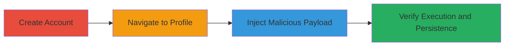

---
tags:
  - xss
  - stored-xss
  - web
  - defense
  - javascript
type: attack_chain
tools: []
tactics:
  - '[[Execution]]'
  - '[[Collection]]'
verified: false
platforms:
  - Web
submitted: true
complexity: low
created_at: '2024-10-01T00:00:00Z'
procedures:
  - '[[procedures/Exploit-Stored-XSS-in-User-Profile-Description]]'
step_count: 4
techniques:
  - '[[JavaScript]]'
updated_at: '2025-12-14T03:16:08.508Z'
description: >-
  Demonstrates exploitation of a stored XSS vulnerability in a U.S. Department
  of Defense web application's user profile field to inject malicious JavaScript
  that executes in victims' browsers, enabling cookie theft and session
  hijacking.
skill_level: beginner
impact_level: high
id: aefe1c13-b24c-44a7-aa52-45605c82f129
validated: true
mitre_tactics:
  - '[[Execution]]'
  - '[[Collection]]'
mitre_techniques:
  - '[[JavaScript]]'
---
# Stored XSS Exploitation in DoD User Profile for Session Hijacking

Multi-stage attack chain demonstrating a complete attack workflow.

## Chain Metrics Dashboard

| Metric | Value |
|--------|-------|
| Chain Status | Unverified |
| Total Steps | 4 |
| Execution Time | ~5 minutes |
| Skill Level | Beginner |
| Complexity | Low |
| Impact Level | High |

## Attack Flow Visualization

## Prerequisites & Requirements

### Required Tools

- Web browser (e.g., Chrome, Firefox)

### Target Environment

- Web application using ASP.NET
- Publicly accessible registration and profile pages
- No special services or ports required beyond standard HTTP/HTTPS (ports 80/443)

### Initial Access Requirements

- No prior credentials needed; ability to register a new account
- Direct network access to the target web application
- No elevated privileges required

## Detailed Attack Procedures

### Step 1: Create an Account
procedure: [[procedures/Exploit-Stored-XSS-in-User-Profile-Description]]

**Objective**: Gain access to the user profile editing functionality by registering a new account.

**Instructions**: Navigate to the registration page of the target application and complete the signup process with valid details.

**Expected Output**: Successful account creation with login credentials.

**Success Indicators**:
- Confirmation email or success message
- Ability to log in to the application

### Step 2: Navigate to User Profile
procedure: [[procedures/Exploit-Stored-XSS-in-User-Profile-Description]]

**Objective**: Access the profile editing section where the vulnerable field is located.

**Instructions**: After logging in, locate and click on the user profile link to reach the edit page at the vulnerable endpoint.

**Expected Output**: Profile editing form loads, displaying the 'Say something about yourself...' field.

**Success Indicators**:
- Profile page accessible
- Editable text field visible

### Step 3: Inject XSS Payload into Profile Field
procedure: [[procedures/Exploit-Stored-XSS-in-User-Profile-Description]]

**Objective**: Insert a malicious JavaScript payload into the unsanitized profile description field to trigger XSS.

**Instructions**: In the 'Say something about yourself...' field, enter the payload `xxx<svg/onload=alert(document.cookie);>xxx` and submit the form.

**Expected Output**: Payload saved without sanitization; immediate alert may trigger if viewing the profile.

**Success Indicators**:
- Form submission succeeds without errors
- Payload appears in the profile view

### Step 4: Observe XSS Execution and Persistence
procedure: [[procedures/Exploit-Stored-XSS-in-User-Profile-Description]]

**Objective**: Confirm the stored XSS executes JavaScript in the attacker's and victims' browsers, persisting across reloads.

**Instructions**: View the updated profile to trigger the alert displaying document cookies; reload the page to verify persistence.

**Expected Output**: JavaScript alert box shows session cookies; execution repeats on reload.

**Success Indicators**:
- Alert pops up with cookie data
- XSS triggers on subsequent page loads when profile is viewed

## Attack Chain Summary

### Key Achievements

1. Successful account creation and profile access
2. Injection of persistent malicious JavaScript via unsanitized input
3. Execution of arbitrary code to steal sensitive browser data like cookies
4. Potential for broader impact on victims viewing the profile

## Technique & Tactic Coverage

### MITRE ATT&CK Techniques

- [[JavaScript]]

### MITRE ATT&CK Tactics

- [[Execution]]
- [[Collection]]

---

*Last updated: 2024-10-01T00:00:00Z*
