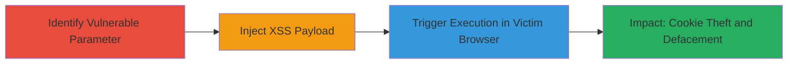

# Stored XSS Exploitation in DoD Web Application Parameter

Multi-stage attack chain demonstrating the exploitation of a stored cross-site scripting (XSS) vulnerability in a U.S. Department of Defense web application at https://███████, targeting the q_13787 parameter to inject and persist malicious JavaScript for execution in victims' browsers.

## Chain Metrics Dashboard

| Metric | Value |
|--------|-------|
| Chain Status | Unverified |
| Total Steps | 3 |
| Execution Time | ~5 minutes |
| Skill Level | Intermediate |
| Complexity | Medium |
| Impact Level | High |

## Attack Flow Visualization

## Prerequisites & Requirements

### Required Tools

- Web browser (e.g., Chrome Developer Tools for payload testing)
- Proxy tool like Burp Suite (optional for intercepting requests)

### Target Environment

- Web application platform
- Access to the DoD application at https://███████
- No specific ports required; standard HTTPS (443)

### Initial Access Requirements

- Valid user account or public access to the input form
- Ability to submit data via the q_13787 parameter
- Victim access to view stored content pages

## Detailed Attack Procedures

### Step 1: Identify Vulnerable Input Parameter
procedure: [[procedures/Identify-Stored-XSS-Vulnerable-Parameter]]

**Objective**: Locate the unsanitized user input field that allows storage of malicious payloads without proper escaping.

**Instructions**: Inspect the web application's forms and parameters, focusing on data submission endpoints. Test the q_13787 parameter by submitting benign inputs like  and check if they are stored and reflected without sanitization when viewing the stored data page.

**Expected Output**: Confirmation that input is persisted without escaping, e.g., raw HTML tags visible in source.

**Success Indicators**:
- Input reflected in stored content without HTML entity encoding
- No server-side filtering observed

### Step 2: Inject Malicious XSS Payload
procedure: [[procedures/Inject-Malicious-XSS-Payload]]

**Objective**: Submit a JavaScript payload into the vulnerable parameter to store executable code.

**Instructions**: Use a web browser or form submission tool to send the URL-encoded payload '%22%27%3e%3csvg%2fonload%3dconfirm(666)%3e' (decodes to "'><svg onload=confirm(666)>") via the q_13787 parameter. This payload breaks out of any string context and executes JavaScript on load.

**Expected Output**: Payload stored successfully; no errors on submission.

**Success Indicators**:
- Payload visible in application storage (e.g., database or session)
- No immediate execution (as it's stored, not reflected)

### Step 3: Trigger Execution by Viewing Stored Content
procedure: [[procedures/Trigger-Stored-XSS-Execution]]

**Objective**: Cause the payload to execute in a victim's browser by accessing the page containing the stored malicious script.

**Instructions**: As a victim (or simulate by logging in as another user), navigate to the page displaying the stored data from q_13787. The browser will parse and execute the injected <svg onload=confirm(666)> tag, popping a confirmation dialog with '666'.

**Expected Output**: JavaScript execution, such as alert or confirm dialog; in production, this could steal cookies via document.cookie or send requests.

**Success Indicators**:
- Dialog or script effect observed in browser
- Network requests or console logs confirming execution

## Attack Chain Summary

### Key Achievements

1. Identified and confirmed stored XSS in q_13787 parameter without sanitization.
2. Injected and persisted a functional JavaScript payload.
3. Demonstrated execution leading to potential session hijacking, defacement, or malware prompts.

## Technique & Tactic Coverage

### MITRE ATT&CK Techniques

- [[JavaScript]]

### MITRE ATT&CK Tactics

- [[Execution]]

---
*Last updated: 2023-10-01T00:00:00Z*
