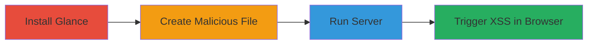

---
tags:
  - xss
  - stored-xss
  - node-js
  - directory-listing
type: attack_chain
tools:
  - '[[tools/npm]]'
  - '[[tools/glance]]'
  - '[[tools/Chromium]]'
tactics:
  - '[[Execution]]'
verified: false
platforms:
  - Web
  - Node.js
submitted: true
complexity: medium
created_at: '2024-01-01T00:00:00Z'
procedures:
  - '[[procedures/Install-Glance-Node-Module]]'
  - '[[procedures/Create-Malicious-File-for-XSS]]'
  - '[[procedures/Run-Glance-Server]]'
  - '[[procedures/Trigger-XSS-in-Browser]]'
step_count: 4
techniques:
  - '[[JavaScript]]'
updated_at: '2025-12-14T03:15:46.979Z'
description: >-
  A multi-stage attack chain exploiting a Stored XSS vulnerability in the Glance
  Node.js module by injecting malicious JavaScript into file names, leading to
  arbitrary code execution when users view the directory listing.
skill_level: intermediate
impact_level: high
id: d274915e-ca7f-4845-9370-2e512957b96a
validated: true
mitre_tactics:
  - '[[Execution]]'
mitre_techniques:
  - '[[JavaScript]]'
---
# Stored XSS Exploitation in Glance Node.js Module via Malicious File Names

Multi-stage attack chain demonstrating the exploitation of a Stored XSS vulnerability in the Glance Node.js module, where unsanitized file names in the directory listing allow injection of malicious JavaScript, leading to execution in users' browsers.

## Chain Metrics Dashboard

| Metric | Value |
|--------|-------|
| Chain Status | Unverified |
| Total Steps | 4 |
| Execution Time | ~5 minutes |
| Skill Level | Intermediate |
| Complexity | Medium |
| Impact Level | High |

## Attack Flow Visualization



## Prerequisites & Requirements

### Required Tools

- [[tools/npm]]
- [[tools/glance]]
- [[tools/Chromium]]

### Target Environment

- Node.js runtime environment
- Local file system access for creating files
- No specific ports required (default 3000)

### Initial Access Requirements

- Local machine with Node.js and npm installed
- No network credentials needed; local exploitation
- Administrative access not required

## Detailed Attack Procedures

### Step 1: Install Glance Module
procedure: [[procedures/Install-Glance-Node-Module]]

**Objective**: Set up the vulnerable Glance module to serve static files.

**Instructions**: Use [[commands/npm-install-glance]] to install the module:

```bash
npm install glance
```

**Expected Output**: Installation logs confirming the package is added to node_modules.

**Success Indicators**:
- Glance binary available in node_modules/glance/bin/
- No errors in npm output

### Step 2: Create Malicious File for XSS
procedure: [[procedures/Create-Malicious-File-for-XSS]]

**Objective**: Inject a Stored XSS payload into a file name to be rendered unsafely in the directory listing.

**Instructions**: Manually create a file with a malicious name, such as one embedding a javascript: URI or HTML tag. For example, touch a file named 'javascript:alert("you are pwned!")' or '1"><iframe src="malicious_frame.html">'.

**Expected Output**: File created successfully in the target directory.

**Success Indicators**:
- File exists with the malicious name
- No filesystem errors

### Step 3: Run Glance Server
procedure: [[procedures/Run-Glance-Server]]

**Objective**: Start the HTTP server to expose the directory listing containing the malicious file name.

**Instructions**: Execute [[commands/run-glance-server]] from the directory with the malicious file:

```bash
./node_modules/glance/bin/glance.js --verbose --dir ./
```

**Expected Output**: Server starts and listens on port 3000 with verbose logs.

**Success Indicators**:
- Server message: "Listening on port 3000"
- Directory listing accessible at http://localhost:3000

### Step 4: Trigger XSS in Browser
procedure: [[procedures/Trigger-XSS-in-Browser]]

**Objective**: View the directory listing and interact with the malicious link to execute JavaScript.

**Instructions**: Open http://localhost:3000 in [[tools/Chromium]] and click the link for the malicious file name.

**Expected Output**: JavaScript executes, e.g., an alert popup saying "you are pwned!".

**Success Indicators**:
- Malicious script runs in browser context
- Potential for further exploitation like cookie theft

## Attack Chain Summary

### Key Achievements

1. Successful installation and setup of the vulnerable Glance module
2. Injection of Stored XSS payload via file name
3. Exposure of the payload in an unsanitized directory listing
4. Arbitrary JavaScript execution in victim browsers, enabling session hijacking or data theft

## Technique & Tactic Coverage

### MITRE ATT&CK Techniques

- [[JavaScript]]

### MITRE ATT&CK Tactics

- [[Execution]]

---
*Last updated: 2024-01-01T00:00:00Z*
