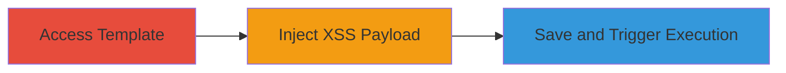

# Stored-XSS-Exploitation-in-Infogram-Report-Classic-Template

Multi-stage attack chain demonstrating a complete attack workflow exploiting stored XSS in Infogram's free template to achieve arbitrary JavaScript execution.

## Chain Metrics Dashboard

| Metric | Value |
|--------|-------|
| Chain Status | Unverified |
| Total Steps | 3 |
| Execution Time | ~5 minutes |
| Skill Level | Intermediate |
| Complexity | Low |
| Impact Level | High |

## Attack Flow Visualization

## Prerequisites & Requirements

### Required Tools

- Web browser (e.g., Chrome, Firefox)

### Target Environment

- Infogram.com platform
- Free account access
- No specific services/ports required beyond standard HTTPS (443)

### Initial Access Requirements

- Public internet access
- No credentials needed beyond free registration on infogram.com
- No prior access to victim accounts

## Detailed Attack Procedures

### Step 1: Access the Free Report Classic Template

procedure: [[procedures/Exploit-Stored-XSS-in-Infogram-Report-Classic-Template]]

**Objective**: Gain entry to the vulnerable template to begin modification.

**Instructions**: Navigate to infogram.com in your web browser, sign up for a free account if needed, and select the 'Report Classic' free template from the template library to start editing a new report.

**Expected Output**: The template editor loads, displaying editable elements including tables.

**Success Indicators**:
- Template editor is accessible
- Table elements are visible for modification

### Step 2: Inject Malicious XSS Payload into Table Values

procedure: [[procedures/Exploit-Stored-XSS-in-Infogram-Report-Classic-Template]]

**Objective**: Insert unsanitized JavaScript payloads into table data fields to persist malicious code.

**Instructions**: In the template editor, locate a table element and input a malicious payload into a table value field, such as `">` or `"></svg/onload=alert(0);>`. These payloads exploit the lack of HTML/JS sanitization in the input fields.

**Expected Output**: The payload is accepted without error and appears in the table preview.

**Success Indicators**:
- Payload input succeeds without validation errors
- Preview shows the injected HTML/JS elements

### Step 3: Save the Report and Trigger XSS Execution

procedure: [[procedures/Exploit-Stored-XSS-in-Infogram-Report-Classic-Template]]

**Objective**: Persist the changes and execute the payload by viewing the report, simulating victim interaction.

**Instructions**: Save the modified report on infogram.com, then open or share the report URL in a new browser tab or incognito window. The payload will execute automatically via browser events like onerror or onload when the table renders.

**Expected Output**: A JavaScript alert or prompt box appears, confirming execution (e.g., alert(0) or prompt(0)).

**Success Indicators**:
- Report loads and payload triggers JS execution
- No sanitization blocks the onload/onerror events

## Attack Chain Summary

### Key Achievements

1. Successful injection of stored XSS payload into persistent report data
2. Arbitrary JavaScript execution in the context of viewing users' browsers
3. Potential for session hijacking, data theft, or further client-side attacks on unsuspecting viewers

## Technique & Tactic Coverage

### MITRE ATT&CK Techniques

- [[JavaScript]]

### MITRE ATT&CK Tactics

- [[Execution]]

---

*Last updated: 2024-01-01T12:00:00Z*
