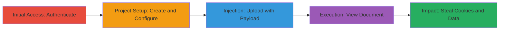

# Stored XSS Exploitation in Localize Document Title for JavaScript Execution

Multi-stage attack chain demonstrating the exploitation of a stored cross-site scripting (XSS) vulnerability in the Localize web application. An attacker injects a malicious payload into the document title during upload, which is stored unsanitized and executes JavaScript when the document is viewed, potentially stealing session cookies and accessing sensitive user data.

## Chain Metrics Dashboard

| Metric | Value |
|--------|-------|
| Chain Status | Unverified |
| Total Steps | 7 |
| Execution Time | ~5 minutes |
| Skill Level | Intermediate |
| Complexity | Medium |
| Impact Level | High |

## Attack Flow Visualization

## Prerequisites & Requirements

### Required Tools

- Web browser (e.g., Chrome, Firefox)

### Target Environment

- Localize web application (e.g., https://app.localizestaging.com)
- Valid user account with upload permissions

### Initial Access Requirements

- Authenticated session
- Network access to the application

## Detailed Attack Procedures

### Step 1: Authenticate to Application
procedure: [[procedures/Authenticate-to-Localize-App]]

**Objective**: Gain access to the Localize dashboard to initiate project creation.

**Instructions**: Open a web browser and navigate to the Localize login page. Enter valid credentials to authenticate.

**Expected Output**: Redirect to the dashboard with active session.

**Success Indicators**:
- Successful login without errors
- Access to project creation interface

### Step 2: Create New Project
procedure: [[procedures/Create-New-Translation-Project]]

**Objective**: Set up a new translation project to access document upload functionality.

**Instructions**: From the dashboard, click 'New Project' and select 'Documents' as the translation type.

**Expected Output**: Project creation form loaded.

**Success Indicators**:
- Project initiated
- Option to upload documents available

### Step 3: Upload Document with XSS Payload
procedure: [[procedures/Upload-Document-with-XSS-Payload]]

**Objective**: Inject the malicious XSS payload into the document title field during upload.

**Instructions**: Upload a sample document file and enter the payload `>">` in the title field, then save.

**Expected Output**: Document uploaded successfully with the tainted title stored.

**Success Indicators**:
- No upload errors
- Document listed in project with injected title

### Step 4: Trigger Stored XSS Execution
procedure: [[procedures/Trigger-Stored-XSS-Execution]]

**Objective**: View the document to execute the stored payload and observe JavaScript execution.

**Instructions**: Navigate to the uploaded document or project page to render the title, triggering the onerror event.

**Expected Output**: Alert box displaying the document domain.

**Success Indicators**:
- JavaScript alert fires
- Potential for further payload to steal cookies

## Attack Chain Summary

### Key Achievements

1. Successful injection of stored XSS payload without detection.
2. Execution of arbitrary JavaScript in victim browsers.
3. Capability to exfiltrate session cookies and sensitive data.

## Technique & Tactic Coverage

### MITRE ATT&CK Techniques

- [[JavaScript]]
- [[Exploit Public-Facing Application]]

### MITRE ATT&CK Tactics

- [[Execution]]
- [[Collection]]

---
*Last updated: 2023-10-01T00:00:00Z*
