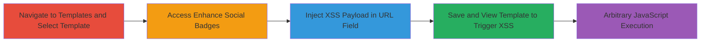

---
tags:
  - xss
  - stored-xss
  - javascript
  - web-vulnerability
type: attack_chain
tools: []
tactics:
  - '[[Execution]]'
verified: false
platforms:
  - Web
submitted: true
complexity: low
procedures:
  - '[[procedures/Navigate-to-Templates-and-Select-Template]]'
  - '[[procedures/Access-Enhance-Social-Badges-Section]]'
  - '[[procedures/Inject-XSS-Payload-in-URL-Field]]'
  - '[[procedures/Save-and-Trigger-XSS-in-Template]]'
step_count: 4
techniques:
  - '[[JavaScript]]'
description: >-
  A multi-step stored cross-site scripting attack in the Mixmax web application,
  exploiting unsanitized URL inputs in the Social Badges feature to execute
  arbitrary JavaScript when templates are viewed.
skill_level: intermediate
impact_level: high
id: 19cff7de-e405-42e6-a545-00108121124d
created_at: '2025-12-14T03:16:25.019Z'
updated_at: '2025-12-14T03:16:25.019Z'
validated: true
mitre_tactics:
  - '[[Execution]]'
mitre_techniques:
  - '[[JavaScript]]'
---
# Stored XSS Exploitation in Mixmax Templates Social Badges

Multi-stage attack chain demonstrating a complete stored XSS workflow in the Mixmax web application.

## Chain Metrics Dashboard

| Metric | Value |
|--------|-------|
| Chain Status | Unverified |
| Total Steps | 4 |
| Execution Time | ~2 minutes |
| Skill Level | Intermediate |
| Complexity | Low |
| Impact Level | High |

## Attack Flow Visualization

## Prerequisites & Requirements

### Required Tools

- Web browser (e.g., Chrome, Firefox)

### Target Environment

- Mixmax web application
- Authenticated user session
- No specific services/ports required beyond standard HTTPS access

### Initial Access Requirements

- Valid Mixmax account credentials
- Direct browser access to the Mixmax dashboard
- No prior network compromise needed

## Detailed Attack Procedures

### Step 1: Navigate to Templates and Select Template
procedure: [[procedures/Navigate-to-Templates-and-Select-Template]]

**Objective**: Gain access to the template editing interface to prepare for payload injection.

**Instructions**: Log in to the Mixmax web application using valid credentials. Navigate to the Templates section in the dashboard and select an existing user template to edit.

**Expected Output**: The selected template opens in the editor view.

**Success Indicators**:
- Templates section accessible
- Template editor loaded without errors

### Step 2: Access Enhance Social Badges Section
procedure: [[procedures/Access-Enhance-Social-Badges-Section]]

**Objective**: Reach the vulnerable input field within the Social Badges feature.

**Instructions**: In the template editor, locate and click on the Enhance menu, then select the Social Badges option to open the configuration panel.

**Expected Output**: Social Badges configuration interface appears, showing fields for social networking buttons.

**Success Indicators**:
- Enhance menu expands
- Social Badges section loads with URL input fields visible

### Step 3: Inject XSS Payload in URL Field
procedure: [[procedures/Inject-XSS-Payload-in-URL-Field]]

**Objective**: Insert a malicious JavaScript payload into the unsanitized URL field to store the XSS.

**Instructions**: In the Social Badges configuration, locate the URL field for a social networking button (e.g., Twitter or Facebook link). Enter the payload `javascript:alert(1)` as the URL value.

**Expected Output**: The payload is accepted and stored in the field without validation errors.

**Success Indicators**:
- Payload entered successfully
- No immediate sanitization or rejection

### Step 4: Save and Trigger XSS in Template
procedure: [[procedures/Save-and-Trigger-XSS-in-Template]]

**Objective**: Persist the payload and execute it by viewing the template, confirming arbitrary code execution.

**Instructions**: Save the changes to the template. Reload or view the template in the Mixmax interface to trigger the stored payload.

**Expected Output**: An alert box with "1" appears, indicating JavaScript execution in the browser context.

**Success Indicators**:
- Template saves without issues
- Alert dialog triggers on view
- Browser console shows no blocking errors

## Attack Chain Summary

### Key Achievements

1. Successful navigation and access to the vulnerable feature
2. Injection and storage of JavaScript payload via URL field
3. Triggering of stored XSS leading to arbitrary code execution
4. Potential for session cookie theft or user impersonation in victim browsers

## Technique & Tactic Coverage

### MITRE ATT&CK Techniques

- [[JavaScript]]

### MITRE ATT&CK Tactics

- [[Execution]]

---
*Last updated: 2024-10-01T00:00:00Z*
