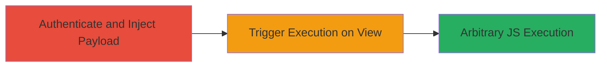

---
tags:
  - xss
  - stored-xss
  - javascript
  - web-vulnerability
type: attack_chain
tools: []
tactics:
  - '[[Execution]]'
verified: false
platforms:
  - Web
submitted: true
complexity: low
created_at: '2023-10-01T00:00:00Z'
procedures:
  - '[[procedures/Inject-Stored-XSS-Payload-in-Search]]'
  - '[[procedures/Trigger-and-Observe-XSS-Execution]]'
step_count: 2
techniques:
  - '[[JavaScript]]'
updated_at: '2025-12-14T03:15:31.417Z'
description: >-
  Demonstrates exploitation of a stored XSS vulnerability in Moneybird's
  JavaScript module for searching Incoming Manual Journals, enabling arbitrary
  JavaScript execution in authenticated users' browsers.
skill_level: beginner
impact_level: high
id: 3de90376-935f-42cc-a0c8-f06a207bf3e2
validated: true
mitre_tactics:
  - '[[Execution]]'
mitre_techniques:
  - '[[JavaScript]]'
---
# Stored XSS Exploitation in Moneybird Manual Journal Search

Multi-stage attack chain demonstrating exploitation of a stored Cross-Site Scripting (XSS) vulnerability in the Moneybird web application. The vulnerability resides in the JavaScript module handling search inputs for 'Incoming (Manual Journal)', where unsanitized inputs are stored and reflected back, allowing malicious scripts to execute in the browsers of authenticated users who view the affected content. This can lead to session hijacking, data theft, or further client-side attacks. The issue was reported on HackerOne in 2016 and subsequently fixed by Moneybird.

## Chain Metrics Dashboard

| Metric | Value |
|--------|-------|
| Chain Status | Unverified |
| Total Steps | 2 |
| Execution Time | ~5 minutes |
| Skill Level | Beginner |
| Complexity | Low |
| Impact Level | High |

## Attack Flow Visualization

## Prerequisites & Requirements

### Required Tools

- Web browser (e.g., Chrome with developer tools)

### Target Environment

- Moneybird web application
- Authenticated user session
- No specific ports or services beyond standard HTTPS (443)

### Initial Access Requirements

- Valid user credentials for Moneybird account
- Direct network access to the Moneybird application (https://my.moneybird.com or similar)
- No prior elevated access needed

## Detailed Attack Procedures

### Step 1: Authenticate and Inject Payload
procedure: [[procedures/Inject-Stored-XSS-Payload-in-Search]]

**Objective**: Gain authenticated access and inject a malicious JavaScript payload into the search functionality for Incoming Manual Journals, exploiting the lack of input sanitization to store the payload.

**Instructions**: Log in to the Moneybird application using valid credentials. Navigate to the search interface and enter a malicious payload in the search field specifically for 'Incoming (Manual Journal)'. A simple test payload is ``.

**Expected Output**: The search results page loads without immediate errors, but the payload is stored in the backend or session data associated with the search.

**Success Indicators**:
- No validation errors on input submission
- Search functionality appears to process the input normally

### Step 2: Trigger and Observe Execution
procedure: [[procedures/Trigger-and-Observe-XSS-Execution]]

**Objective**: View the stored search results to trigger the XSS payload, resulting in arbitrary JavaScript execution in the victim's browser context.

**Instructions**: Refresh the search results page or have another authenticated user access the same search query for 'Incoming (Manual Journal)'. Open browser developer tools (F12) to monitor the console for script execution.

**Expected Output**: An alert box pops up displaying 'XSS', or in a real attack, more malicious code like keylogging or session theft executes silently.

**Success Indicators**:
- JavaScript alert or console log confirms execution
- No server-side errors; payload reflects unsanitized in the DOM

## Attack Chain Summary

### Key Achievements

1. Successful injection of unsanitized JavaScript payload via search input
2. Storage and persistence of the payload in the application's JavaScript module
3. Execution of arbitrary code in the browser of viewing users, demonstrating potential for session hijacking or data exfiltration

## Technique & Tactic Coverage

### MITRE ATT&CK Techniques

- [[JavaScript]]

### MITRE ATT&CK Tactics

- [[Execution]]

---
*Last updated: 2023-10-01T00:00:00Z*
