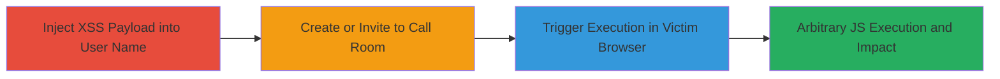

# Stored XSS Exploitation in Nextcloud Spreed Plugin for JavaScript Execution

Multi-stage attack chain demonstrating a complete stored XSS workflow in the Nextcloud Spreed (Calling) plugin, allowing attackers to inject malicious JavaScript into user names and execute it in victims' browsers, potentially leading to session theft or other client-side attacks, especially against admin users.

## Chain Metrics Dashboard

| Metric | Value |
|--------|-------|
| Chain Status | Unverified |
| Total Steps | 3 |
| Execution Time | ~5 minutes |
| Skill Level | Intermediate |
| Complexity | Medium |
| Impact Level | High |

## Attack Flow Visualization

## Prerequisites & Requirements

### Required Tools

- Web browser (e.g., Chrome, IE for testing variations)
- Access to a Nextcloud instance with Spreed plugin enabled

### Target Environment

- Nextcloud platform (Web-based)
- Spreed (Calling) plugin active
- PHP backend

### Initial Access Requirements

- Valid user account in Nextcloud
- Ability to modify user profile/name in Spreed
- Network access to the Nextcloud instance

## Detailed Attack Procedures

### Step 1: Inject XSS Payload into User Name
procedure: [[procedures/Inject-XSS-Payload-into-Spreed-User-Name]]

**Objective**: Inject a malicious JavaScript payload into the user's name field in the Spreed plugin to store the XSS for later execution.

**Instructions**: Log in to the Nextcloud instance, navigate to the Spreed plugin settings, and modify the user name field with a payload such as `'>` or `'>`. Save the changes to persist the injection.

**Expected Output**: The name is updated without errors, storing the payload server-side.

**Success Indicators**:
- Payload appears in the name field without sanitization
- No immediate errors on save

### Step 2: Create and Share Call Room
procedure: [[procedures/Create-and-Share-Spreed-Call-Room]]

**Objective**: Use the Spreed plugin to create a call room or invite participants, embedding the injected payload in the room context for victim exposure.

**Instructions**: Within the Spreed interface, create a single-user call room and invite other users, or generate a public room link. Share the invitation or link with potential victims, ensuring the injected name is visible in the room metadata.

**Expected Output**: Room created successfully with invitations sent; public link generated if applicable.

**Success Indicators**:
- Invitations delivered to victims
- Room link accessible and shows the injected name

### Step 3: Trigger Stored XSS Execution
procedure: [[procedures/Trigger-Stored-XSS-in-Spreed-Room]]

**Objective**: Cause the payload to execute in the victim's browser by interacting with the room, leading to arbitrary JavaScript execution.

**Instructions**: Have the victim view the call room or hover over the injected name in the participant list. In IE, execution occurs on room load due to lack of CSP; in Chrome, hovering triggers the onerror or script event.

**Expected Output**: Alert box or other JS effects (e.g., alert(1) or alert(3)) appear in the victim's browser.

**Success Indicators**:
- JavaScript executes (e.g., alert fires)
- Potential for further actions like session cookie theft via additional payload

## Attack Chain Summary

### Key Achievements

1. Successful injection of stored XSS payload into Spreed user name without sanitization.
2. Propagation of the payload via call room invitations or public links to reach victims.
3. Arbitrary JavaScript execution in browsers, enabling client-side attacks like session theft, particularly impactful against admin users.

## Technique & Tactic Coverage

### MITRE ATT&CK Techniques

- [[JavaScript]]

### MITRE ATT&CK Tactics

- [[Execution]]
- [[Collection]]

---
*Last updated: 2024-10-01T00:00:00Z*
